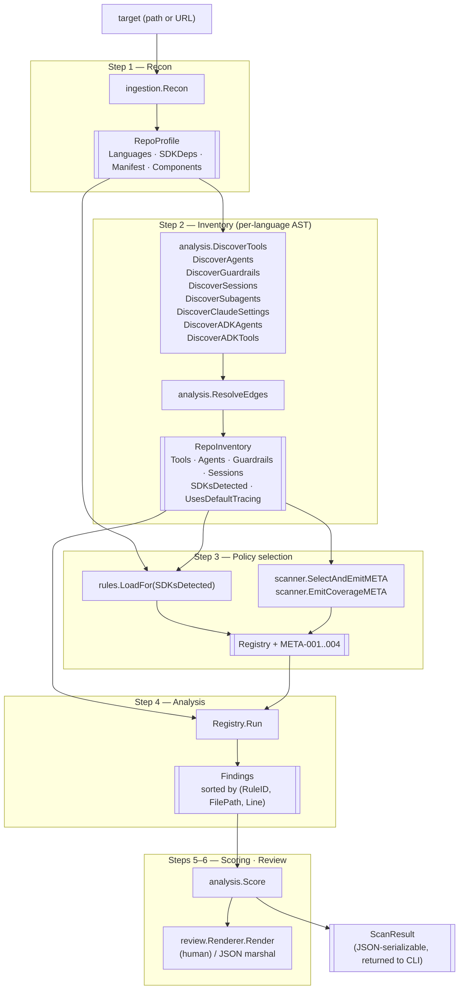
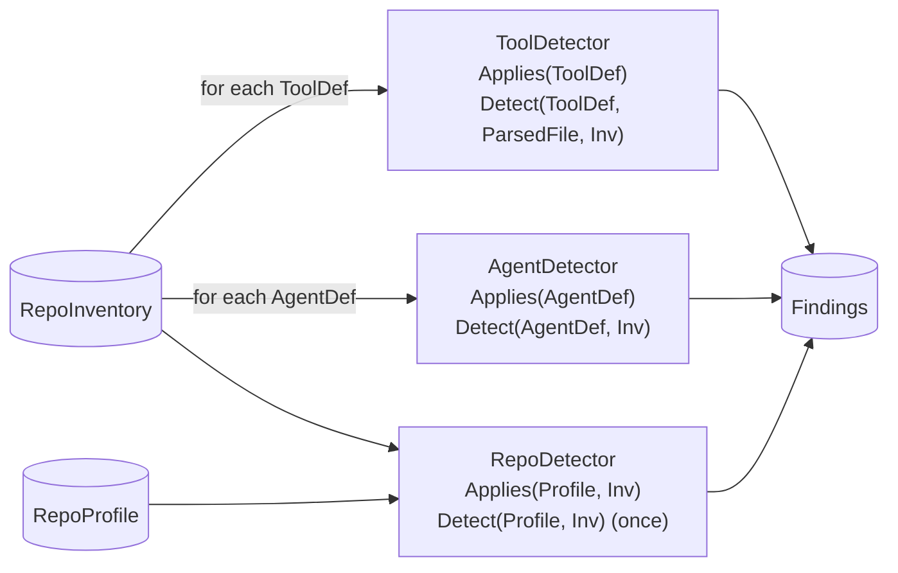
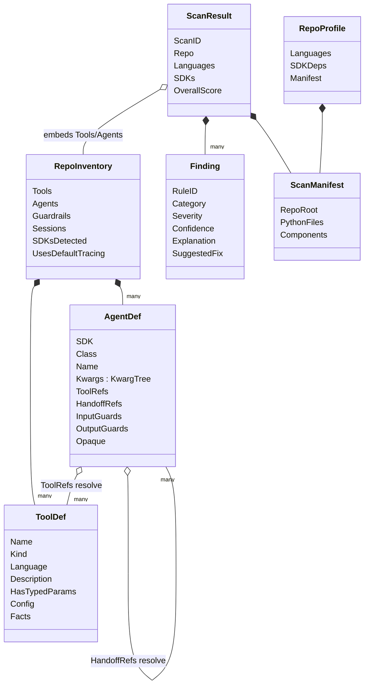

# Architecture

This document describes the concrete architecture of the Trustabl codebase as it
exists today. It is the implementer's reference: what each package owns, the
data that crosses package boundaries, and the decisions that shaped the layout.

For the broader product vision, see the design doc tracker — this file is
scoped to the Go binary in this repository.

---

## 1. Goal

trustabl scans an agent SDK repository (Claude Agent SDK, OpenAI Agents SDK,
Google ADK, MCP), finds reliability weaknesses in its tool and agent
definitions, and reports them. A scan is read-only: it writes nothing into the scanned repo. The
output is a `ScanResult` — findings (each with an explanation, suggested fix,
and confidence), per-tool readiness scores, an overall score, and the
discovered inventory — rendered as a human summary or as JSON for CI.

Single Go binary, no daemon, no server. Web app and CI surfaces are out of
scope (see `README.md`).

The binary ships with **no embedded rules**. Detection rules live in a
separate git repository and are resolved at scan time (see §2 — Rule
resolution). This decouples rule updates from binary releases: rules can be
added or changed without rebuilding or redistributing the scanner.

---

## 1.1 Language scope

Trustabl ships with **Python tool discovery** wired in. The scanner can also
recognize TypeScript, JavaScript, and Go *files* (they appear in
`manifest.typescript_files` etc. and feed component discovery), but no AST
parser for those languages is plumbed in yet — so no tools are extracted
from them and no rules fire against them.

The rule schema's `language:` field gates per-language rule sets. Existing
rules declare `language: python` explicitly and the loader rejects any
unknown language value. When TypeScript tool discovery lands, new rules
declare `language: typescript` and run only against TS tools; Python rules
remain inert against TS tools.

Adding a new tool-discovery language requires:

1. A tree-sitter binding for that language in `internal/analysis/astutil/`.
2. Discovery patterns for that language's tool definitions in
   `internal/analysis/discovery.go` (e.g. AI SDK's `tool({})` factory in TS).
3. Per-language predicate implementations in `internal/rules/predicates.go`
   (since AST node types differ across languages).
4. New rule files under `<category>/` in the external `trustabl-rules`
   repository declaring `language: <new>`.

---

## 2. Pipeline

### Rule resolution (pre-pipeline) ([internal/rulesource/](internal/rulesource/))

Before the pipeline runs, `cmd/trustabl` resolves the detection rules. The
binary embeds none; `rulesource.Resolve` fetches them from the rules git
repository (`DefaultRepoURL`, currently
`https://github.com/jhumel-code/trustabl-rules`; overridable with
`--rules-repo` / `TRUSTABL_RULES_REPO`) via go-git and caches the clone under
`os.UserCacheDir()/trustabl/rules/<sha>/`, with a `current` pointer file
naming the active commit. The clone lands via a temp dir + atomic rename, and
the pack is named by the actually-cloned HEAD commit, so an interrupted clone
never leaves a partial pack and the recorded SHA always matches the content
(see `internal/rulesource/git.go`).

Resolution order:

1. Unless `--no-rules-update` is set, fetch the configured ref and clone it
   into the cache if not already present.
2. If the network is unreachable, fall back to the cached `current` rules and
   print a warning.
3. If no usable rules exist locally **and** none can be fetched, exit `2` and
   advise `trustabl rules pull`. The engine never runs rule-less.
4. After a successful resolve, the cache is pruned to a single active pack —
   the `<sha>/` for the newly recorded `current` plus the `current` pointer
   itself are kept; every other pack directory (and any stale `.tmp-clone-*`
   from interrupted clones) is removed. Pruning is best-effort, so a pack a
   concurrent scan still holds open is left for next time.

The pack's `manifest.yaml` declares a `schema_version`; resolution rejects a
pack whose version is incompatible with the engine's
`rules.SupportedSchemaVersion` (treated as no compatible rules → exit `2`).
The resolved commit SHA is recorded on `ScanResult` (`RulesSource`,
`RulesVersion`, `RulesFromCache`) and folded into `ScanID` (see §7).
`trustabl rules pull` performs the same fetch eagerly without scanning.

### Progress reporting

`scanner.Run` takes an optional `Config.Progress` (`progress.Reporter`); nil
means no output. It emits phase events (recon, inventory per-file, analysis
per-entity) that the CLI renders to **stderr** — animated on a TTY, plain lines
when piped, silent for JSON. `DiscoverTools` takes an `onFile` callback and
`detectors.Registry.Run` takes an `onEntity` callback to drive the per-item
bars; both are nil-able and do not affect `ScanResult`. Progress never touches
stdout, preserving the determinism contract (§7).

### Steps

The scan is a flat sequence of steps. There is no concurrency between steps and
no state shared across runs. `scanner.Run` ([internal/scanner/scanner.go](internal/scanner/scanner.go))
receives the resolved rules as an `fs.FS` on its `Config` and calls each step
in order; the output of one is the typed input to the next.



The three scopes a rule can fire at — `tool`, `agent`, `repo` — flow into
`Registry.Run` from the same `RepoInventory`, but each detector consumes a
different typed input:



### Step 1 — Recon ([internal/ingestion/normalizer.go](internal/ingestion/normalizer.go))

`ingestion.Resolve` resolves a CLI target to a directory on disk (cloning
remote repos). `ingestion.Recon` then walks the source tree and returns a
`RepoProfile`:

- **Languages** detected (by file extension).
- **SDK dependencies declared** — text search in `pyproject.toml` /
  `requirements.txt` / `Pipfile` / `poetry.lock` / `package.json` / `go.mod`
  for known SDK package names. Each hit becomes a typed `SDKDep{Name, Source}`.
- **`ScanManifest`** — per-language file paths and discovered agent components.

Recon must stay cheap. No tree-sitter parses here.

### Step 2 — Inventory ([internal/analysis/](internal/analysis/))

For each language recon cleared, do the AST work and produce a `RepoInventory`:

- **DiscoverTools** (`discovery.go`) — two-pass Python discovery (decorated
  functions and bare shell-invoking functions). Also captures decorator kwargs
  into `ToolDef.Config` for rules that inspect `@function_tool(strict_mode=...)`.
- **DiscoverAgents** (`agents.go`) — finds `Agent(...)` / `SandboxAgent(...)` /
  `AgentDefinition(...)` constructor calls; captures all constructor kwargs into
  a typed `KwargTree`; sets `Opaque=true` for `Agent(**config)` or
  `tools=<non-literal>`.
- **DiscoverGuardrails** — finds `@input_guardrail` / `@output_guardrail`
  decorated functions.
- **DiscoverSessions** — finds construction sites for `*Session` classes from
  the agents SDK.
- **DiscoverSubagents** (`subagents.go`) — reads every `.claude/agents/*.md`
  component file in the manifest, parses YAML frontmatter (the block between
  leading `---` markers), and emits one `SubagentDef` per file with frontmatter.
  Files without frontmatter or with malformed YAML are skipped silently. The
  `tools:` field accepts both the comma-separated scalar form
  (`tools: Read, Bash`) and the YAML-list form (`tools:\n - Read\n - Bash`).
- **DiscoverClaudeSettings** (`claude_settings.go`) — JSON-parses every
  `.claude/settings.json` (and `settings.local.json`) component into a typed
  `ClaudeSettings`. The `permissions` block's allow/deny/ask lists are
  decomposed via `ParsePermissionRule` into typed `PermissionRule` records
  (`Tool`, `Pattern`, `Raw`) using the grammar `<Tool>` | `<Tool>(<pattern>)`
  plus the literal MCP-tool form `mcp__<server>__<tool>`. Malformed JSON is
  skipped silently.
- **DiscoverADKAgents** (`adk_agents.go`) — finds `LlmAgent(...)`,
  `SequentialAgent(...)`, `ParallelAgent(...)`, `LoopAgent(...)`,
  `LanggraphAgent(...)`, and the `Agent(...)` alias (normalized to `LlmAgent`
  in the emitted `AgentDef.Class`) in files that import from `google.adk`.
  The import gate prevents the bare `Agent` class name from colliding with
  OpenAI's identically-named class. All constructor kwargs are captured into a
  typed `KwargTree`; `Agent(**config)` or `sub_agents=<non-literal>` sets
  `Opaque=true`.
- **DiscoverADKTools** (`adk_agents.go`) — finds `FunctionTool(symbol)` calls
  and resolves the argument to a same-file top-level function definition. Each
  resolved match emits a `ToolDef` with `Kind=adk_function_tool`. Cross-module
  resolution is out of scope.
- **ResolveEdges** — links agent `tools=`, `handoffs=`, `input_guardrails=`
  references to discovered definitions in the same repo; cross-module resolution
  uses import statements; unresolvable references are flagged `External=true`.
  Hosted-tool dispatch is SDK-aware: OpenAI agents are matched against
  `HostedToolClasses` (11 classes); Google ADK agents are matched against
  `ADKHostedToolClasses` (13 classes, defined in `adk_hosted_tools.go`). Each
  match emits a `HostedToolDef` record and a parallel `HostedToolRefs` edge on
  the owning agent. For Google ADK agents, `FunctionTool(symbol)` references
  inside `tools=[...]` are unwrapped and resolved to same-file `ToolDef`s before
  the hosted-tool check. `sub_agents=[...]` kwargs on ADK agents are resolved
  into `HandoffRefs` pointing to same-file `AgentDef`s. `mcp_servers=[...]` is
  processed for MCP server constructors (`MCPServerStdio`, `MCPServerSse`,
  `MCPServerStreamableHttp`) — both inline calls and aliases bound by
  `async with X() as srv:`. Each match becomes an `MCPServerDef` and an entry in
  `MCPServerRefs`. After all agents are processed, `inv.HostedTools` and
  `inv.MCPServers` are sorted by `(FilePath, Line, Class)` and
  `HostedToolRefs`/`MCPServerRefs.Resolved` pointers are re-resolved to the
  post-sort positions.

**Discovered agent components** (`Components []AgentComponent`).

The normalizer enumerates non-tool agent artifacts so users see the full
agent surface, even though detection rules currently only run against
tools. Component kinds:

| Kind                  | What it matches                                                |
| --------------------- | -------------------------------------------------------------- |
| `mcp_config`          | `mcp.json`, `mcp_servers.json`, `claude_desktop_config.json`   |
| `claude_md`           | `CLAUDE.md` / `claude.md` at any depth                         |
| `claude_settings`     | `.claude/settings.json`, `.claude/settings.local.json`         |
| `subagent`            | `.claude/agents/*.md`                                          |
| `slash_command`       | `.claude/commands/*.md`                                        |
| `hook_script`         | `hooks/*.{py,ts,js,jsx,mjs}`                                   |
| `sandbox_policy`      | `openshell/*.yaml` / `openshell/*.yml`                         |
| `system_prompt`       | `prompts/*.md`, `system_prompt.md`, `system_prompt.txt` (root) |
| `dependency_manifest` | `pyproject.toml`, `requirements.txt`, `Pipfile`, `poetry.lock`, `package.json`, `go.mod` |
| `claude_agent_definition` | Python file importing `claude_agent_sdk` AND containing an `AgentDefinition(` call |

Each `AgentComponent` carries `Path` (relative to repo root, normalized to
forward slashes) and `Language` (set for code components, empty for
configs / prompts).

**Directory skip rules.** Skips `.git`, `.venv`, `venv`, `node_modules`,
`__pycache__`, `dist`, `build`, `.tox`, `.mypy_cache`, `.pytest_cache`, and
any other dot-prefixed directory — **except `.claude/`**, which is a
deliberately-included agent-config directory.

Manifest fields are emitted as JSON in `ScanResult.manifest` for CI consumers;
the Go pipeline does not currently branch on them.

#### Discovery detail ([internal/analysis/discovery.go](internal/analysis/discovery.go))

Two-pass discovery over each Python file. tree-sitter is used because we need
structural recognition (decorator nodes, function bodies, call shapes) rather
than just text matching.

1. **Decorated functions.** A `decorated_definition` is classified by the
   decorator-substring matcher in `kindFromDecorators`:

   | Pattern in decorator text         | ToolKind              | Notes                       |
   | --------------------------------- | --------------------- | --------------------------- |
   | `@function_tool` (any args)       | `KindOpenAITool`      | OpenAI Agents SDK           |
   | `@tool`, `@claude_tool`, `@agent.tool`, `claude_agent_sdk` | `KindClaudeSDKTool` | Claude Agent SDK (pre-1.0 — names still in flux) |
   | `@server.tool`, `@mcp.tool`, `.register_tool` | `KindMCPTool`         | MCP server registrations    |
   | (none of the above)               | `KindUnknown`         | Falls through to shell pass |

   Order matters: `@function_tool` is matched before `@tool` so the broader
   substring doesn't capture the more specific OpenAI decorator. Discovery
   is conservative — when in doubt, return `KindUnknown` and let the
   function be considered for shell discovery.

2. **Bare functions that shell out.** Any `function_definition` not already
   captured above whose body calls `subprocess.*`, `os.system`, or `os.popen`
   is a `KindShellInvocation`. These are surfaced in the inventory and feed
   `SDKsDetected` so a META-001 finding flags the repo as using an
   unaudited SDK. The OpenShell detection rules that previously consumed
   these tools moved to a closed-source companion project.

Each `ToolDef` carries `Language: python` (set unconditionally today —
discovery is python-only).

The function's docstring is extracted via `astutil.FunctionDocstring`, which
calls `stripPythonStringLiteral` to handle prefixes (r/b/u/f and 2-char
combinations) and triple-vs-single quote markers. Parameter names come from
`astutil.FunctionParams`; `self`/`cls` are dropped. `HasTypedParams` is set if
any parameter is type-annotated (`typed_parameter` or `typed_default_parameter`
in tree-sitter terms).

### Steps 3–4 — Policy selection and analysis ([internal/rules/](internal/rules/) + [internal/analysis/detectors/](internal/analysis/detectors/))

Detection is **YAML-driven**. The `internal/analysis/detectors` package owns
three typed interfaces and the `Registry` runtime; concrete detectors are
produced by `internal/rules` from the YAML policy files resolved out of the
external rules repository (see §2 — Rule resolution).

```go
// ToolDetector fires against one ToolDef at a time.
type ToolDetector interface {
    RuleID() string
    Category() models.DetectorCategory
    Applies(models.ToolDef) bool
    Detect(models.ToolDef, analysis.ParsedFile, models.RepoInventory) []models.Finding
}

// AgentDetector fires against one AgentDef at a time.
type AgentDetector interface {
    RuleID() string
    Category() models.DetectorCategory
    Applies(models.AgentDef) bool
    Detect(models.AgentDef, models.RepoInventory) []models.Finding
}

// RepoDetector fires once per scan against the profile + inventory.
type RepoDetector interface {
    RuleID() string
    Category() models.DetectorCategory
    Applies(models.RepoProfile, models.RepoInventory) bool
    Detect(models.RepoProfile, models.RepoInventory) []models.Finding
}
```

`Registry.Run(profile, inv, parsed, onEntity)` iterates all three slices:
ToolDetectors fire per `inv.Tools`, AgentDetectors per `inv.Agents`,
RepoDetectors once. The optional `onEntity` callback is invoked once per
tool/agent visited (used by the CLI to drive the per-entity progress bar);
passing `nil` is fine. Findings are sorted deterministically by
`(RuleID, FilePath, Line)`.

Pipeline at startup:

1. `cmd/trustabl` resolves the rules repository into an `fs.FS` (see §2 —
   Rule resolution) and hands it to `scanner.Run` via `Config.RulesFS`.
2. `rules.LoadFor(fsys, inv.SDKsDetected)` walks recursively, decodes every
   `.yaml` file, validates required fields / enums / cross-file rule-ID
   uniqueness, then wraps each `RuleDef` whose category matches an SDK in
   `SDKsDetected` as a `ToolRuleDetector`, `AgentRuleDetector`, or
   `RepoRuleDetector` based on the rule's `scope:` field. (Tests that want
   every shipped rule loaded unconditionally use `rules.LoadRegistry(fsys)`
   instead — same loader, no SDK filter.)
3. Each detector's `Detect` evaluates the rule's `MatchExpr` against the
   typed input; on a match it emits one `Finding` populated from the rule's
   metadata.

Discipline: rule evaluation is pure (no I/O, no clocks); predicates may walk
the AST. Every `Finding` MUST carry an `Explanation`, `SuggestedFix`, and
`Confidence` — the YAML schema requires those fields, so the loader rejects a
rule that omits them.

The `Registry` supports `Subset(...categories)` for `--detectors` filtering.
Output is reproducible: detectors run in stable order, findings sorted by
`(RuleID, FilePath, Line)`.

Shipped rules (one row per YAML rule entry):

| Rule    | Scope | Category   | Severity | Source file                              | Notes                                                               |
| ------- | ----- | ---------- | -------- | ---------------------------------------- | ------------------------------------------------------------------- |
| CSDK-001 | tool | claude_sdk | low      | `claude_sdk/tool_definition.yaml`        | Missing docstring / description                                     |
| CSDK-002 | tool | claude_sdk | medium   | `claude_sdk/tool_definition.yaml`        | Untyped parameters                                                  |
| CSDK-003 | tool | claude_sdk | high     | `claude_sdk/network.yaml`                | HTTP call without `timeout=` kwarg                                  |
| CSDK-004 | tool | claude_sdk | high     | `claude_sdk/path_safety.yaml`            | Path-like param flows to I/O without `.resolve()`/`realpath()`     |
| CSDK-005 | tool | claude_sdk | medium   | `claude_sdk/error_handling.yaml`         | Raises with no try/except wrapping                                  |
| CSDK-006 | tool | claude_sdk | medium   | `claude_sdk/idempotency.yaml`            | Mutating verb in name + no idempotency-key param                    |
| CSDK-007 | tool | claude_sdk | low      | `claude_sdk/tool_definition.yaml`        | Ambiguous name (`process`, `handle`, `run`, …)                      |
| CSDK-101 | agent | claude_sdk | high    | `claude_sdk/agent_safety.yaml`           | Claude `AgentDefinition` subagent granted the built-in `Bash` tool  |
| OAI-001 | tool  | openai_sdk | low      | `openai_sdk/tool_definition.yaml`        | Tool function has no docstring                                      |
| OAI-002 | tool  | openai_sdk | medium   | `openai_sdk/tool_definition.yaml`        | Tool has no type-annotated parameters                               |
| OAI-003 | tool  | openai_sdk | medium   | `openai_sdk/decorator_config.yaml`       | `@function_tool(strict_mode=False)` — schema not enforced           |
| OAI-004 | tool  | openai_sdk | medium   | `openai_sdk/decorator_config.yaml`       | No `failure_error_function` — errors propagate raw to the model     |
| OAI-005 | tool  | openai_sdk | high     | `openai_sdk/network.yaml`                | HTTP call without `timeout=`                                        |
| OAI-006 | tool  | openai_sdk | high     | `openai_sdk/path_safety.yaml`            | Path-like param passed to I/O without normalization                 |
| OAI-101 | agent | openai_sdk | high     | `openai_sdk/agent_safety.yaml`           | Agent with shell tools and no `input_guardrails`                    |
| OAI-102 | agent | openai_sdk | medium   | `openai_sdk/agent_safety.yaml`           | `tool_use_behavior="stop_on_first_tool"` — agent stops after one tool call |
| OAI-103 | agent | openai_sdk | high     | `openai_sdk/agent_safety.yaml`           | `tool_choice=required` + `reset_tool_choice=False` — unbounded loop risk |
| OAI-104 | agent | openai_sdk | high     | `openai_sdk/agent_safety.yaml`           | Bare `Agent` (not `SandboxAgent`) with shell-invoking tools         |
| OAI-105 | agent | openai_sdk | high     | `openai_sdk/mcp_safety.yaml`             | Agent uses MCP servers without `input_guardrails`                   |
| OAI-201 | repo  | openai_sdk | medium   | `openai_sdk/tracing.yaml`                | OpenAI Agents SDK present but no custom trace processor configured  |
| ADK-001 | tool  | google_adk | low      | `google_adk/tool_definition.yaml`        | FunctionTool-wrapped function has no docstring                      |
| ADK-002 | tool  | google_adk | medium   | `google_adk/tool_definition.yaml`        | FunctionTool-wrapped function has no type-annotated parameters      |
| ADK-003 | tool  | google_adk | high     | `google_adk/network.yaml`                | HTTP call inside wrapped function body without `timeout=`           |
| ADK-101 | agent | google_adk | medium   | `google_adk/agent_safety.yaml`           | `LlmAgent` with no `description=` (becomes unreachable in delegation) |
| ADK-102 | agent | google_adk | high     | `google_adk/agent_safety.yaml`           | `LlmAgent` with `BashTool` and no `before_tool_callback=`           |
| ADK-103 | agent | google_adk | high     | `google_adk/agent_safety.yaml`           | Sub-agent (target of someone's `sub_agents`) granted `BashTool`     |

### Step 5 — Scoring ([internal/analysis/scoring.go](internal/analysis/scoring.go))

Per-tool:

```
weighted = Σ severityWeight(finding) * finding.confidence
score    = max(0, 1 - weighted / saturation)        # saturation = 3.0
```

Overall score is the **min** across per-tool scores. The agent is as reliable
as its weakest surface; mean is misleading because one terrible tool and one
perfect tool would average to a "moderate" overall score that hides the
critical exposure.

Both `saturation` and the severity weights in [models.SeverityWeight](internal/models/models.go)
are initial values pending corpus calibration (architecture § 8). They live in one
place so the curve can be tuned without touching detectors.

### Step 6 — Review ([internal/review/](internal/review/))

The scan is read-only: review renders the `ScanResult`, it does not write
anything into the scanned repo.

- `Renderer.Render` ([diff.go](internal/review/diff.go)) — produces the human
  scan summary printed to stdout for `--format human`: per-tool readiness, the
  overall score, the discovered inventory, and the findings list. Color via
  lipgloss, disabled with `--no-color`.
- `--format json` marshals the `ScanResult` directly (in `cmd/trustabl`), for
  CI consumers.

### SARIF output (`--format sarif`)

`internal/sarif.Render(ScanResult)` emits a SARIF 2.1.0 JSON document that
`github/codeql-action/upload-sarif` and other SARIF consumers accept
unchanged. The field-mapping rules — severity bucketing, the META finding
split between results and notifications, the `partialFingerprints` scheme,
and rule-catalog inclusion — are recorded in the spec at
`.superpowers/specs/2026-05-24-sarif-output-design.md`. Like JSON, SARIF is
a pure function of `ScanResult`: no clocks, no map-iteration leakage,
byte-stable per `ScanID`.

An earlier version of Trustabl also generated committable artifacts
(Pre/PostToolUse hook scripts, an OpenShell sandbox-policy starter) and could
apply or export them. That generation path has been removed — Trustabl now
detects and reports only.

---

## 3. Data model

All cross-package values live in [internal/models/](internal/models/). Anything
that crosses ingestion → analysis → review is a typed struct with JSON tags,
because `ScanResult` is the contract for `--format json` CI output.



```go
// Recon output
RepoProfile {
    Languages []Language   // detected by file extension
    SDKDeps   []SDKDep     // declared deps (from manifests)
    Manifest  ScanManifest // file inventory + discovered components
}

SDKDep { Name, Source string; Confidence float64 }
SDK = "claude_agent_sdk" | "openai_agents" | "mcp" | "openshell" | "google_adk"

// Inventory output
RepoInventory {
    Tools              []ToolDef
    Agents             []AgentDef
    Guardrails         []GuardrailDef
    Sessions           []SessionUse
    HostedTools        []HostedToolDef
    MCPServers         []MCPServerDef
    Subagents          []SubagentDef
    ClaudeSettings     []ClaudeSettings
    SDKsDetected       []SDK     // observed in code (drives the policy-selection step)
    Manifest           ScanManifest
    UsesDefaultTracing bool
}

AgentDef {
    SDK, Class, FilePath string; Line, EndLine int
    Name           string         // from name= kwarg literal
    Kwargs         *KwargTree     // all constructor kwargs, typed
    ToolRefs       []ToolRef      // resolved to ToolDef or flagged External
    HostedToolRefs []HostedToolRef
    MCPServerRefs  []MCPServerRef
    HandoffRefs    []AgentRef
    InputGuards    []GuardrailRef
    OutputGuards   []GuardrailRef
    Opaque         bool           // Agent(**config) or tools=non-literal
}

// KwargTree holds a kwarg value as either a leaf or a nested map
// (e.g. model_settings.tool_choice parses as Children["model_settings"].Children["tool_choice"])
KwargTree { Value *Expr; Children map[string]*KwargTree }

ToolDef {
    Name           string
    Kind           ToolKind   // claude_sdk_tool | openai_tool | mcp_tool | shell_invocation | unknown | adk_function_tool
    Language       Language   // python | typescript | javascript | go
    FilePath       string
    Line, EndLine  int
    Description    string
    HasTypedParams bool
    ParamNames     []string
    Facts          map[string]string // detector-injected body facts
    Config         map[string]string // decorator kwargs (e.g. strict_mode, failure_error_function)
}

ScanManifest {
    RepoRoot, IsRemote, RemoteURL string
    PythonFiles, TypeScriptFiles, JavaScriptFiles []string
    YAMLFiles, JSONFiles, MarkdownFiles []string
    HasClaudeSDKDependency, HasOpenShellArtifact bool // legacy convenience flags; prefer RepoProfile.SDKDeps
    Components []AgentComponent
}

AgentComponent {
    Kind     ComponentKind  // mcp_config | claude_md | claude_settings | subagent | ...
    Path     string         // forward-slash relative to repo root
    Language Language       // set for code components, empty for configs/prompts
    Note     string
}

HostedToolDef {
    Class    string     // "WebSearchTool" | "FileSearchTool" | "ComputerTool" | ...
    SDK      SDK
    FilePath string
    Line     int
    Kwargs   *KwargTree
}

HostedToolRef {
    Class    string         // matches HostedToolDef.Class
    Resolved *HostedToolDef // nil if not resolved
}

MCPServerDef {
    Class     string     // "MCPServerStdio" | "MCPServerSse" | "MCPServerStreamableHttp"
    Transport string     // "stdio" | "sse" | "streamable_http"
    SDK       SDK
    FilePath  string
    Line      int
    Kwargs    *KwargTree
}

MCPServerRef {
    Class    string        // matches MCPServerDef.Class
    Resolved *MCPServerDef // nil if not resolved
    External bool
}

SubagentDef {
    Name        string
    Description string
    Tools       []string   // parsed from frontmatter tools: field
    Model       string
    FilePath    string
}

PermissionRule {
    Tool    string  // "Bash" | "Read" | "Edit" | "WebFetch" | "MCP" | "Agent" | ...
    Pattern string  // empty for bare tool; "npm run *" for "Bash(npm run *)"
    Raw     string  // original string from JSON for attribution
}

ClaudePermissions {
    Allow []PermissionRule
    Deny  []PermissionRule
    Ask   []PermissionRule
}

ClaudeSettings {
    FilePath        string
    Permissions     ClaudePermissions
    DefaultMode     string
    AdditionalDirs  []string
    HasEnvBlock     bool
    HasHooks        bool
    HasSandboxBlock bool
}

// Top-level output
ScanResult {
    ScanID             string
    Repo               string
    Languages          []Language          // recon, by file extension
    SDKs               []SDK               // inventory, observed in code
    Manifest           ScanManifest
    Tools              []ToolDef
    Agents             []AgentDef
    HostedTools        []HostedToolDef
    MCPServers         []MCPServerDef
    Subagents          []SubagentDef
    ClaudeSettings     []ClaudeSettings
    Findings           []Finding
    Readiness          []ToolReadiness
    OverallScore       float64
    RulesSource        string              // repo the rule pack came from
    RulesVersion       string              // resolved rules commit SHA (folded into ScanID)
    RulesFromCache     bool                // true if rules came from cache (network skipped/unreachable)
}
```

`scanner.Run` returns `(ScanResult, error)` — the whole result is the
record, and both output formats render from it (the human summary lists
findings and readiness; `--format json` marshals the struct directly).

`ScanID` is derived deterministically from the repo label, the sorted
Python file list, and the resolved rules version, so identical inputs produce
diff-comparable JSON across runs — and a different rule pack yields a distinct,
honest ID.

Discipline rules:

- `RawSource` was deliberately **not** included on `ToolDef`. Carrying full
  function bodies in memory and then in JSON is wasteful, and the LLM
  enrichment path that would consume them is not yet wired.
- `ToolDef.Config` carries decorator kwargs (`strict_mode`, `failure_error_function`,
  hosted-tool args) captured at discovery time. Detectors read these fields
  instead of re-parsing the decorator from inside a rule.
- `ToolDef.Facts map[string]string` is reserved for detector-injected body
  facts (e.g., "this function shells out") that downstream steps can read
  without re-walking the AST.
- `AgentComponent.Path` always uses forward slashes (`filepath.ToSlash`),
  even on Windows. This keeps manifest output platform-stable so JSON
  consumers and snapshot tests don't see `/` vs `\` differences.
- `Components` is sorted by `(Kind, Path)` for byte-stable JSON output.

---

## 4. Package layout

```
cmd/trustabl/                    CLI entry point (cobra). main.go only.
internal/
├── models/                      Cross-boundary types. JSON-tagged. Zero deps.
├── ingestion/                   Importer + Normalizer.
├── progress/                    Real-time scan progress (stderr-only).
│   ├── reporter.go              Reporter iface, Mode, PickMode, nop.
│   ├── plain.go                 Static-line reporter (piped human).
│   └── tty.go                   bubbletea model + TTYReporter (interactive).
├── analysis/
│   ├── astutil/                 Tiny tree-sitter ergonomic layer (NodeText,
│   │                            Walk, FindAll, FunctionName, FunctionParams,
│   │                            FunctionDocstring, FunctionHasTypedParams,
│   │                            KwargValue).
│   ├── discovery.go             Tool discovery passes.
│   ├── adk_agents.go            ADK agent + FunctionTool discovery (DiscoverADKAgents, DiscoverADKTools).
│   ├── adk_hosted_tools.go      ADK built-in hosted-tool class set + classifier (ADKHostedToolClasses).
│   ├── heuristics.go            Domain helpers shared by every detector path:
│   │                            FindFunctionNode, IsHTTPCall, ResolveClientAliases,
│   │                            IsHTTPCallNode, IsPathishParam.
│   ├── scoring.go               Per-tool + overall scoring.
│   └── detectors/               Detector interface + Registry runtime only.
│       └── detector.go          Detector iface, Registry, New(ds), Subset, Run.
├── rules/                       YAML-driven detection engine. Authoritative.
│   ├── schema.go                PolicyFile / RuleDef / MatchExpr types.
│   ├── schema_version.go        SupportedSchemaVersion const (engine ↔ pack gate).
│   ├── loader.go                Validating YAML loader (recursive walk; skips manifest.yaml).
│   ├── predicates.go            One Pred* per detection primitive.
│   ├── evaluator.go             MatchExpr.Evaluate — recursive walker.
│   └── rule_detector.go         RuleDetector adapter + LoadRegistry.
│                                (No embed.go: rules are not embedded — see rulesource.)
├── rulesource/                  External-rules resolution.
│   ├── git.go                   resolveRef / cloneInto via go-git.
│   ├── cache.go                 Cache layout + current-pointer helpers.
│   ├── manifest.go              manifest.yaml read + schema-compatibility gate.
│   └── rulesource.go            Resolve / Pull; Config; Resolved; DefaultRepoURL.
├── sarif/                       SARIF 2.1.0 output renderer (`--format sarif`).
│   ├── types.go                 SARIF struct definitions.
│   └── render.go                Render(ScanResult) + helpers (severity, locations, fingerprints).
├── review/                      Human renderer (read-only; no file writes).
└── inference/                   BYOK inference router (interface + cache).

The YAML rule packs themselves live in the **separate** `trustabl-rules`
repository (`https://github.com/jhumel-code/trustabl-rules`), not in this
tree — that is what `trustabl scan` pulls and runs. `testdata/rules-fixture/`
(with a `manifest.yaml` declaring `schema_version`) is an in-engine **test
mirror** of those packs, injected via `os.DirFS` so `go test` validates rules
without network access. The mirror and the live repo must be kept in sync — see
the "Two-repo rule model" section in [`CLAUDE.md`](CLAUDE.md).
```

### `internal/analysis/heuristics.go` — the shared-helper boundary

Domain-level utilities the rules package and any future Go-native detector
need:

- `FindFunctionNode(t, pf)` — relocate a tool's `function_definition` node.
- `IsHTTPCall(callee)` — exact-text match against the known HTTP client API
  surface (the direct-call check).
- `ResolveClientAliases(fn, src)` — walks a function body and maps local
  variables bound to a client constructor (`requests.Session()`,
  `httpx.Client()/AsyncClient()`, `aiohttp.ClientSession()`, including
  `with ... as c:`) to their canonical module. Same-function scope only;
  instance-attribute and cross-module aliases are not resolved.
- `IsHTTPCallNode(call, src, aliases)` — resolves a call node to its canonical
  HTTP callee, handling both direct calls and aliased session/client calls
  (`s.get(...)` → `requests.get`). The timeout and dynamic-URL predicates use
  it so a reused session/client is no longer invisible.
- `IsPathishParam(name)` — word-boundary check against path/file/dir names so
  `editor_id` does not match `_dir`.

`KwargValue(call, src, name)` is in `astutil` because it is pure tree-sitter and
has no domain knowledge. It returns a keyword argument's value text plus a
presence flag, so callers can distinguish absent from present-but-`None`.

---

## 5. The rules engine: schema, evaluator, loader

YAML rule files live in the external `trustabl-rules` repository (and, for
tests, the interim `testdata/rules-fixture/` copy), grouped first by detector
category and then by topic. Each file is a single `policy:` block with one or
more rules:

```yaml
policy:
  id: claude_sdk_network
  name: Network call hygiene
  category: claude_sdk
  description: >
    Rules covering outbound network calls made from inside agent tools.
rules:
  - id: CSDK-003
    title: Network call has no timeout
    severity: high
    confidence: 0.85
    applies_to: [claude_sdk_tool, mcp_tool]
    singleton: false
    match:
      call_without_kwarg:
        callees: [requests.get, requests.post, ...]
        missing: timeout
    explanation: >
      An agent tool that makes a network request without a timeout ...
    fix: Pass `timeout=` (typically 5–30s) to the request.
```

### Adding a rule

1. Pick the right category subdirectory (`claude_sdk/` or `openai_sdk/`) in
   the rules repository.
2. Either append to an existing topic file or create a new `<topic>.yaml`
   file — the loader walks the rules FS recursively, so new files are picked
   up automatically with no engine change.
3. Use a fresh rule ID that does not collide with any existing ID across all
   policy files (the loader rejects duplicates).
4. If your rule needs a primitive the schema does not yet expose, extend
   `MatchExpr` in `schema.go` and add a corresponding `Pred*` function in
   `predicates.go`. The evaluator wires them together by name.
5. Add at least one fire case and one silent case for the new rule to
   `policyRuleCases` in
   [internal/rules/policies_test.go](internal/rules/policies_test.go). The
   `TestPolicyRules_AllRulesCovered` guard fails at build time if a shipped
   rule has no test coverage — this is contract, not best practice.

### §5.1 META findings (engine-emitted, not YAML-driven)

The policy-selection step emits up to four engine-level META findings before any rule runs. These
are not backed by YAML policy files: META-001..003 come from `SelectAndEmitMETA`
and META-004 from `EmitCoverageMETA`, both in the scanner.

| ID       | Trigger                                                    | Severity | Intent                                               |
| -------- | ---------------------------------------------------------- | -------- | ---------------------------------------------------- |
| META-001 | An SDK is observed in code (`SDKsDetected`) but Trustabl has no policy pack for it | info | Honest "unaudited SDK" signal — silence on an unknown SDK is wrong |
| META-002 | An SDK appears in declared deps (`SDKDeps`) but no code use was observed | info | Dep declared but not used — surfaces drift between manifests and code |
| META-003 | An `AgentDef` has `Opaque=true` (`Agent(**config)` or `tools=non-literal`) | info | Agent analysis is partial; tool-graph predicates on this agent are unreliable |
| META-004 | An audited SDK (Claude/OpenAI) was observed but **no loaded rule was applicable** to any discovered tool/agent | info | Distinguishes "could not audit" from "audited, clean" — prevents a false clean bill when discovery extracted nothing a rule targets |

META-004 is emitted by `EmitCoverageMETA` (post-policy-selection, using
`Registry.ApplicableCategories`) — `Applies()` true means a rule was relevant,
not that it fired, so a genuinely clean repo still suppresses META-004.

META findings use `RuleID = "META-001"` etc. and `Category = ""` (no category
filter applies to them). They are included in `ScanResult.Findings` and
emitted in both human and JSON output formats.

### Evaluator semantics ([evaluator.go](internal/rules/evaluator.go))

`MatchExpr.Evaluate` is a recursive conjunctive walker:

- An empty `MatchExpr` returns true (vacuously matches; useful for singleton
  rules with no predicate body).
- Every set field on a node contributes one boolean to a logical AND: all
  combinators, all primitives, and all nested struct predicates that are
  non-nil must hold for the node to match.
- The combinators `all` and `any` recurse; `not` negates the whole subtree.

The conjunctive default makes simple one-predicate rules read naturally as
YAML, while combinators are available when a rule needs disjunction or
negation.

### Loader contract ([loader.go](internal/rules/loader.go))

- `fs.WalkDir` from the FS root, picking up every `*.yaml` recursively.
- File handles are closed inside the per-file decode helper, not deferred to
  Load's return — so the descriptor budget is bounded by iteration, not by
  total policy count.
- `KnownFields(true)` rejects unknown YAML keys (catches typos like
  `has_blah` immediately).
- Required-field validation, enum validation (severity / category),
  duplicate-rule-ID detection across files. Every error is collected via
  `errors.Join` so a contributor sees every problem in one run.

### Rule source ([internal/rulesource/](internal/rulesource/))

The engine embeds no rules. `cmd/trustabl` resolves the `trustabl-rules`
repository into an `fs.FS` (see §2 — Rule resolution) and passes it to
`scanner.Run` via `Config.RulesFS`; the loader walks that FS, skipping the
top-level `manifest.yaml`. Tests inject `testdata/rules-fixture/` via
`os.DirFS`, and any `fs.FS` (e.g. an `fstest.MapFS`) can be handed to
`LoadRegistry` to exercise alternate rule sets.

### Detector interface boundary ([detectors/detector.go](internal/analysis/detectors/detector.go))

The `detectors` package is interface + runtime only. It owns three typed
interfaces — `ToolDetector`, `AgentDetector`, `RepoDetector` — and the
`Registry` type that runs them. `Registry.New(tool, agent, repo []…)` accepts
three slices; `Run`, `Subset(cats…)`, `ApplicableCategories`, and `Count`
operate on the union. There is no single `Detector` interface and no
`Singleton` flag — scope is now an explicit choice at construction time.

The package deliberately ships no concrete detectors. Any producer (the rules
engine today; potentially a future Go-native or LLM-judged producer) builds
its own typed slices and hands them to `detectors.New(...)`. This keeps the
runtime agnostic to where a rule comes from.

### Rule lifecycle

From YAML source in the rules repository to a `Finding` emitted at scan time:

```mermaid
flowchart LR
    yaml["trustabl-rules<br/>&lt;sdk&gt;/&lt;topic&gt;.yaml"]
    resolve["rulesource.Resolve<br/>· go-git clone/fetch<br/>· cache fallback<br/>· schema_version gate"]
    fs[("Config.RulesFS<br/>(fs.FS)")]
    loader["rules.Load<br/>· KnownFields(true)<br/>· required-field validation<br/>· severity/category/scope enums<br/>· applies_to-vs-scope check<br/>· cross-file ID uniqueness"]
    rules[("[]PolicyFile")]
    loadfor["rules.LoadFor(SDKsDetected)<br/>filters by inventory"]
    wrap["wrap each RuleDef as<br/>ToolRuleDetector / AgentRuleDetector / RepoRuleDetector"]
    registry[("detectors.Registry")]
    evaluate["MatchExpr.Evaluate<br/>(recursive conjunctive walker)"]
    finding[("Finding<br/>RuleID · Severity · Confidence<br/>Explanation · SuggestedFix")]

    yaml --> resolve --> fs --> loader --> rules --> loadfor --> wrap --> registry
    registry -- "Run(profile, inv, parsed)" --> evaluate --> finding
```



---

## 6. Test strategy

Coverage is split across three layers, each with a focused contract:

1. **Predicate unit tests** ([predicates_test.go](internal/rules/predicates_test.go)).
   Each `Pred*` function in
   [internal/rules/predicates.go](internal/rules/predicates.go) is
   exercised against tiny Python snippets — the AST building blocks are
   verified in isolation.
2. **Per-rule fire/silent tests** ([policies_test.go](internal/rules/policies_test.go)).
   A table of `policyRuleCases` drives one fire and one silent case per
   shipped rule, loading the actual YAML from `testdata/rules-fixture/` via
   `os.DirFS`.
   `TestPolicyRules_AllRulesCovered` fails if any shipped rule lacks an
   entry — adding a rule without test cases is therefore a build failure.
3. **End-to-end sweep** ([scanner_test.go](internal/scanner/scanner_test.go)).
   `TestScanExamples_NoCrash` walks every immediate subdirectory of
   `examples/` (skipping the `ToolBench` dataset) and runs `scanner.Run`
   on each. It asserts no error and a populated manifest — *not* specific
   findings. The point is regression coverage: weird real-world code
   shouldn't panic the discovery pass.
4. **Determinism regression** ([determinism_test.go](internal/scanner/determinism_test.go)).
   `TestScanDeterministic` runs `scanner.Run` twice over
   `testdata/deterministic-fixture` and asserts that `ScanID` is identical
   across both runs. This enforces the §7 contract mechanically so a
   non-deterministic scan is a build failure, not a latent bug.

Real-world examples in `examples/` are NOT a controlled fixture and are
not expected to trigger every rule. Per-rule correctness lives in
`policies_test.go`.

## 7. Determinism contract

Two invariants are load-bearing for the user-facing experience:

1. **Same inputs → same `ScanID`.** Derived from the repo label, a sorted
   file list, and the resolved rules version, so file ordering from the OS
   walk does not leak into the ID. Because the rules version is folded in, a
   scan run against a different rule pack produces a distinct ID — the ID is
   honest about which rules were applied, not just which code was scanned.
2. **Same inputs → byte-stable report.** Findings are sorted by
   `(RuleID, FilePath, Line)`; the inventory slices (`HostedTools`,
   `MCPServers`, `Subagents`, `ClaudeSettings`) and `Components` (by
   `(Kind, Path)`) are sorted before marshaling. The JSON output is therefore
   diff-stable across runs.

This matters because CI consumers diff scan output. A non-deterministic scan
means spurious diffs on every run, which trains users to ignore the diff
entirely.

The contract is enforced by `TestScanDeterministic` in
[internal/scanner/determinism_test.go](internal/scanner/determinism_test.go):
two consecutive `scanner.Run` calls over `testdata/deterministic-fixture` must
produce identical `ScanID` values. A change that violates this is a build
failure.

New ordered output MUST be sorted deterministically before emitting. No
timestamp, no map iteration order, no goroutine scheduling may influence output.

---

## 8. CLI surface ([cmd/trustabl/main.go](cmd/trustabl/main.go))

```
trustabl scan <target> [--detectors=…] [--format=human|json|sarif]
                       [--strict] [--no-color] [--no-progress]
                       [--rules-repo=URL] [--rules-ref=REF] [--no-rules-update]
trustabl rules pull    [--rules-repo=URL] [--rules-ref=REF]
trustabl version
```

`--rules-repo` (env `TRUSTABL_RULES_REPO`) overrides the rules repository URL;
`--rules-ref` selects a branch or tag; `--no-rules-update` skips the network
fetch and uses the local cache only. `trustabl rules pull` downloads the rule
packs into the cache without scanning. See §2 — Rule resolution.

Exit codes:

- `0` — no findings ≥ medium (or no findings at all).
- `1` — at least one finding ≥ medium, OR `--strict` and any finding present.
- `2` — scanner / I/O error, OR no usable rules found and none fetchable
  (run `trustabl rules pull`).

The CLI is a thin shell over `scanner.Run`. The same
`Run(Config) (ScanResult, error)` is what a future HTTP server, GitHub Action,
or test harness calls; the boundary is intentionally narrow.

---

## 9. Build constraint: CGO

tree-sitter is a C library, so `CGO_ENABLED=1` is required. `README.md`
documents zig-cc as the easiest cross-compile path. If single-binary,
no-CGO distribution becomes a hard requirement, the swap target is
`github.com/go-python/gpython` with reduced fidelity on modern Python
(walrus, structural pattern matching, etc.). This is a known cliff; do not
take it absent a concrete distribution requirement.

---

## 10. What is intentionally out

- **LLM enrichment is opt-in.** `internal/inference/router.go` defines the BYOK
  interface and an in-process cache; `Call()` returns `ErrLLMDisabled` when
  no API key is set. The first planned target is upgrading low-confidence
  rule-based hits to confirmed findings (CSDK-005 raw-exception detection is
  the highest-leverage rule for this).
- **No corpus-eval benchmark.** Detection quality measured on a 20–40
  real-agent-repo corpus is the detection-quality target. The shipped
  rule-based detectors carry three-layer test coverage (see §6) — that is
  regression coverage, not the corpus eval, which requires labelled-finding
  ground truth on real repos.
- **No web app, no API server, no GitHub Action.** CLI-only.
- **No artifact generation or remediation.** Trustabl detects and reports; it
  does not write hook scripts, sandbox policies, or any other file into the
  scanned repo. An earlier version generated and could apply/export such
  artifacts; that path was removed.
