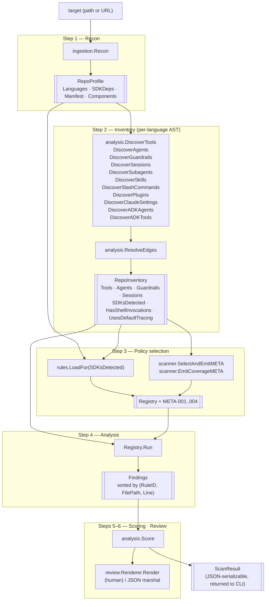
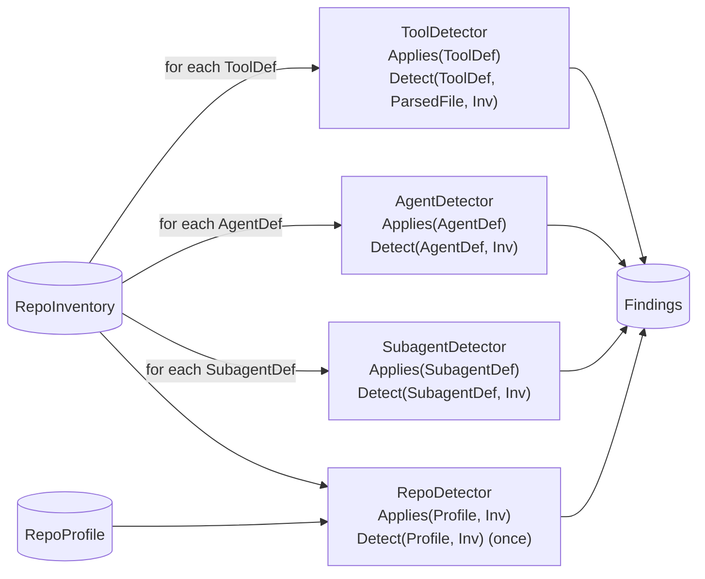
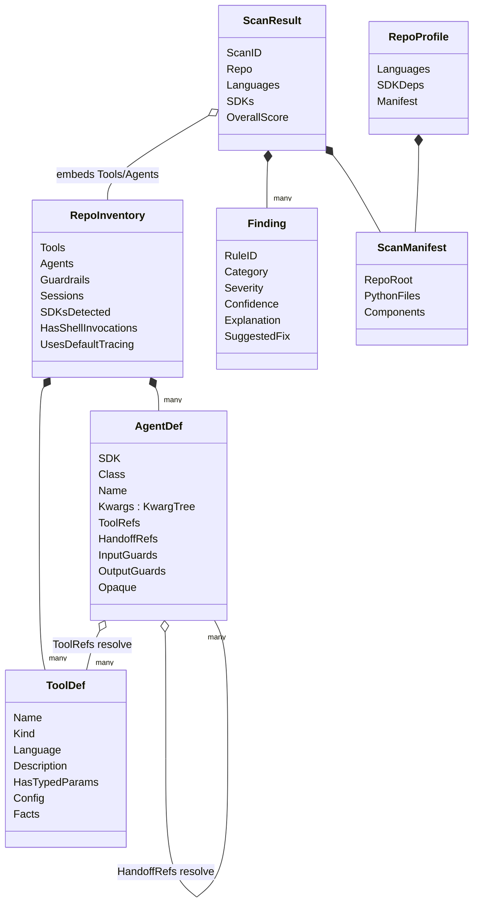

# Architecture

This document describes the concrete architecture of the Trustabl codebase as it
exists today. It is the implementer's reference: what each package owns, the
data that crosses package boundaries, and the decisions that shaped the layout.

For the broader product vision, see the design doc tracker — this file is
scoped to the Go binary in this repository.

---

## 1. Goal

Trustabl scans an agent SDK repository (Claude Agent SDK, OpenAI Agents SDK,
Google ADK, MCP), finds reliability weaknesses in its tool and agent
definitions, and reports them. A scan is read-only: it writes nothing into the scanned repo. The
output is a `ScanResult` — findings (each with an explanation, suggested fix,
and confidence), per-surface readiness scores, an overall score, and the
discovered inventory — rendered as a human summary or as JSON for CI.

Single Go binary, no network daemon. The one long-running mode is
`trustabl mcp`, a local stdio MCP server that is a thin frontend over the same
scan (§8.1) — it opens no socket and exposes no network surface. Web app and
hosted-API surfaces remain out of scope (see `README.md`).

The binary ships with **no embedded rules**. Detection rules live in a
separate git repository and are resolved at scan time (see §2 — Rule
resolution). This decouples rule updates from binary releases: rules can be
added or changed without rebuilding or redistributing the scanner.

---

## 1.1 Language scope

Trustabl ships with **Python and TypeScript tool/agent discovery** wired
in. Python covers the OpenAI Agents SDK, Google ADK, Claude Agent SDK
(via decorators), CrewAI, AutoGen / AG2, and Pydantic AI. TypeScript covers the Claude Agent SDK (via `tool()` /
`query()` / `createSdkMcpServer()` / typed-const `AgentDefinition` shapes
in `.ts`/`.tsx`/`.mts`/`.cts`) and the OpenAI Agents SDK (via `tool({...})`
/ `new Agent({...})` / `Agent.create({...})` / 9 hosted-tool factories
/ MCP server classes / `defineX` guardrail factories / `MemorySession` /
`OpenAIConversationsSession` / `OpenAIResponsesCompactionSession` in the
same TS file extensions, gated on imports from `@openai/agents`,
`@openai/agents-core`, or `@openai/agents-openai`), and the Google ADK
(via `new LlmAgent({...})` / `SequentialAgent` / `ParallelAgent` /
`LoopAgent` / `RoutedAgent` / `new FunctionTool({...})` / 13 hosted-tool
classes / `subAgents` edges in the same TS file extensions, gated on
imports from `@google/adk`). MCP-proper servers authored with
`@modelcontextprotocol/sdk` (`new McpServer(...)` + `registerTool` / `tool`)
are discovered in TS via `ts_mcp_proper.go`. LangChain / LangGraph is discovered
in both Python (the `@tool` decorator — import-routed to disambiguate from the
Claude SDK's `@tool` — plus `StructuredTool` / `Tool` factories,
`create_react_agent` / `create_agent` / `AgentExecutor`, and the `PythonREPLTool`
/ `ShellTool` built-ins) and TypeScript (the `tool(fn, {...})` factory,
`DynamicStructuredTool` / `DynamicTool`, and `createReactAgent` / `createAgent` /
`AgentExecutor`), import-gated to the `@langchain/*` / `langchain` / `langgraph`
ecosystem. Four further SDKs are wired in Python and TypeScript: CrewAI (Python —
`Agent(...)` import-gated to `crewai`, the `@tool` decorator import-routed, the
`Tool(fn)` factory, and the `CodeInterpreterTool` / `FileReadTool` built-ins),
AutoGen / AG2 (Python — `ConversableAgent` / `UserProxyAgent` / `AssistantAgent`
/ `GroupChat` / `GroupChatManager` / `CodeExecutorAgent` across the AG2 `autogen`
and Microsoft v0.4 `autogen_agentchat` import lines, plus `register_function`
and `@x.register_for_llm` / `@x.register_for_execution` tool registrations),
Pydantic AI (Python — `Agent(...)` import-gated to `pydantic_ai`, the
`@agent.tool` / `@agent.tool_plain` decorators import-routed with the Claude SDK
winning the collision, the `Tool(fn)` factory, and the `CodeExecutionTool` /
`WebFetchTool` native tools), and the Vercel AI SDK (TypeScript — the
`tool({...})` / `dynamicTool({...})` single-object factory, the call-based
`generateText` / `streamText` / `generateObject` / `streamObject` agents and the
class `ToolLoopAgent` / `Experimental_Agent`, with `tools` walked as an
object/record, plus the `<provider>.tools.*()` hosted tools — all gated on the
bare `ai` import). TypeScript rule packs now ship for
all six SDK surfaces: Claude SDK (CSDK-010/011/012/013/014/016 tool rules,
CSDK-120/130/131 agent rules), OpenAI Agents (OAI-016/017/019/022/024 tool
rules, OAI-105 agent rule), Google ADK (ADK-013/015/016 tool rules, ADK-109
agent rule), MCP (MCP-011/012/013/014 tool rules), LangChain
(LC-010/011/012/013/014 tool rules, LC-111 agent rule), and the Vercel AI SDK
(VAI-001..005 + VAI-011 tool rules, VAI-006/007/008 agent rules, VAI-012 repo rule). A TS
repo for any of these no longer produces a blanket META-004; the full
per-SDK/language matrix lives in COVERAGE.md. JavaScript
(`.js`/`.jsx`/`.mjs`/`.cjs`) is AST-parsed through the same TypeScript-family
pipeline: discovery stamps the shared `LanguageTypeScript`, then the scanner
re-tags JS-sourced defs to `LanguageJavaScript` after edge resolution
(`retagJavaScriptDefs`) so the inventory honestly names the source language
while the `language: typescript` rule packs still audit it (both ES `import` and
CommonJS `require()` bindings are recognized). Go has tree-sitter-go discovery
for MCP tools (mark3labs/mcp-go + the official modelcontextprotocol/go-sdk),
emitted as `ToolDef{Kind: mcp_tool, Language: go}` and audited by the
`language: go` rules in the mcp/ pack; other Go SDKs are recognized as files but
not yet AST-parsed. C# has tree-sitter-c-sharp discovery for the official
ModelContextProtocol SDK's `[McpServerTool]` methods, emitted as
`ToolDef{Kind: mcp_tool, Language: csharp}` and audited by the `language: csharp`
rules; other .NET agent SDKs (Semantic Kernel, AutoGen) are not yet parsed. PHP
has tree-sitter-php discovery for `#[McpTool]`-attributed methods (official
mcp/sdk + community php-mcp/server), emitted as
`ToolDef{Kind: mcp_tool, Language: php}` and audited by the `language: php`
rules; the smacker grammar parses single-line `#[...]` as a comment, so the
attribute is read from comment text (multi-line attributes are a gap). Rust has
tree-sitter-rust discovery for the official rmcp crate's `#[tool]`-attributed
methods, emitted as `ToolDef{Kind: mcp_tool, Language: rust}` and audited by the
`language: rust` rules; rmcp accepts a tool's description from either the
`description = "..."` attribute argument or the method's `///` doc comment, and
discovery honors both.

The rule schema's `language:` field gates per-language rule sets. Existing
rules declare `language: python` explicitly and the loader rejects any
unknown language value. TS-language rules declare `language: typescript`; the
language gate treats TypeScript and JavaScript as one family
(`models.IsTSOrJS`), so a `typescript` rule fires on `.js` too. Python rules
remain inert against TS/JS tools.

Adding a new tool-discovery language requires:

1. A tree-sitter binding for that language in `internal/analysis/astutil/`
   (done for TypeScript via `astutil/ts.go`).
2. Discovery patterns for that language's tool definitions in
   `internal/analysis/` (e.g. the Claude SDK `tool()` factory in TS — done
   for TS in `internal/analysis/ts_discovery.go`, `ts_agents.go`,
   `ts_mcp_servers.go`).
3. Per-language predicate implementations in `internal/rules/predicates.go`
   (since AST node types differ across languages).
4. New rule files under `<category>/` in the external `trustabl-rules`
   repository declaring `language: <new>`.

---

## 2. Pipeline

### Rule resolution (pre-pipeline) ([internal/rulesource/](internal/rulesource/))

Before the pipeline runs, `cmd/trustabl` resolves the detection rules. The
binary embeds none; `rulesource.Resolve` fetches them from the rules git
repository (`DefaultRepoURL`, currently
`https://github.com/trustabl/trustabl-rules`; overridable with
`--rules-repo` / `TRUSTABL_RULES_REPO`) via go-git and caches the clone under
`os.UserCacheDir()/trustabl/rules/<sha>/`, with a `current` pointer file
naming the active commit. The clone lands via a temp dir + atomic rename, and
the pack is named by the actually-cloned HEAD commit, so an interrupted clone
never leaves a partial pack and the recorded SHA always matches the content
(see `internal/rulesource/git.go`).

Resolution order:

1. Unless `--no-rules-update` is set, fetch the configured ref and clone it
   into the cache if not already present.
2. If the remote is unreachable (a remote-contact failure), fall back to the
   cached `current` rules and print a warning. A **local** install fault during
   the clone — disk full, permission denied, a failed rename, or a corrupt
   freshly-cloned repo — is *not* a fallback case: it is propagated as a hard
   error so stale cached rules never silently mask an operator-environment
   problem. (Internally these are tagged `fatalResolveError`; remote-contact
   failures are deliberately left untagged so they stay fallback-eligible.)
3. If no usable rules exist locally **and** none can be fetched, exit `2` and
   advise `trustabl rules pull`. The engine never runs rule-less.
4. After a successful resolve, the cache is pruned to a single active pack —
   the `<sha>/` for the newly recorded `current` plus the `current` pointer
   itself are kept; every other pack directory (and any stale `.tmp-clone-*`
   from interrupted clones) is removed. Pruning is best-effort and skips any
   entry modified within a grace window (`pruneGraceWindow`, 30 min): a pack a
   concurrent scan just materialized is read lazily via `os.DirFS` *after*
   resolve returns, so deleting it mid-read would fail that scan (notably on
   Windows). Fresh entries are therefore spared; only genuinely stale packs and
   abandoned temp-clone dirs from prior runs are removed. The cache still
   converges to one pack between runs because the same SHA is reused. Each
   installed pack carries a `.complete` sentinel written as the last step of the
   clone (before the atomic rename); `packExists` requires it, and pruning
   deletes the sentinel *first*, so a pack left half-deleted by an interrupted
   prune is markerless and re-cloned rather than trusted as a thinned ruleset.

The pack's `manifest.yaml` declares a `schema_version`. Resolution is
**forward-compatible**: a pack whose version *exceeds*
`rules.SupportedSchemaVersion` is **not** rejected — it is loaded leniently
(below) and flagged `SchemaNewer` so the CLI warns. Resolution refuses a pack
only when its manifest is missing / unparseable / non-positive
(`ErrNoCompatibleRules`). The resolved commit SHA is recorded on `ScanResult`
(`RulesSource`, `RulesVersion`, `RulesFromCache`, plus `RulesSchemaVersion` /
`RulesSchemaNewer`) and folded into `ScanID` along with the engine's
`SupportedSchemaVersion` (see §7). `trustabl rules pull` performs the same fetch
eagerly without scanning.

**Lenient rule loading (forward compatibility).** The deployed scanner loads the
pack via `rules.LoadLenient`: a rule that references a `scope`, an `applies_to`
value, or a `match` predicate this build does not understand (a rule from a newer
schema — e.g. a future `skill`-scoped rule on a binary that predates skill
support) is **dropped whole** — its ID collected into `ScanResult.RulesSkipped`,
surfaced as a stderr warning, and summarized in a single deterministic
`META-005` info finding in the report — and the scan proceeds with the rules it
understands. The unknown-value check (`rules.ruleNeedsNewerEngine`) is narrow: an
*empty* scope/applies_to is a missing required field, not a newer-engine signal,
so it still hard-fails. Likewise, a pack
whose `category` this build does not recognize — an SDK a *newer* rules release
added — is **skipped as a whole file** (its rule IDs collected into
`RulesSkipped` the same way) rather than hard-failing the entire load and taking
every other SDK's rules down with it; `models.ValidCategory` is the recognized
set, and strict load still rejects an unknown category so a typo is caught at
authoring. The whole rule is
dropped, not partially decoded, because a silently-omitted predicate would
collapse the rule's `match` to vacuous-true (firing on every entity). Authoring
and CI use the **strict** `rules.Load` (`KnownFields(true)`), so typos and bad
rules — including a malformed *known* rule (missing required field, out-of-range
confidence, duplicate ID) — are still caught against the in-repo fixture; the
runtime path degrades only for genuinely-newer rules, never for real authoring
errors, which it still hard-fails in both modes. The engine exits `2` only when *no* rule is usable: a genuinely empty
pack (`ErrNoRulesInPack`) or one whose every rule is forward-incompatible
(`ErrAllRulesIncompatible`, which hints "upgrade Trustabl"). This decouples
additive rule updates from binary upgrades — see the `SupportedSchemaVersion`
contract in [`internal/rules/schema_version.go`](internal/rules/schema_version.go).

### Progress reporting

`scanner.Run` takes an optional `Config.Progress` (`progress.Reporter`); nil
means no output. It emits phase events (clone for remote targets, recon
per-file, inventory per-file, analysis per-entity) that the CLI renders to
**stderr** — animated on a TTY, plain lines when piped, silent for JSON. (A
second optional stderr channel, `Config.Log`, carries `--verbose`/`--debug`
diagnostics — see the **Diagnostics** subsection below.) The
TTY renderer is a **live multi-row panel** (`internal/progress/tty.go`): every
stage is a row drawn together and repainted in place — finished rows show a green
`✔ <label>  <summary>`, the active row its spinner and (where a total is known) a
teal bar, a failed row a red `✗`. The completed panel is printed once via
`tea.Println` on quit so it persists in scrollback. In plain mode each phase
prints a start line (`[key] label…`) as well as its end summary, so a long
network pre-flight (rules resolution, remote clone) is never a blank screen. The
clone phase wraps `ingestion.Resolve` (gated on `ingestion.IsRemote`); local
targets resolve instantly and get no phase.

The remote clone shows an **accurate `receiving objects N/M` bar**. go-git's
high-level `PlainClone` cannot drive this — its `CloneOptions.Progress` writer
forwards only the server-side sideband (counting/compressing, the fast prep) and
reports nothing through the actual object download. So `ingestion.fetchTreeToDir`
does the shallow fetch at the **plumbing level**: an upload-pack session (HEAD,
depth 1), then it parses the returned packfile with a `packfile.Parser` whose
`Observer` fires `OnHeader(total)` and one `OnInflatedObjectHeader` per object —
driving `SetTotal` then `Advance` for a true bar. Because the scanner only needs
the working tree (not history), it then walks the wanted commit's tree and writes
each file blob to the temp dir (via `safeJoin`, which rejects path-escapes;
symlinks/submodules are skipped) rather than doing a full checkout. If the
plumbing fetch fails — notably private/SSH auth, which go-git's defaults cover —
it falls back to `PlainClone` (spinner only). `Reporter.SetDetail` is the
spinner-phase primitive for a status string with no count (clone's "connecting…"
/ "writing files…", and the rules pre-flight's "fetching <repo>" line).
`ingestion.Recon` and `DiscoverTools`
each take an `onFile` callback and `detectors.Registry.Run` takes an `onEntity`
callback to drive the per-item line; all are nil-able and do not affect
`ScanResult`. Recon has no upfront file total (the walk discovers it), so its
live line is a running counter rather than a bar; the callback fires both on the
tree walk and on the per-file body reads in component discovery (the slow span
on large repos). Progress never touches stdout, preserving the determinism
contract (§7).

### Diagnostics (`--verbose` / `--debug`)

Separate from progress (the phase UI) is **diagnostic logging**: opt-in
verbose/debug narration via a small leveled logger,
[`internal/logx`](internal/logx/logx.go). It is a leaf package (no project
imports) holding a `Logger` with three levels — `LevelNormal` (silent),
`LevelVerbose`, `LevelDebug` — and `Verbosef` / `Debugf` / `Enabled` / `Timer`
methods. A **nil `*logx.Logger` is a valid silent logger** (every method
short-circuits before touching a field), so `Config.Log` defaults to a safe
no-op. `Timer` reads no clock unless debug is on, so per-phase timing is free on
the normal path and cannot introduce a time-dependent value near the report.

The two flags are **persistent (global)** on the root command (`-v`/`--verbose`,
`--debug`; `--debug` implies verbose), resolved by `logLevelFor(cmd)`. `scan`
wires the logger fully (`scanner.Config.Log`), narrating each pipeline phase —
rule provenance, recon/inventory/policy/analysis counts, detected and unaudited
SDKs, per-entity and per-finding detail (debug, capped at 50), output
destinations, and a result summary; `mcp` and `rules pull` wire it lightly. Like
progress, **diagnostics are stderr-only** and never feed `ScanResult`, so the
report stays byte-stable even under `--format json --debug`. Diagnostic color is
gated by `diagColor` (off under `--no-color`, `NO_COLOR`, or a non-terminal
stderr), matching the report's color contract.

Because an animated TTY panel repaints in place, interleaving log lines into that
region on the same stderr corrupts both. `pickScanMode` therefore calls
`modeForLogs`, which **downgrades `ModeTTY` to `ModePlain` whenever verbose is
on** (other modes pass through). A verbose run thus always takes the synchronous
path, so the logger and the plain reporter write to stderr in order from one
goroutine.

### Steps

The scan is a flat sequence of steps. There is no concurrency between steps and
no state shared across runs. `scanner.Run` ([internal/scanner/scanner.go](internal/scanner/scanner.go))
receives the resolved rules as an `fs.FS` on its `Config` and calls each step
in order; the output of one is the typed input to the next.



The four scopes a rule can fire at — `tool`, `agent`, `subagent`, `repo` — flow into
`Registry.Run` from the same `RepoInventory`, but each detector consumes a
different typed input:



### Step 1 — Recon ([internal/ingestion/normalizer.go](internal/ingestion/normalizer.go))

`ingestion.Resolve` resolves a CLI target to a directory on disk (cloning
remote repos). `ingestion.Recon` then walks the source tree and returns a
`RepoProfile`:

- **Languages** detected (by file extension).
- **SDK dependencies declared** — text search in `pyproject.toml` /
  `requirements.txt` / `Pipfile` / `poetry.lock` / `package.json` / `go.mod`
  for known SDK package names. Each hit becomes a typed `SDKDep{Name, Source}`.
- **`ScanManifest`** — per-language file paths and discovered agent components.

Recon must stay cheap. No tree-sitter parses here.

### Step 2 — Inventory ([internal/analysis/](internal/analysis/))

For each language recon cleared, do the AST work and produce a `RepoInventory`:

- **DiscoverTools** (`discovery.go`) — two-pass Python discovery (decorated
  functions and bare shell-invoking functions). Also captures decorator kwargs
  into `ToolDef.Config` for rules that inspect `@function_tool(strict_mode=...)`.
- **DiscoverAgents** (`agents.go`) — finds `Agent(...)` / `SandboxAgent(...)` /
  `AgentDefinition(...)` constructor calls; captures all constructor kwargs into
  a typed `KwargTree`; sets `Opaque=true` for `Agent(**config)` or
  `tools=<non-literal>`.
- **DiscoverGuardrails** — finds `@input_guardrail` / `@output_guardrail`
  decorated functions.
- **DiscoverSessions** — finds construction sites for `*Session` classes from
  the agents SDK.
- **DiscoverSubagents** (`subagents.go`) — **hybrid** discovery in two passes.
  Pass 1 reads every `.claude/agents/*.md` component (matched at any path depth
  — monorepos that nest agent projects under `agent/.claude/agents/` or
  `packages/x/.claude/agents/` are handled). Pass 2 is a **frontmatter-shape
  fallback** over every `manifest.MarkdownFiles` entry not already emitted: a
  markdown file that is not a `SKILL.md`, not under `.claude/commands/`, and not
  template scaffolding (`TEMPLATE.md` / `*-template.md`, whose subagent-shaped
  frontmatter is a fill-in example, not a live declaration), with frontmatter
  carrying a `name` and at least one of `tools`/`model`, is treated as a
  subagent. This catches flat collections (e.g.
  `VoltAgent/awesome-claude-code-subagents` stores 150+ subagents under
  `categories/<NN>/*.md`, never `.claude/agents/`). The shape gate is
  deliberately tight to avoid mislabelling generic docs; canonical-path files
  (pass 1) skip the gate, since a `.claude/agents/` file with no tools/model
  still inherits the parent's grants. Each emitted `SubagentDef` captures the
  security-relevant frontmatter: `tools` (verbatim) + `ToolGrants` (parsed via
  the permission grammar — bare, parametered `Bash(...)`, or `mcp__server__tool`
  forms), `disallowedTools`, `permissionMode` (incl. `bypassPermissions`),
  `mcpServers`, `skills`, `isolation`, and `HasHooks` (true only when `hooks:`
  is a non-empty mapping). Files without frontmatter, with malformed YAML, or
  with no `name` are skipped silently. The `tools:` field accepts both the
  comma/space-separated scalar form and the YAML-list form.
- **DiscoverSkills** (`skills.go`) — emits one `SkillDef` per `SKILL.md`
  (identified by basename at any depth: `.claude/skills/<name>/SKILL.md`,
  plugin `skills/`, nested monorepo skills). Captures `name`, `description`,
  `allowed-tools` (space-separated or YAML-list, parsed into `ToolGrants`),
  `argument-hint`, and `disable-model-invocation`. No frontmatter or no `name`
  → skipped.
- **DiscoverSlashCommands** (`slash_commands.go`) — emits one
  `SlashCommandDef` per `ComponentSlashCommand` component. Recon tags those
  at two path shapes: the canonical `.claude/commands/*.md` (any depth) AND
  `<plugin-root>/commands/*.md` whenever `<plugin-root>` has a sibling
  `.claude-plugin/plugin.json` (the layout used by plugin-distribution repos
  such as `wshobson/agents`). The candidate-plugin-root set is derived once
  in `discoverComponents` via `pluginRootSet`; `isPluginSlashCommand` gates
  on it so a `commands/` directory without a sibling plugin manifest is NOT
  swept up. The command name is the file basename without extension (Claude
  Code derives the command from the path, not frontmatter). Frontmatter
  (`description`, `allowed-tools`, `model`, `argument-hint`,
  `disable-model-invocation`) is parsed when present; a command **without**
  frontmatter is still emitted (its body is the prompt — only name + location
  populated).
- **DiscoverPlugins** (`plugins.go`) — JSON-parses `.claude-plugin/plugin.json`
  and `marketplace.json` into `PluginManifest` records. A file with a non-empty
  `plugins[]` array is a `marketplace` (its entries carry `name` + `source`);
  otherwise a plain `plugin`. Each plugin entry's `source` field is captured
  as `json.RawMessage` because real-world marketplaces use *both* the string
  form (`"./local-path"`) and an object form
  (`{"source":"git-subdir","url":"…","path":"…"}` for external git refs).
  `normalizePluginSource` collapses each value into a single human-readable
  string preserved on `PluginEntry.Source`: a plain string stays as-is; a
  recognized object becomes `<source>:<url>#<path>` (so the trust category
  survives the round-trip); any other shape falls back to raw JSON so nothing
  is silently dropped. A typed `string` field here previously failed
  `json.Unmarshal` on the object form and silently dropped the entire
  manifest. Malformed JSON is still skipped silently. (The recon walk descends
  into `.claude-plugin/` — it is whitelisted alongside `.claude/` against the
  dot-prefixed-dir skip.)
- **DiscoverClaudeSettings** (`claude_settings.go`) — JSON-parses every
  `.claude/settings.json` (and `settings.local.json`) component into a typed
  `ClaudeSettings`. The `permissions` block's allow/deny/ask lists are
  decomposed via `ParsePermissionRule` into typed `PermissionRule` records
  (`Tool`, `Pattern`, `Raw`) using the grammar `<Tool>` | `<Tool>(<pattern>)`
  plus the literal MCP-tool form `mcp__<server>__<tool>`. Malformed JSON is
  skipped silently.
- **DiscoverClaudeAgentOptions** (`claude_agent_options.go`) — finds every
  `ClaudeAgentOptions(...)` construction in parsed Python and captures its
  constructor kwargs into a `ClaudeAgentOptionsDef` (carried on
  `RepoInventory.ClaudeAgentOptions`). This is the claude-agent-sdk session
  config object; its `permission_mode` is the in-code analogue of
  settings.json `defaultMode`, read by `repo_claude_options_permission_mode_is`
  (CSDK-202). Its presence also marks the repo `claude_agent_sdk` so the pack
  loads for options-only repos.
- **DiscoverADKAgents** (`adk_agents.go`) — finds `LlmAgent(...)`,
  `SequentialAgent(...)`, `ParallelAgent(...)`, `LoopAgent(...)`,
  `LanggraphAgent(...)`, and the `Agent(...)` alias (normalized to `LlmAgent`
  in the emitted `AgentDef.Class`) in files that import from `google.adk`.
  The import gate is AST-based — it walks `import` / `from … import` nodes, so
  a comment or string literal that merely mentions `google.adk` does not trip
  it — and prevents the bare `Agent` class name from colliding with OpenAI's
  identically-named class. All constructor kwargs are captured into a
  typed `KwargTree`; `Agent(**config)` or `sub_agents=<non-literal>` sets
  `Opaque=true`.
- **DiscoverADKTools** (`adk_agents.go`) — finds `FunctionTool(symbol)` calls
  and resolves the argument to a same-file top-level function definition. Each
  resolved match emits a `ToolDef` with `Kind=adk_function_tool`. Cross-module
  resolution is out of scope.
- **DiscoverTSTools** (`ts_discovery.go`) — TS Claude SDK `tool(name,
  description, zodSchema, handler, extras?)` factory calls. Captures `Name`
  (arg 0), `Description` (arg 1), `ParamNames` from the Zod schema top-level
  keys, handler body facts via shared `tsHandlerFacts` (`shells_out`,
  `http_call`, `dynamic_url`), and extras flattened into `Config`. Sets
  `VarName` from the enclosing `const x = tool(...)` binding.
- **DiscoverTSAgents** (`ts_agents.go`) — TS Claude SDK agent shapes:
  one `AgentDef` per `query({...})` call (`Class="QueryMainAgent"`), each
  property under `options.agents` (`Class="AgentDefinition"`), and each
  typed-const `const x: AgentDefinition = {...}` binding. Captures kwargs
  into `KwargTree`; sets `Opaque=true` when `options` is a computed
  identifier.
- **DiscoverTSMCPServers** (`ts_mcp_servers.go`) — TS Claude SDK MCP
  servers: `createSdkMcpServer({...})` calls plus object literals in
  `options.mcpServers` discriminated by `type:` into
  `McpStdioServerConfig` / `McpSSEServerConfig` / `McpHttpServerConfig` /
  `McpSdkServerConfigWithInstance`. This is the Claude *client-side* server
  config (emits `MCPServerDef`), NOT MCP-proper server authoring.
- **DiscoverTSMCPProper** (`ts_mcp_proper.go`) — MCP *server authoring* with
  `@modelcontextprotocol/sdk`: tracks variables bound to `new McpServer(...)` /
  `new Server(...)` (import-gated to `.../server/{mcp,index}.js`), then emits a
  `ToolDef{Kind: mcp_tool, Language: typescript}` per `registerTool(name,
  config, handler)` and legacy `tool(...)` call on a tracked server var.
  Reuses `tsZodParamNames` (from `inputSchema`) and `tsHandlerFacts` (handler
  body facts). Receiver-aware so a non-server `.tool(...)` is not
  mis-attributed. Emitting `KindMCPTool` routes through the existing
  `SDKMCP` → `mcp` pack plumbing. Low-level `Server` + `setRequestHandler`
  tools are not extracted (gap).
- **DiscoverTSOpenAITools** (`ts_openai_tools.go`) — `tool({...})` factory calls
  from `@openai/agents` / `-core` / `-openai`. Captures `name`/`description`
  (registered name), `parameters` top-level keys as `ParamNames`, handler body
  facts via shared `tsHandlerFacts`, and option fields (`strict`, `needsApproval`,
  `timeoutMs`, etc.) into `Config`. Sets `VarName` from the enclosing
  `const x = tool({...})` binding.
- **DiscoverTSOpenAIAgents** (`ts_openai_agents.go`) — `new Agent({...})` and
  `Agent.create({...})`. Captures all option-object kwargs into a typed
  `KwargTree`; sets `Opaque=true` for non-object arg or `...spread` inside
  options. Walks `tools: [...]` at discovery to pre-resolve hosted-tool
  factory calls (the alias map is local to this pass); leaves identifier-valued
  refs in `tools`/`handoffs`/`inputGuardrails`/`outputGuardrails`/`mcpServers`
  for `ResolveEdges` to wire by binding name.
- **DiscoverTSOpenAIMCPServers** (`ts_openai_mcp_servers.go`) —
  `new MCPServerStdio({...})` / `MCPServerSSE` / `MCPServerStreamableHttp` /
  `MCPServers`. Emits `MCPServerDef` with `Transport` ∈ `stdio`/`sse`/
  `streamable_http`/`multi` and `VarName` from the enclosing `const`.
- **DiscoverTSOpenAIGuardrails** (`ts_openai_guardrails.go`) —
  `defineInputGuardrail` / `defineOutputGuardrail` / `defineToolInputGuardrail`
  / `defineToolOutputGuardrail` factory calls. Emits `GuardrailDef` with
  `Kind` ∈ `input`/`output`/`tool_input`/`tool_output` and `VarName` from
  the enclosing `const`.
- **DiscoverTSOpenAISessions** (`ts_openai_sessions.go`) — `new MemorySession()`
  / `new OpenAIConversationsSession()` / `new OpenAIResponsesCompactionSession()`
  / `startOpenAIConversationsSession()`. Emits `SessionUse` with `Class` set
  to the canonical name.
- **DiscoverTSADKTools** (`ts_adk_tools.go`) — `new FunctionTool({...})` constructor
  calls from `@google/adk`. Captures `name`/`description` from options string
  literals, `parameters` top-level keys as `ParamNames`, handler body facts
  via shared `tsHandlerFacts`, and other leaf option fields (`isLongRunning`,
  etc.) into `Config`. Sets `VarName` from the enclosing
  `const x = new FunctionTool({...})` binding. Reuses the existing
  `KindADKFunctionTool` kind — language field distinguishes the JS
  options-object shape from Python's function-wrapper shape.
- **DiscoverTSADKAgents** (`ts_adk_agents.go`) — `new LlmAgent({...})` /
  `SequentialAgent` / `ParallelAgent` / `LoopAgent` / `RoutedAgent` (5
  classes; no `Agent` alias unlike Python ADK). Captures option-object
  kwargs into a typed `KwargTree`; sets `Opaque=true` for non-object arg or
  `...spread` inside options. Walks `tools: [...]` at discovery to
  pre-resolve hosted-tool class instantiations against
  `TSADKHostedToolClasses` (13 entries); leaves identifier-valued refs in
  `tools` / `subAgents` for `ResolveEdges` to wire by binding name.
- **DiscoverLangChainTools / DiscoverLangChainAgents** (`langchain_tools.go`,
  `langchain_agents.go`) — Python LangChain / LangGraph. The `@tool` decorator
  (shared with the Claude SDK) is routed in `discovery.go`'s `kindFromDecorators`
  by the **import binding** of the `tool` symbol (`collectToolImports`): `tool`
  bound from a langchain module → `KindLangChainTool`, from `claude_agent_sdk` →
  Claude, last-binding-wins on shadowing — correct for any mix of the two SDKs. A
  file-level import-presence check is the fallback for the unresolvable case (a
  star-import or a locally defined `tool`). `StructuredTool` / `Tool` factories
  (and `.from_function`) are recognized here, with the wrapped function resolved so
  body predicates scan the implementation. Agents: `create_react_agent` /
  `create_agent` / `AgentExecutor` → normalized Class `ReactAgent` / `CreateAgent`
  / `AgentExecutor`; the positional `tools` argument (index 1) is captured as a
  synthetic kwarg. `langchain_hosted_tools.go` classifies the `PythonREPLTool` /
  `PythonAstREPLTool` / `ShellTool` / `Requests*` built-ins in an agent's tool list
  as `HostedToolDef`s (SDK `langchain`).
- **DiscoverTSLangChainTools / DiscoverTSLangChainAgents** (`ts_langchain_tools.go`,
  `ts_langchain_agents.go`) — TS LangChain. Tools: `tool(fn, {...})` (config at
  arg 1, unlike OpenAI's arg-0), `new DynamicStructuredTool({...})`,
  `new DynamicTool({...})`; the import gate is prefix-matched via
  `astutil.TSImportAliasesMatch` to cover the many `@langchain/*` subpaths. Agents:
  `createReactAgent` / `createAgent` / `new AgentExecutor`. Reuses
  `tsZodParamNames` / `tsHandlerFacts`.
- **DiscoverCrewAIAgents** (`crewai_agents.go`) — Python CrewAI `Agent(...)`
  constructor calls, import-gated (AST-based) to the `crewai` / `crewai_tools`
  ecosystem so the bare `Agent` name does not collide with the OpenAI Agents SDK
  or Google ADK classes (`agentKindMatches("crewai_agent")` keys on both SDK and
  Class). All kwargs captured into a typed `KwargTree`; the label falls back from
  `name=` to `role=` to the assignment-target variable. CrewAI `@tool` tools are
  routed in `discovery.go`'s `kindFromDecorators` (import-routed, below); the
  `Tool(fn)` factory and the `CodeInterpreterTool` / `FileReadTool` built-ins are
  resolved in `crewai_hosted_tools.go` during `ResolveEdges`. `class X(BaseTool)`
  and `Crew(...)` are v1 gaps.
- **DiscoverAutoGenAgents / DiscoverAutoGenTools** (`autogen_agents.go`,
  `autogen_tools.go`) — Python AutoGen / AG2, import-gated to **either** upstream
  line (AG2 `autogen` / `autogen.*`; Microsoft v0.4 `autogen_agentchat` /
  `autogen_core` / `autogen_ext`); `agentKindMatches` keys on both SDK and Class
  so the colliding `AssistantAgent` / `GroupChat` never cross-match. Agents: the
  6 constructors `ConversableAgent` / `UserProxyAgent` / `AssistantAgent` /
  `GroupChat` / `GroupChatManager` / `CodeExecutorAgent`, with the nested
  `code_execution_config={...}` dict descended so dotted-path lookups reach
  `code_execution_config.use_docker`. Tools: `register_function(fn, ...)` (a call,
  not a decorator — resolves the first positional ident to a same-file function)
  and the stacked attribute decorators `@<x>.register_for_llm` /
  `@<x>.register_for_execution` (an attribute callee, so `kindFromDecorators` does
  not classify it — this pass walks `decorated_definition` nodes itself). The
  v0.4 executor-class surface (AG2-003), the `register_function` caller/executor
  edge, and an AG2 bare-name `@tool` arm are v1 gaps.
- **DiscoverPydanticAIAgents / DiscoverPydanticAITools** (`pydantic_ai_agents.go`,
  `pydantic_ai_tools.go`) — Python Pydantic AI, import-gated to `pydantic_ai` so
  the bare `Agent` name (normalized to Class `PydanticAgent`) does not collide
  with OpenAI / ADK / CrewAI. Agents: `Agent(...)` with all kwargs captured;
  `VarName` captured so the `@agent.tool` owner and `tools=[...]` references
  resolve. Tools: the `@agent.tool` / `@agent.tool_plain` attribute decorators
  (routed in `discovery.go`'s `kindFromDecorators`, import-gated and
  Claude-disambiguated, below) and the `Tool(fn)` factory (gated on `pydantic_ai`
  AND NOT LangChain, since LangChain ships an identically-named `Tool(...)`). The
  `CodeExecutionTool` / `WebFetchTool` / `UrlContextTool` / `WebSearchTool` native
  tools under `capabilities=` / `builtin_tools=` (the modern `NativeTool(...)`
  wrapper unwrapped one level) are classified in `pydantic_ai_hosted_tools.go`
  during `ResolveEdges`. PYD-104 (`force_download`), the bare-`tools=[fn]` ToolDef
  shape, and the `RunContext` param-strip for PYD-002 are v1 gaps.
- **DiscoverTSVercelTools / DiscoverTSVercelAgents** (`ts_vercel_tools.go`,
  `ts_vercel_agents.go`, `ts_vercel_hosted_tools.go`) — TS Vercel AI SDK,
  import-gated to the bare `ai` core module (the disambiguator from the
  identically-named Claude / OpenAI / LangChain `tool()` factories). Tools: the
  `tool({...})` / `dynamicTool({...})` single-object factory (arg 0 is the options
  object, unlike LangChain's arg-1 config); the tool NAME comes from the agent's
  tools-record key, so `ToolDef.Name` is empty and `VarName` carries the binding.
  Agents: the call-based `generateText` / `streamText` / `generateObject` /
  `streamObject` (emitted only when the options object carries a `tools` property)
  and the class `ToolLoopAgent` / `Experimental_Agent` (often imported `as Agent`).
  In both forms `tools` is an OBJECT / RECORD walked by property value (not a
  `[...]` array like every other TS pass): bare identifier → `ToolRef`; inline
  `tool({...})` / spread / other → agent `Opaque`; `<provider>.tools.<name>()` →
  `HostedToolRef` (canonicalized in `ts_vercel_hosted_tools.go`). `.js` / `.mjs`
  / `.cjs` apps are now AST-parsed via the shared TS-family pipeline (ES `import`
  and CommonJS require() bindings); VAI-009/010 (name
  rules) are v1 gaps.
  VAI-011 (HTTP-call-without-timeout) ships via the structural
  `has_http_call_without_timeout` predicate.
- **DiscoverGoMCPTools** (`go_mcp.go`) — Go MCP tools parsed with tree-sitter-go
  (a dedicated parse pass, `parseGoFiles`), import-gated to the mcp-go modules
  (mark3labs/mcp-go + the official modelcontextprotocol/go-sdk). Two shapes:
  mark3labs `mcp.NewTool("name", mcp.WithDescription(...), mcp.WithString(...))`
  (name + description + typed params from the `WithX` builders) and the official
  `mcp.AddTool(server, &mcp.Tool{Name, Description}, fn)` (name + description from
  the composite literal). Emits `ToolDef{Kind: mcp_tool, Language: go}`, so
  deriveSDKsDetected stamps SDKMCP and the mcp/ pack's `language: go` rules
  (MCP-015/016) audit them. metoro-io/mcp-golang's reflection-based
  `RegisterTool`, the official SDK's handler-struct param schema, and Go
  body-fact predicates are v1 gaps.
- **DiscoverCSharpMCPTools** (`csharp_mcp.go`) — C# MCP tools parsed with
  tree-sitter-c-sharp (a dedicated parse pass, `parseCSharpFiles`), gated to
  files that `using` a ModelContextProtocol namespace. Recognizes the official
  SDK's `[McpServerTool]`-attributed methods: name = the method name, description
  from a co-located `[Description("...")]` attribute, params from the method
  signature (typed — C# is statically typed). Emits
  `ToolDef{Kind: mcp_tool, Language: csharp}`, so deriveSDKsDetected stamps
  SDKMCP and the mcp/ pack's `language: csharp` rules (MCP-017/018) audit them.
  The `[McpServerTool(Name=...)]` override and the Semantic Kernel
  `[KernelFunction]` / AutoGen `[Function]` shapes are v1 gaps.
- **DiscoverPHPMCPTools** (`php_mcp.go`) — PHP MCP tools parsed with
  tree-sitter-php (a dedicated parse pass, `parsePHPFiles`), gated to files whose
  `use` statements reference an `Mcp` namespace (covers the official `Mcp\...`
  and community `PhpMcp\...` roots). Recognizes `#[McpTool]`-attributed methods:
  name from the attribute's `name:` argument (falling back to the method name),
  description from its `description:` argument, params + typed-params from the
  method signature (PHP type hints are optional, so `HasTypedParams` is real
  signal). The smacker grammar does not model PHP 8 attributes — a single-line
  `#[...]` is parsed as a `comment` node — so the attribute is read from the
  comment text immediately preceding the method via regex. Emits
  `ToolDef{Kind: mcp_tool, Language: php}`, so deriveSDKsDetected stamps SDKMCP
  and the mcp/ pack's `language: php` rules (MCP-019/020) audit them. Multi-line
  `#[...]` attributes, `#[McpResource]` / `#[McpPrompt]`, and PHP body-fact
  predicates are v1 gaps.
- **DiscoverRustMCPTools** (`rust_mcp.go`) — Rust MCP tools parsed with
  tree-sitter-rust (a dedicated parse pass, `parseRustFiles`), gated to files that
  `use` the rmcp crate. Recognizes the official rmcp SDK's `#[tool]`-attributed
  methods: name = the `name = "..."` arg (or the method name), description = the
  `description = "..."` arg **or** the method's `///` doc comment (rmcp derives it
  from either), params from the signature (typed — Rust is statically typed).
  Unlike PHP, tree-sitter-rust models `#[tool]` as a real `attribute_item`
  preceding-sibling node, so no comment-text hack is needed. Emits
  `ToolDef{Kind: mcp_tool, Language: rust}`, so deriveSDKsDetected stamps SDKMCP
  and the mcp/ pack's `language: rust` rules (MCP-021/022) audit them. Raw-string
  descriptions, `#[prompt]` / resource shapes, and Rust body-fact predicates are
  v1 gaps.
- **ResolveEdges** — links agent `tools=`, `handoffs=`, `input_guardrails=`
  references to discovered definitions in the same repo; cross-module resolution
  uses import statements; unresolvable references are flagged `External=true`.
  Hosted-tool dispatch is SDK-aware: OpenAI agents are matched against
  `HostedToolClasses` (11 classes); Google ADK agents against
  `ADKHostedToolClasses` (13 classes, `adk_hosted_tools.go`); CrewAI agents
  against `CrewAIHostedToolClasses` (13 classes, `crewai_hosted_tools.go`); and
  Pydantic AI agents against `PydanticAIHostedToolClasses` (4 classes,
  `pydantic_ai_hosted_tools.go`) — but Pydantic native tools live under the
  `capabilities=` / `builtin_tools=` kwargs, NOT the generic `tools=` list, so
  `ResolveEdges` scans those two kwargs for Pydantic agents (unwrapping the modern
  `NativeTool(...)` wrapper one level). Each match emits a `HostedToolDef` record
  and a parallel `HostedToolRefs` edge on the owning agent. For Google ADK agents, `FunctionTool(symbol)` references
  inside `tools=[...]` are unwrapped and resolved to same-file `ToolDef`s before
  the hosted-tool check. `sub_agents=[...]` kwargs on ADK agents are resolved
  into `HandoffRefs` pointing to same-file `AgentDef`s. `mcp_servers=[...]` is
  processed for MCP server constructors (`MCPServerStdio`, `MCPServerSse`,
  `MCPServerStreamableHttp`) — both inline calls and aliases bound by
  `async with X() as srv:`. Each match becomes an `MCPServerDef` and an entry in
  `MCPServerRefs`. After all agents are processed, `inv.HostedTools` and
  `inv.MCPServers` are sorted by `(FilePath, Line, Class)` and
  `HostedToolRefs`/`MCPServerRefs.Resolved` pointers are re-resolved to the
  post-sort positions. TS OpenAI tool/MCP/guardrail refs use a Name+VarName
  double-indexed lookup so `tools: [computeSum]` resolves when
  `const computeSum = tool({name: "sum", ...})`. The same block recognizes
  TS ADK `subAgents` (camelCase) when the agent's Language is TypeScript,
  and the TS HostedTool-materialization step stamps `SDKGoogleADK` for
  classes in `TSADKHostedToolClasses`. HandoffRefs are resolved by a
  language-agnostic pass (mirrors the existing ToolRefs/MCP/guards passes).

**Discovered agent components** (`Components []AgentComponent`).

The normalizer enumerates non-tool agent artifacts so users see the full
agent surface, even though detection rules currently only run against
tools. Component kinds:

| Kind                  | What it matches                                                |
| --------------------- | -------------------------------------------------------------- |
| `mcp_config`          | `mcp.json`, `mcp_servers.json`, `claude_desktop_config.json`   |
| `claude_md`           | `CLAUDE.md` / `claude.md` at any depth                         |
| `agents_md`           | `AGENTS.md` / `agents.md` at any depth (vendor-neutral)        |
| `claude_settings`     | `.claude/settings.json`, `.claude/settings.local.json`         |
| `subagent`            | `.claude/agents/*.md` at any path depth                        |
| `skill`               | `SKILL.md` at any depth (`.claude/skills/`, plugin `skills/`, nested) |
| `slash_command`       | `.claude/commands/*.md`, plus `<plugin-root>/commands/*.md` when `<plugin-root>` has a sibling `.claude-plugin/plugin.json` |
| `plugin_manifest`     | `.claude-plugin/plugin.json`, `.claude-plugin/marketplace.json` |
| `hook_script`         | `hooks/*.{py,ts,js,jsx,mjs}`                                   |
| `sandbox_policy`      | `openshell/*.yaml` / `openshell/*.yml`                         |
| `system_prompt`       | `prompts/*.md`, `system_prompt.md`, `system_prompt.txt` (root) |
| `dependency_manifest` | `pyproject.toml`, `requirements.txt`, `Pipfile`, `poetry.lock`, `package.json`, `go.mod` |
| `claude_agent_definition` | Python file importing `claude_agent_sdk` AND containing an `AgentDefinition(` call |

Each `AgentComponent` carries `Path` (relative to repo root, normalized to
forward slashes) and `Language` (set for code components, empty for
configs / prompts).

**Directory skip rules.** Skips `.git`, `.venv`, `venv`, `node_modules`,
`__pycache__`, `dist`, `build`, `.tox`, `.mypy_cache`, `.pytest_cache`, and
any other dot-prefixed directory — **except `.claude/` and `.claude-plugin/`**,
both deliberately-included agent-config directories (`.claude/` holds
agents/skills/commands/settings; `.claude-plugin/` holds plugin/marketplace
manifests). See `shouldSkipDir` in `normalizer.go`.

Manifest fields are emitted as JSON in `ScanResult.manifest` for CI consumers;
the Go pipeline does not currently branch on them.

#### Discovery detail ([internal/analysis/discovery.go](internal/analysis/discovery.go))

Two-pass discovery over each Python file. tree-sitter is used because we need
structural recognition (decorator nodes, function bodies, call shapes) rather
than just text matching.

1. **Decorated functions.** A `decorated_definition` is classified in
   `kindFromDecorators` by each decorator's *resolved callee path* (the
   identifier or dotted attribute after `@`, with any call arguments stripped),
   not by a substring of the raw decorator text:

   | Decorator callee                  | ToolKind              | Notes                       |
   | --------------------------------- | --------------------- | --------------------------- |
   | `function_tool` (any args)        | `KindOpenAITool`      | OpenAI Agents SDK           |
   | bare `tool` / `claude_tool` bound by import | resolved SDK | The unqualified `@tool` is shared by the Claude SDK, LangChain, and CrewAI; `collectToolImports` resolves it to `KindClaudeSDKTool` / `KindLangChainTool` / `KindCrewAITool` by the **import binding** of the `tool` symbol (last-binding-wins), with a file-level import-presence fallback for a star-import / locally defined `tool` |
   | `<agentvar>.tool`, `<agentvar>.tool_plain` (attribute) | `KindPydanticAITool` | Pydantic AI context tools — routed ONLY when the file imports `pydantic_ai` AND does NOT import the Claude SDK (the `&& !claudeImport` guard is load-bearing: the Claude SDK also exposes `@agent.tool`, so a Claude-only file and a both-importing file fall through to the `agent.tool` → Claude case below) |
   | `agent.tool`, or a callee containing `claude_agent_sdk` | `KindClaudeSDKTool` | Claude Agent SDK (pre-1.0 — names still in flux); wins the `@agent.tool` collision with Pydantic |
   | `server.tool`, `mcp.tool`, `*.register_tool` | `KindMCPTool`  | MCP server registrations    |
   | (none of the above)               | `KindUnknown`         | Falls through to shell pass |

   Matching the exact callee rather than a substring is what keeps unrelated
   user decorators (`@tool_registry.register`, `@toolbar`) from being
   misclassified as Claude-SDK tools and firing tool rules on non-tool code.
   Discovery is conservative — when in doubt, return `KindUnknown` and let the
   function be considered for shell discovery.

2. **Bare functions that shell out.** Any `function_definition` not already
   captured above whose body calls `subprocess.*`, `os.system`, or `os.popen`
   is a `KindShellInvocation`. These set `RepoInventory.HasShellInvocations`
   (and the mirror field on `ScanResult`); they do **not** appear in
   `SDKsDetected`, because "openshell" is a risk-surface label, not a library
   you import. Repo-scope rules with `applies_to: [openshell]` are gated on
   `HasShellInvocations`; the `repo_has_sdk_in_code` predicate routes the
   string `"openshell"` to the same field. The OpenShell detection rules
   that previously consumed these tools moved to a closed-source companion
   project.

Each `ToolDef` carries a `Language`. Tools discovered by the Python pass in
`discovery.go` carry `Language: python`; the TypeScript discovery in `ts_*.go`
(`ts_discovery.go`, `ts_openai_tools.go`, `ts_adk_tools.go`) sets
`Language: typescript`. The docstring/param extraction described below is the
Python path; the TS paths populate the same fields from their own AST shapes.

The function's docstring is extracted via `astutil.FunctionDocstring`, which
calls `stripPythonStringLiteral` to handle prefixes (r/b/u/f and 2-char
combinations) and triple-vs-single quote markers. Parameter names come from
`astutil.FunctionParams`; `self`/`cls` are dropped. `HasTypedParams` is set if
any parameter is type-annotated (`typed_parameter` or `typed_default_parameter`
in tree-sitter terms).

### Steps 3–4 — Policy selection and analysis ([internal/rules/](internal/rules/) + [internal/analysis/detectors/](internal/analysis/detectors/))

Detection is **YAML-driven**. The `internal/analysis/detectors` package owns
four typed interfaces and the `Registry` runtime; concrete detectors are
produced by `internal/rules` from the YAML policy files resolved out of the
external rules repository (see §2 — Rule resolution).

```go
// ToolDetector fires against one ToolDef at a time.
type ToolDetector interface {
    RuleID() string
    Category() models.DetectorCategory
    Applies(models.ToolDef) bool
    Detect(models.ToolDef, analysis.ParsedFile, models.RepoInventory) []models.Finding
}

// AgentDetector fires against one AgentDef at a time.
type AgentDetector interface {
    RuleID() string
    Category() models.DetectorCategory
    Applies(models.AgentDef) bool
    Detect(models.AgentDef, models.RepoInventory) []models.Finding
}

// RepoDetector fires once per scan against the profile + inventory.
type RepoDetector interface {
    RuleID() string
    Category() models.DetectorCategory
    Applies(models.RepoProfile, models.RepoInventory) bool
    Detect(models.RepoProfile, models.RepoInventory) []models.Finding
}

// SubagentDetector fires against one SubagentDef at a time. Subagents are
// .claude/agents/*.md frontmatter declarations — no function body or AST
// (markdown frontmatter, not code), so Detect takes no ParsedFile.
type SubagentDetector interface {
    RuleID() string
    Category() models.DetectorCategory
    Applies(models.SubagentDef) bool
    Detect(models.SubagentDef, models.RepoInventory) []models.Finding
}
```

`Registry.Run(profile, inv, parsed, onEntity)` iterates all four slices:
ToolDetectors fire per `inv.Tools`, AgentDetectors per `inv.Agents`,
SubagentDetectors per `inv.Subagents`, RepoDetectors once. The optional
`onEntity` callback is invoked once per tool/agent/subagent visited (used by
the CLI to drive the per-entity progress bar); passing `nil` is fine. Findings
are sorted deterministically by `(RuleID, FilePath, Line)`.

Pipeline at startup:

1. `cmd/trustabl` resolves the rules repository into an `fs.FS` (see §2 —
   Rule resolution) and hands it to `scanner.Run` via `Config.RulesFS`.
2. `rules.LoadFor(fsys, inv.SDKsDetected)` walks recursively, decodes every
   `.yaml` file, validates required fields / enums / cross-file rule-ID
   uniqueness, then wraps each `RuleDef` whose category matches an SDK in
   `SDKsDetected` as a `ToolRuleDetector`, `AgentRuleDetector`,
   `RepoRuleDetector`, or `SubagentRuleDetector` based on the rule's `scope:`
   field. If the pack decodes cleanly but carries **zero rules total**
   (unfiltered — an empty or truncated checkout), `LoadFor` returns
   `ErrNoRulesInPack`, which `main` maps to exit 2; the engine never runs
   rule-less. This is distinct from "the repo's SDKs have no matching pack",
   where the unfiltered pack is non-empty and the SDK filter legitimately
   narrows it (possibly to just openshell). (Tests that want every shipped rule
   loaded unconditionally use `rules.LoadRegistry(fsys)` instead — same loader,
   no SDK filter, no zero-rules guard.)
3. Each detector's `Detect` evaluates the rule's `MatchExpr` against the
   typed input; on a match it emits one `Finding` populated from the rule's
   metadata.

Discipline: rule evaluation is pure (no I/O, no clocks); predicates may walk
the AST. Every `Finding` MUST carry an `Explanation`, `SuggestedFix`, and
`Confidence` — the YAML schema requires those fields, so the loader rejects a
rule that omits them.

The `Registry` supports `Subset(...categories)` for `--detectors` filtering.
Output is reproducible: detectors run in stable order, findings are sorted by
the total order `(RuleID, FilePath, Line, ToolName, Title)` and then
adjacent-deduped, so neither entity-iteration order nor a doubly-reported hit
can leak into the byte-stable report.

Shipped rules (one row per YAML rule entry):

| Rule     | Scope    | Category   | Severity | Source file                        | Notes                                                                                 |
| -------- | -------- | ---------- | -------- | ---------------------------------- | ------------------------------------------------------------------------------------- |
| CSDK-001 | tool     | claude_sdk | low      | `claude_sdk/tool_definition.yaml`  | Tool has no description                                                               |
| CSDK-002 | tool     | claude_sdk | medium   | `claude_sdk/tool_definition.yaml`  | Tool parameters are not type-annotated                                                |
| CSDK-003 | tool     | claude_sdk | high     | `claude_sdk/network.yaml`          | Network call has no timeout                                                           |
| CSDK-004 | tool     | claude_sdk | high     | `claude_sdk/path_safety.yaml`      | Path parameter used in I/O without validation                                         |
| CSDK-005 | tool     | claude_sdk | medium   | `claude_sdk/error_handling.yaml`   | Tool raises exceptions without a structured error contract                            |
| CSDK-006 | tool     | claude_sdk | medium   | `claude_sdk/idempotency.yaml`      | Mutating tool has no idempotency key                                                  |
| CSDK-007 | tool     | claude_sdk | low      | `claude_sdk/tool_definition.yaml`  | Ambiguous tool name                                                                   |
| CSDK-008 | tool     | claude_sdk | medium   | `claude_sdk/tool_definition.yaml`  | Tool exposes **kwargs without explicit input_schema                                   |
| CSDK-009 | tool     | claude_sdk | high     | `claude_sdk/ssrf.yaml`             | Tool fetches a caller-controlled URL (SSRF)                                           |
| CSDK-101 | agent    | claude_sdk | high     | `claude_sdk/agent_safety.yaml`     | Claude subagent is granted the Bash tool                                              |
| CSDK-102 | agent    | claude_sdk | high     | `claude_sdk/agent_safety.yaml`     | Claude subagent is granted the WebSearch tool                                         |
| CSDK-103 | agent    | claude_sdk | high     | `claude_sdk/agent_safety.yaml`     | AgentDefinition sets permissionMode to bypassPermissions                              |
| CSDK-104 | agent    | claude_sdk | high     | `claude_sdk/agent_safety.yaml`     | Claude subagent is granted filesystem-write built-ins                                 |
| CSDK-105 | agent    | claude_sdk | high     | `claude_sdk/agent_safety.yaml`     | Claude subagent is granted the WebFetch tool                                          |
| CSDK-107 | tool     | claude_sdk | high     | `claude_sdk/code_execution.yaml`   | Tool body calls eval/exec/compile on dynamic input                                    |
| CSDK-108 | tool     | claude_sdk | high     | `claude_sdk/shell_safety.yaml`     | Tool body spawns a subprocess                                                         |
| CSDK-110 | subagent | claude_sdk | high     | `claude_sdk/subagent_safety.yaml`  | Subagent granted the built-in Bash tool                                               |
| CSDK-111 | subagent | claude_sdk | high     | `claude_sdk/subagent_safety.yaml`  | Subagent granted filesystem-write or web-fetch built-ins                              |
| CSDK-201 | repo     | claude_sdk | high     | `claude_sdk/repo.yaml`             | Project default permission mode bypasses approvals                                    |
| CSDK-202 | repo     | claude_sdk | high     | `claude_sdk/repo.yaml`             | Session permission mode bypasses approvals                                            |
| CSDK-203 | repo     | claude_sdk | low      | `claude_sdk/repo_hygiene.yaml`     | Claude Agent SDK code with no agent-guidance doc (AGENTS.md/CLAUDE.md)                |
| CSDK-010 | tool     | claude_sdk | high     | `claude_sdk/shell_safety.yaml`     | TypeScript tool body spawns a subprocess (`language: typescript`)                     |
| CSDK-011 | tool     | claude_sdk | high     | `claude_sdk/code_execution.yaml`   | TypeScript tool body calls eval / new Function on dynamic input                       |
| CSDK-012 | tool     | claude_sdk | high     | `claude_sdk/path_safety.yaml`      | TypeScript tool writes to the filesystem                                               |
| CSDK-013 | tool     | claude_sdk | high     | `claude_sdk/ssrf.yaml`             | TypeScript tool fetches a caller-controlled URL (SSRF / dynamic URL)                  |
| CSDK-120 | agent    | claude_sdk | high     | `claude_sdk/agent_safety.yaml`     | TypeScript AgentDefinition sets permissionMode to bypassPermissions                   |
| CSDK-014 | tool     | claude_sdk | low      | `claude_sdk/tool_definition.yaml`  | TypeScript Claude SDK tool has no description                                         |
| CSDK-016 | tool     | claude_sdk | medium   | `claude_sdk/idempotency.yaml`      | TypeScript Claude SDK mutating tool has no idempotency key                            |
| CSDK-130 | agent    | claude_sdk | high     | `claude_sdk/agent_safety.yaml`     | TypeScript query() main agent is granted the Bash tool                                |
| CSDK-131 | agent    | claude_sdk | high     | `claude_sdk/agent_safety.yaml`     | TypeScript query() main agent is granted filesystem-write or web-fetch built-ins      |
| OAI-001  | tool     | openai_sdk | low      | `openai_sdk/tool_definition.yaml`  | Tool function has no docstring                                                        |
| OAI-002  | tool     | openai_sdk | medium   | `openai_sdk/tool_definition.yaml`  | Tool function has no type-annotated parameters                                        |
| OAI-003  | tool     | openai_sdk | medium   | `openai_sdk/decorator_config.yaml` | Tool sets strict_mode=False                                                           |
| OAI-004  | tool     | openai_sdk | medium   | `openai_sdk/decorator_config.yaml` | Tool has no failure_error_function                                                    |
| OAI-005  | tool     | openai_sdk | high     | `openai_sdk/network.yaml`          | Network call has no timeout                                                           |
| OAI-006  | tool     | openai_sdk | high     | `openai_sdk/path_safety.yaml`      | Tool accepts path without normalization                                               |
| OAI-007  | tool     | openai_sdk | low      | `openai_sdk/tool_definition.yaml`  | Ambiguous tool name                                                                   |
| OAI-008  | tool     | openai_sdk | medium   | `openai_sdk/error_handling.yaml`   | Tool raises exceptions without a structured error contract                            |
| OAI-009  | tool     | openai_sdk | medium   | `openai_sdk/idempotency.yaml`      | Mutating tool has no idempotency key                                                  |
| OAI-010  | tool     | openai_sdk | low      | `openai_sdk/observability.yaml`    | Tool function prints to stdout for diagnostics                                        |
| OAI-011  | tool     | openai_sdk | high     | `openai_sdk/network.yaml`          | urllib network call has no timeout                                                    |
| OAI-012  | tool     | openai_sdk | high     | `openai_sdk/shell_safety.yaml`     | Tool body spawns a subprocess                                                         |
| OAI-013  | tool     | openai_sdk | high     | `openai_sdk/code_execution.yaml`   | Tool body calls eval/exec/compile on dynamic input                                    |
| OAI-014  | tool     | openai_sdk | high     | `openai_sdk/approvals.yaml`        | Privileged tool has no needs_approval gate                                            |
| OAI-015  | tool     | openai_sdk | high     | `openai_sdk/decorator_config.yaml` | Tool sets failure_error_function=None                                                 |
| OAI-016  | tool     | openai_sdk | high     | `openai_sdk/network.yaml`          | TypeScript tool fetch call has no AbortSignal timeout                                 |
| OAI-017  | tool     | openai_sdk | high     | `openai_sdk/code_execution.yaml`   | TypeScript tool body calls eval / new Function on dynamic input                       |
| OAI-018  | tool     | openai_sdk | medium   | `openai_sdk/network.yaml`          | Tool builds outbound URL from non-literal value                                       |
| OAI-019  | tool     | openai_sdk | medium   | `openai_sdk/idempotency.yaml`      | TypeScript mutating tool has no idempotency key                                       |
| OAI-022  | tool     | openai_sdk | low      | `openai_sdk/tool_definition.yaml`  | TypeScript tool has no description                                                    |
| OAI-024  | tool     | openai_sdk | medium   | `openai_sdk/network.yaml`          | TypeScript tool builds outbound URL from a non-literal value                          |
| OAI-101  | agent    | openai_sdk | high     | `openai_sdk/agent_safety.yaml`     | Agent has no input_guardrails AND wires shell or filesystem-touching tools            |
| OAI-102  | agent    | openai_sdk | high     | `openai_sdk/agent_safety.yaml`     | Agent uses tool_use_behavior="stop_on_first_tool"                                     |
| OAI-103  | agent    | openai_sdk | high     | `openai_sdk/agent_safety.yaml`     | tool_choice="required" combined with reset_tool_choice=False                          |
| OAI-104  | agent    | openai_sdk | medium   | `openai_sdk/agent_safety.yaml`     | Raw Agent (not SandboxAgent) wires shell or filesystem-touching tools                 |
| OAI-105  | agent    | openai_sdk | high     | `openai_sdk/agent_safety.yaml`     | TypeScript agent wires a content-fetching hosted tool without inputGuardrails         |
| OAI-106  | agent    | openai_sdk | high     | `openai_sdk/mcp_safety.yaml`       | Agent wires MCP servers without input_guardrails                                      |
| OAI-109  | agent    | openai_sdk | high     | `openai_sdk/agent_safety.yaml`     | Agent uses WebSearchTool without input_guardrails                                     |
| OAI-110  | agent    | openai_sdk | high     | `openai_sdk/agent_safety.yaml`     | Agent wires a content-fetching tool without output_guardrails                         |
| OAI-111  | agent    | openai_sdk | high     | `openai_sdk/approvals.yaml`        | Agent wires a privileged hosted tool without needs_approval                           |
| OAI-201  | repo     | openai_sdk | medium   | `openai_sdk/tracing.yaml`          | Project uses default OpenAI tracing                                                   |
| OAI-202  | repo     | openai_sdk | low      | `openai_sdk/repo_hygiene.yaml`     | OpenAI Agents project with no agent-guidance doc (AGENTS.md/CLAUDE.md)                |
| ADK-001  | tool     | google_adk | low      | `google_adk/tool_definition.yaml`  | FunctionTool-wrapped function has no docstring                                        |
| ADK-002  | tool     | google_adk | medium   | `google_adk/tool_definition.yaml`  | FunctionTool-wrapped function has no type-annotated parameters                        |
| ADK-003  | tool     | google_adk | high     | `google_adk/network.yaml`          | Network call has no timeout                                                           |
| ADK-004  | tool     | google_adk | high     | `google_adk/path_safety.yaml`      | Path parameter used in I/O without normalization                                      |
| ADK-005  | tool     | google_adk | medium   | `google_adk/error_handling.yaml`   | Tool raises exceptions without a structured error contract                            |
| ADK-006  | tool     | google_adk | medium   | `google_adk/idempotency.yaml`      | Mutating tool has no idempotency key                                                  |
| ADK-007  | tool     | google_adk | low      | `google_adk/tool_definition.yaml`  | Ambiguous tool name                                                                   |
| ADK-008  | agent    | google_adk | high     | `google_adk/builtin_tools.yaml`    | Agent grants BashTool with no restrictive command policy                              |
| ADK-009  | tool     | google_adk | low      | `google_adk/tool_definition.yaml`  | FunctionTool body prints to stdout                                                    |
| ADK-010  | tool     | google_adk | high     | `google_adk/shell_safety.yaml`     | Tool body spawns a subprocess                                                         |
| ADK-011  | tool     | google_adk | high     | `google_adk/code_execution.yaml`   | Tool body calls eval/exec/compile on dynamic input                                    |
| ADK-012  | tool     | google_adk | high     | `google_adk/ssrf.yaml`             | Tool fetches a caller-controlled URL (SSRF)                                           |
| ADK-013  | tool     | google_adk | low      | `google_adk/tool_definition.yaml`  | TypeScript FunctionTool has no description                                            |
| ADK-015  | tool     | google_adk | high     | `google_adk/code_execution.yaml`   | TypeScript FunctionTool body evaluates dynamic code                                   |
| ADK-016  | tool     | google_adk | high     | `google_adk/ssrf.yaml`             | TypeScript FunctionTool fetches a caller-controlled URL (SSRF)                        |
| ADK-101  | agent    | google_adk | medium   | `google_adk/agent_safety.yaml`     | LlmAgent has no description                                                           |
| ADK-102  | agent    | google_adk | high     | `google_adk/agent_safety.yaml`     | Agent with BashTool has no before_tool_callback                                       |
| ADK-103  | agent    | google_adk | high     | `google_adk/agent_safety.yaml`     | Sub-agent is granted BashTool                                                         |
| ADK-104  | agent    | google_adk | medium   | `google_adk/agent_safety.yaml`     | Agent has no safety_settings                                                          |
| ADK-105  | agent    | google_adk | high     | `google_adk/agent_safety.yaml`     | Agent uses web search built-in without before_tool_callback                           |
| ADK-106  | agent    | google_adk | high     | `google_adk/agent_safety.yaml`     | Agent has a code_executor but no before_model_callback                                |
| ADK-107  | agent    | google_adk | high     | `google_adk/agent_safety.yaml`     | Agent grants AgentTool but has no before_tool_callback                                |
| ADK-108  | agent    | google_adk | medium   | `google_adk/agent_safety.yaml`     | LoopAgent has no max_iterations                                                       |
| ADK-109  | agent    | google_adk | medium   | `google_adk/agent_safety.yaml`     | TypeScript LlmAgent has no description                                                |
| ADK-110  | agent    | google_adk | medium   | `google_adk/agent_safety.yaml`     | Agent fetches web content via UrlContextTool/LoadWebPage without before_tool_callback |
| ADK-201  | repo     | google_adk | low      | `google_adk/repo_hygiene.yaml`     | Google ADK project with no agent-guidance doc (AGENTS.md/CLAUDE.md)                   |
| MCP-001  | tool     | mcp        | low      | `mcp/tool_definition.yaml`         | MCP tool has no description                                                           |
| MCP-002  | tool     | mcp        | medium   | `mcp/tool_definition.yaml`         | MCP tool parameters are not type-annotated                                            |
| MCP-003  | tool     | mcp        | low      | `mcp/tool_definition.yaml`         | Ambiguous MCP tool name                                                               |
| MCP-004  | tool     | mcp        | high     | `mcp/network.yaml`                 | Network call in MCP tool handler has no timeout                                       |
| MCP-005  | tool     | mcp        | high     | `mcp/path_safety.yaml`             | Path parameter used in I/O without validation                                         |
| MCP-006  | tool     | mcp        | medium   | `mcp/error_handling.yaml`          | MCP tool raises exceptions without a structured error contract                        |
| MCP-007  | tool     | mcp        | medium   | `mcp/idempotency.yaml`             | Mutating MCP tool has no idempotency key                                              |
| MCP-008  | tool     | mcp        | high     | `mcp/ssrf.yaml`                    | MCP tool fetches a caller-controlled URL (SSRF)                                       |
| MCP-009  | tool     | mcp        | high     | `mcp/code_execution.yaml`          | MCP tool body calls eval/exec/compile on dynamic input                               |
| MCP-010  | tool     | mcp        | high     | `mcp/shell_safety.yaml`            | MCP tool body spawns a subprocess                                                     |
| MCP-011  | tool     | mcp        | low      | `mcp/tool_definition.yaml`         | TypeScript MCP tool has no description (`language: typescript`)                       |
| MCP-012  | tool     | mcp        | high     | `mcp/shell_safety.yaml`            | TypeScript MCP tool spawns a subprocess                                               |
| MCP-013  | tool     | mcp        | high     | `mcp/ssrf.yaml`                    | TypeScript MCP tool fetches a caller-controlled URL (SSRF)                            |
| MCP-014  | tool     | mcp        | high     | `mcp/code_execution.yaml`          | TypeScript MCP tool evaluates dynamic code (eval / new Function)                      |
| LC-001   | tool     | langchain  | low      | `langchain/tool_definition.yaml`   | LangChain tool has no description                                                     |
| LC-002   | tool     | langchain  | medium   | `langchain/tool_definition.yaml`   | LangChain tool parameters are not type-annotated                                      |
| LC-003   | tool     | langchain  | high     | `langchain/shell_safety.yaml`      | LangChain tool body spawns a subprocess                                               |
| LC-004   | tool     | langchain  | high     | `langchain/code_execution.yaml`    | LangChain tool body evaluates dynamic code                                            |
| LC-005   | tool     | langchain  | high     | `langchain/ssrf.yaml`              | LangChain tool fetches a caller-controlled URL (SSRF)                                 |
| LC-006   | tool     | langchain  | medium   | `langchain/tool_behavior.yaml`     | LangChain tool returns output directly (`return_direct`)                              |
| LC-010   | tool     | langchain  | low      | `langchain/tool_definition.yaml`   | TypeScript LangChain tool has no description                                          |
| LC-011   | tool     | langchain  | high     | `langchain/shell_safety.yaml`      | TypeScript LangChain tool body spawns a subprocess                                    |
| LC-012   | tool     | langchain  | high     | `langchain/code_execution.yaml`    | TypeScript LangChain tool evaluates dynamic code                                      |
| LC-013   | tool     | langchain  | high     | `langchain/ssrf.yaml`              | TypeScript LangChain tool fetches a caller-controlled URL (SSRF)                      |
| LC-014   | tool     | langchain  | medium   | `langchain/tool_behavior.yaml`     | TypeScript LangChain tool returns output directly (`returnDirect`)                    |
| LC-101   | agent    | langchain  | high     | `langchain/agent_safety.yaml`      | LangChain agent wires a code-execution or shell built-in tool                         |
| LC-102   | agent    | langchain  | medium   | `langchain/agent_safety.yaml`      | LangChain AgentExecutor has no max_iterations limit                                   |
| LC-111   | agent    | langchain  | medium   | `langchain/agent_safety.yaml`      | TypeScript LangChain AgentExecutor has no maxIterations limit                         |
| LC-201   | repo     | langchain  | low      | `langchain/repo_hygiene.yaml`      | LangChain project with no agent-guidance doc (AGENTS.md/CLAUDE.md)                     |

> **MCP-tool coverage moved to a dedicated `mcp` category (2026-06-03).** The
> Python CSDK rules CSDK-001/002/003/004/005/006/007/009/107/108 previously
> listed `mcp_tool` in `applies_to`; that token was stripped from all ten so MCP
> tools are audited only by the `mcp` pack (which loads whenever any MCP tool is
> discovered, so pure-MCP repos are now covered and mixed Claude+MCP repos no
> longer double-fire). The `mcp` category is accepted by the loader's
> category allow-list (`internal/rules/loader.go`); `SDKMCP` already routed to
> the `mcp` category via `LoadFor`, so no other wiring changed.

### Step 5 — Scoring ([internal/analysis/scoring.go](internal/analysis/scoring.go))

Scoring works per **surface**, where a surface is a single discovered tool,
agent, or subagent, or the repo as a whole. A surface's identity is
`(Kind, FilePath, Name)` — repos reuse names across modules, and findings carry
the surface's `FilePath`, so they attribute to the right row. Each finding
carries its `Scope` (stamped at emit time), which routes it to its surface; all
repo-scoped findings pool into one repo surface, created only when at least one
repo finding exists. Findings with an empty scope (META) are not scored.

Per-surface:

```
weighted = Σ severityWeight(finding) * finding.confidence
score    = max(0, 1 - weighted / saturation)        # saturation = 3.0
```

The overall score is a **badness-weighted mean** across all surfaces: surface
weight `wᵢ = 1 + k·(1 - scoreᵢ)` (k = 3), so weak surfaces pull the number down
harder while clean surfaces still count. This responds to both severity and
breadth — 20 rough surfaces read worse than one — without the min-cliff (a
single 0-scoring surface dents but does not zero the overall) and without the
dilution-blindness of a plain mean. The overall score is a **triage signal**,
not a gate: the CI pass/fail decision is `exitCode` (severity-based), which does
not read the score.

Both `saturation` and the severity weights in [models.SeverityWeight](internal/models/models.go)
are initial values pending corpus calibration (architecture § 8). They live in one
place so the curve can be tuned without touching detectors.

`ScanResult.projected_scores` ([analysis.Project](internal/analysis/scoring.go))
carries five overall-score projections — `fix_critical`, `fix_high`,
`fix_medium`, `fix_low`, `fix_all` — each the real `Score` overall recomputed
with findings at or above that severity tier treated as resolved (dropped),
cumulatively. It is an estimate, **not a re-scan**: it assumes a fixed finding
vanishes cleanly and introduces nothing new. Values are non-decreasing
`fix_critical → fix_all` and each is ≥ the unprojected `overall_score`. Consumers
(e.g. the GitHub Action's "headroom ladder") read these instead of recomputing
scoring, keeping the formula in one place.

### Step 6 — Review ([internal/review/](internal/review/))

The scan is read-only: review renders the `ScanResult`, it does not write
anything into the scanned repo.

- `Renderer.Render` ([diff.go](internal/review/diff.go)) — produces the human
  scan summary printed to stdout for `--format human`: per-surface readiness, the
  overall score, the discovered inventory, and the findings list. Color via
  lipgloss, disabled with `--no-color`. When `ScanResult.HasShellInvocations`
  is true the summary prints a `Risk surfaces: openshell` block: the count of
  shell-invoking functions, the first three file:line locations
  (deterministically sorted), a `why:` line stating the threat model
  (prompt-injected agent → arbitrary commands), and a `fix:` line with
  concrete remediations (sandbox, allowlist, drop `shell=True`, keep shell
  logic out of agent-callable code). The renderer deliberately does NOT
  claim an audit happened — no openshell rule pack ships today (OSH-* moved
  to a closed-source project), and the renderer has no signal for "was an
  openshell rule loaded."
- `--format json` marshals the `ScanResult` directly (in `cmd/trustabl`), for
  CI consumers. `--json-out <file>` / `--sarif-out <file>` additionally persist
  the JSON / SARIF document to a file independent of `--format`, so a single scan
  can print the human panel to stdout while writing both machine artifacts
  (byte-identical to the matching `--format` stdout output).

### SARIF output (`--format sarif`)

`internal/sarif.Render(ScanResult)` emits a SARIF 2.1.0 JSON document that
GitHub Code Scanning (`github/codeql-action/upload-sarif`) and other SARIF
consumers accept. The field-mapping rules — severity bucketing, the META finding
split between results and notifications, the `partialFingerprints` scheme,
and rule-catalog inclusion — are recorded in the spec at
`.superpowers/specs/2026-05-24-sarif-output-design.md`. A rule's suggested fix is
carried once at the rule level as `help.text`; Trustabl deliberately emits **no
per-result `fixes[]`**, because the SARIF spec requires a `fix` to carry
`artifactChanges` (a concrete patch) while Trustabl's fixes are prose advice — a
described-but-patchless result is both honest and accepted by the Code Scanning
schema validator, which rejects a `fixes[]` entry lacking `artifactChanges`. Like
JSON, SARIF is a pure function of `ScanResult`: no clocks, no map-iteration
leakage, byte-stable per `ScanID`.

**Report destination (`--output` / `-o`).** `cmd/trustabl` renders the chosen
format to bytes (`renderReport`) and then writes them either to stdout or, when
`--output <path>` is set, to that file (`writeReport`). Rendering is decoupled
from the destination so the file receives exactly the bytes stdout would, and
the report is fully materialized before the file is opened so a render error
never leaves a half-written file. The write happens before the findings-based
exit code is applied, which is what lets a CI job run the scan step with
`continue-on-error` and still upload the SARIF on `if: always()` even when the
scan exits 1 on findings. On GitHub Actions, `trustabl/trustabl-action` wraps
this sequence and uploads the SARIF to Code Scanning.

An earlier version of Trustabl also generated committable artifacts
(Pre/PostToolUse hook scripts, an OpenShell sandbox-policy starter) and could
apply or export them. That generation path has been removed — Trustabl now
detects and reports only.

---

## 3. Data model

All cross-package values live in [internal/models/](internal/models/). Anything
that crosses ingestion → analysis → review is a typed struct with JSON tags,
because `ScanResult` is the contract for `--format json` CI output.



```go
// Recon output
RepoProfile {
    Languages []Language   // detected by file extension
    SDKDeps   []SDKDep     // declared deps (from manifests)
    Manifest  ScanManifest // file inventory + discovered components
}

SDKDep { Name, Source string; Confidence float64 }
SDK = "claude_agent_sdk" | "openai_agents" | "mcp" | "openshell" | "google_adk"

// Inventory output
RepoInventory {
    Tools              []ToolDef
    Agents             []AgentDef
    Guardrails         []GuardrailDef
    Sessions           []SessionUse
    HostedTools        []HostedToolDef
    MCPServers         []MCPServerDef
    Subagents          []SubagentDef
    Skills             []SkillDef
    SlashCommands      []SlashCommandDef
    PluginManifests    []PluginManifest
    ClaudeSettings     []ClaudeSettings
    ClaudeAgentOptions []ClaudeAgentOptionsDef  // ClaudeAgentOptions(...) session configs (permission_mode, etc.)
    SDKsDetected        []SDK     // observed in code, PLUS claude_agent_sdk when any markdown subagent OR ClaudeAgentOptions(...) is present (drives the policy-selection step)
    HasShellInvocations bool      // any Python function calling subprocess.* / os.system / os.popen ("openshell" risk surface, not an SDK)
    Manifest            ScanManifest
    UsesDefaultTracing  bool
}

// deriveSDKsDetected (internal/scanner/scanner.go) folds markdown subagent
// presence into SDKsDetected: a repo that ships .claude/agents/*.md (or a flat
// collection) with NO Claude SDK code still reports SDKClaudeAgentSDK, so
// rules.LoadFor loads the claude_sdk pack and subagent-scope rules (CSDK-110)
// fire. Without this, a pure-markdown subagent repo would scan as a false
// "clean" — no SDK in code meant no pack loaded.

// Location is embedded anonymously into every inventory entity so JSON
// stays flat (entity.file_path, entity.start_line, entity.end_line). Line
// and EndLine are 1-indexed inclusive; single-line entities set EndLine == Line.
Location { FilePath string; Line, EndLine int }

AgentDef {
    SDK, Class string
    Location               // file_path, start_line, end_line (flat in JSON)
    // Class values: "Agent" / "SandboxAgent" (OpenAI),
    //   "AgentDefinition" (Claude Python constructor + Claude TS sub-agents),
    //   "QueryMainAgent" (Claude TS: main thread of a query() call — the TS
    //     SDK has no AgentDefinition constructor for the main thread, so the
    //     query() call site IS the declaration),
    //   "LlmAgent" / "SequentialAgent" / "ParallelAgent" / "LoopAgent" /
    //     "LanggraphAgent" (ADK).
    Language       Language       // python | typescript
    Name           string         // from name= kwarg literal; for TS QueryMainAgent: the `const X = query(...)` binding name if present, else ""
    Kwargs         *KwargTree     // all constructor kwargs, typed; for TS QueryMainAgent: the full root arg of query() (prompt at top level, options.* nested)
    ToolRefs       []ToolRef      // resolved to ToolDef or flagged External
    HostedToolRefs []HostedToolRef
    MCPServerRefs  []MCPServerRef
    HandoffRefs    []AgentRef
    InputGuards    []GuardrailRef
    OutputGuards   []GuardrailRef
    Opaque         bool           // Agent(**config) or tools=non-literal
}

// KwargTree holds a kwarg value as either a leaf or a nested map
// (e.g. model_settings.tool_choice parses as Children["model_settings"].Children["tool_choice"]).
// exprFromNode descends into a nested constructor call's kwargs AND into a dict
// literal passed as a kwarg value (dictChildren keys by each string-literal pair
// key), so a dotted-path lookup reaches e.g. AutoGen's
// code_execution_config.use_docker the same way it reaches a nested call's kwarg.
KwargTree { Value *Expr; Children map[string]*KwargTree }

ToolDef {
    Name           string
    Kind           ToolKind   // claude_sdk_tool | openai_tool | mcp_tool | shell_invocation | unknown | adk_function_tool
    Language       Language   // python | typescript | javascript | go
    Location                   // file_path, start_line, end_line (flat in JSON)
    Description    string
    HasTypedParams bool
    ParamNames     []string
    Facts          map[string]string // detector-injected body facts
    Config         map[string]string // decorator kwargs (e.g. strict_mode, failure_error_function)
}

ScanManifest {
    RepoRoot, IsRemote, RemoteURL string
    PythonFiles, TypeScriptFiles, JavaScriptFiles []string
    YAMLFiles, JSONFiles, MarkdownFiles []string
    HasClaudeSDKDependency, HasOpenShellArtifact bool // legacy convenience flags; prefer RepoProfile.SDKDeps
    Components []AgentComponent
}

AgentComponent {
    Kind     ComponentKind  // mcp_config | claude_md | agents_md | claude_settings | subagent | ...
    Path     string         // forward-slash relative to repo root
    Language Language       // set for code components, empty for configs/prompts
    Note     string
}

HostedToolDef {
    Class    string     // "WebSearchTool" | "FileSearchTool" | "ComputerTool" | ...
    SDK      SDK
    Location              // file_path, start_line, end_line (flat in JSON)
    Kwargs   *KwargTree
}

HostedToolRef {
    Class    string         // matches HostedToolDef.Class
    Resolved *HostedToolDef // nil if not resolved
    DefIndex int            // pre-sort index into inv.HostedTools; remapped by sort permutation. -1 = not resolvable.
}

MCPServerDef {
    Class     string     // Python: "MCPServerStdio" | "MCPServerSse" | "MCPServerStreamableHttp"
                         // TS (Claude SDK): "McpStdioServerConfig" | "McpSSEServerConfig" | "McpHttpServerConfig" | "McpSdkServerConfigWithInstance" | "createSdkMcpServer"
                         // TS (OpenAI):     "MCPServerStdio" | "MCPServerSSE" | "MCPServerStreamableHttp" | "MCPServers"
    Transport string     // "stdio" | "sse" | "streamable_http" | "sdk" | "multi"
    Language  Language   // python | typescript
    SDK       SDK
    Location              // file_path, start_line, end_line (flat in JSON)
    Kwargs    *KwargTree
}

MCPServerRef {
    Class    string        // matches MCPServerDef.Class
    Resolved *MCPServerDef // nil if not resolved
    External bool
    DefIndex int           // pre-sort index into inv.MCPServers; remapped by sort permutation. -1 = external / TS / not resolvable.
}

SubagentDef {
    Name            string
    Description     string
    Tools           []string    // verbatim tokens from frontmatter tools: field (incl. mcp__ refs)
    ToolGrants      []ToolGrant  // Tools parsed via the permission grammar
    DisallowedTools []string
    Model           string
    PermissionMode  string      // "default" | "acceptEdits" | "bypassPermissions" | "plan" | ...
    MCPServers      []string
    Skills          []string
    HasHooks        bool        // true only when hooks: is a non-empty mapping
    Isolation       string      // "" | "worktree"
    Location                    // file_path = path to .md; Line = opening "---"; EndLine = closing "---"
}

// ToolGrant is one parsed entry from a markdown agent's tools: / allowed-tools:
// list, reusing the settings.json permission grammar (see ParsePermissionRule).
ToolGrant { Tool, Pattern, Raw string }

SkillDef {
    Name                   string
    Description            string
    AllowedTools           []string    // verbatim (space-separated or YAML-list)
    ToolGrants             []ToolGrant
    ArgumentHint           string
    DisableModelInvocation bool
    Location                           // file_path = SKILL.md path
}

SlashCommandDef {
    Name                   string      // file basename without .md (Claude Code derives the command from the path)
    Description            string
    AllowedTools           []string
    ToolGrants             []ToolGrant
    Model                  string
    ArgumentHint           string
    DisableModelInvocation bool
    Location                           // file_path = command .md path
}

PluginManifest {
    Kind     string         // "plugin" | "marketplace"
    Name     string
    Plugins  []PluginEntry  // catalog entries (marketplace.json); empty for a plain plugin.json
    Location                // file_path = the .json path
}
// PluginEntry.Source is a normalized human-readable string. A plain string
// source in the JSON ("./local-path") survives verbatim; a recognized object
// source ({"source":"git-subdir","url":"…","path":"…"}) is formatted as
// "<source>:<url>#<path>"; any unrecognized object shape falls back to its
// raw JSON. See normalizePluginSource in internal/analysis/plugins.go.
PluginEntry { Name, Source string }

PermissionRule {
    Tool    string  // "Bash" | "Read" | "Edit" | "WebFetch" | "MCP" | "Agent" | ...
    Pattern string  // empty for bare tool; "npm run *" for "Bash(npm run *)"
    Raw     string  // original string from JSON for attribution
    Line    int     // 1-indexed line of this rule's string literal in settings.json
}

ClaudePermissions {
    Allow []PermissionRule
    Deny  []PermissionRule
    Ask   []PermissionRule
}

ClaudeSettings {
    Location                          // whole-file: Line = 1, EndLine = line count
    Permissions     ClaudePermissions
    DefaultMode     string
    AdditionalDirs  []string
    HasEnvBlock     bool
    HasHooks        bool
    HasSandboxBlock bool
}

ClaudeAgentOptionsDef {
    Location                          // file_path = .py path of the ClaudeAgentOptions(...) call
    Kwargs *KwargTree                 // captured constructor kwargs (in-memory; not serialized).
                                      //   permission_mode read by repo_claude_options_permission_mode_is
    Opaque bool                       // true when the call used **unpacking
}

// Top-level output
ScanResult {
    ScanID             string
    Repo               string
    Languages          []Language          // recon, by file extension
    SDKs               []SDK               // inventory, observed in code
    Manifest           ScanManifest
    Tools              []ToolDef
    Agents             []AgentDef
    HostedTools        []HostedToolDef
    MCPServers         []MCPServerDef
    Subagents          []SubagentDef
    Skills             []SkillDef
    SlashCommands      []SlashCommandDef
    PluginManifests    []PluginManifest
    ClaudeSettings     []ClaudeSettings
    Findings           []Finding
    Surfaces           []SurfaceReadiness
    OverallScore       float64
    RulesSource        string              // repo the rule pack came from
    RulesVersion       string              // resolved rules commit SHA (folded into ScanID)
    RulesFromCache     bool                // true if rules came from cache (network skipped/unreachable)
}
```

`scanner.Run` returns `(ScanResult, error)` — the whole result is the
record, and both output formats render from it (the human summary lists
findings and readiness; `--format json` marshals the struct directly).

`ScanID` is derived deterministically from a stable identity label (the
`RemoteURL` for a remote scan, or the target's **basename** for a local scan —
never the absolute mount point, so the same repo checked out at different paths
yields the same ID), every inventoried
file list (Python, TypeScript, JavaScript, YAML, JSON, Markdown — each sorted
independently and folded in with a label so OS-walk order never leaks and a
TS-only or markdown-only repo gets an honest ID), and the resolved rules
version, so identical inputs produce diff-comparable JSON across runs — and a
different rule pack yields a distinct, honest ID.

**Language-field discipline**: `ToolDef`, `AgentDef`, and `MCPServerDef`
carry a `Language` field populated by every discovery path and consulted
by the rule detector's language gate (so a `language: python` rule does
not fire against a TS agent). `HostedToolDef`, `GuardrailDef`,
`SessionUse`, and `SubagentDef` do not carry a `Language` field — none
are consumed by language-gated rule detectors today. A future rule that
needs to gate on hosted-tool language would require adding the field to
`HostedToolDef` and a corresponding gate.

Discipline rules:

- **`Location` embed.** `ToolDef`, `AgentDef`, `HostedToolDef`, `MCPServerDef`,
  `SubagentDef`, `GuardrailDef`, `SessionUse`, and `ClaudeSettings` all embed
  a shared `Location{FilePath, Line, EndLine}` struct anonymously, so JSON
  stays flat (`entity.file_path`, `entity.start_line`, `entity.end_line`).
  `Line` and `EndLine` are both 1-indexed and inclusive. Single-line entities
  set `EndLine == Line` — that is a valid state, not a placeholder. The
  contract is `EndLine >= Line >= 1` for any populated entity; `EndLine == 0`
  is legacy/uninitialized and the human renderer collapses such records to
  `file:N` form. Rule detectors that emit a `Finding` MUST propagate the
  entity's `Line` to `Finding.Line` so jump-to-source works from a finding —
  this is currently done for all four scopes (tool, agent, subagent, repo).
- **No source-text storage.** The inventory is a structured *index of
  locations*; consumers fetch source by reading the file at
  `(FilePath, Line, EndLine)`. `RawSource` is deliberately **not** included
  on `ToolDef` — carrying full function bodies in memory and then in JSON is
  wasteful, and the LLM enrichment path that would consume them is not yet
  wired.
- `ToolDef.Config` carries decorator kwargs (`strict_mode`, `failure_error_function`,
  hosted-tool args) captured at discovery time. Detectors read these fields
  instead of re-parsing the decorator from inside a rule.
- `ToolDef.Facts map[string]string` is reserved for detector-injected body
  facts (e.g., "this function shells out") that downstream steps can read
  without re-walking the AST.
- `AgentComponent.Path` always uses forward slashes (`filepath.ToSlash`),
  even on Windows. This keeps manifest output platform-stable so JSON
  consumers and snapshot tests don't see `/` vs `\` differences.
- `Components` is sorted by `(Kind, Path)` for byte-stable JSON output.

---

## 4. Package layout

```
cmd/trustabl/                    CLI entry point (cobra).
│                                main.go (scan/rules/version) + mcp.go (mcp).
internal/
├── models/                      Cross-boundary types. JSON-tagged. Zero deps.
├── ingestion/                   Importer + Normalizer.
├── progress/                    Real-time scan progress (stderr-only).
│   ├── reporter.go              Reporter iface, Mode, PickMode, nop.
│   ├── plain.go                 Static-line reporter (piped human).
│   └── tty.go                   bubbletea model + TTYReporter (interactive).
├── logx/                        Leveled --verbose/--debug diagnostics (stderr-only,
│                                nil-safe, leaf package).
├── analysis/
│   ├── astutil/                 Tiny tree-sitter ergonomic layer (NodeText,
│   │                            Walk, FindAll, FunctionName, FunctionParams,
│   │                            FunctionDocstring, FunctionHasTypedParams,
│   │                            KwargValue). TS helpers: NewTSParser,
│   │                            NewTSXParser, ParserKindForExtension,
│   │                            TSImportAliases, TSImportAliasesAny,
│   │                            TSObjectKwargs, TSCalleeText.
│   ├── discovery.go             Python tool discovery passes (DiscoverTools,
│   │                            kindFromDecorators, decorator-kwarg capture;
│   │                            stamps a structural shells_out fact via
│   │                            pythonBodyShellsOut so agent rules can see a
│   │                            decorated tool that shells out).
│   ├── agents.go                Python agent / guardrail / session discovery and
│   │                            edge resolution (DiscoverAgents, DiscoverGuardrails,
│   │                            DiscoverSessions, ResolveEdges, SessionClasses).
│   ├── claude_agent_accessors.go Typed Claude AgentDef kwarg accessors
│   │                            (ClaudeBuiltinTools, ClaudeDisallowedTools,
│   │                            ClaudePermissionMode, etc.).
│   ├── claude_settings.go       .claude/settings.json parser (DiscoverClaudeSettings,
│   │                            ParsePermissionRule).
│   ├── subagents.go             .claude/agents/*.md frontmatter parser + flat-collection
│   │                            shape fallback (DiscoverSubagents, parseSubagentFile).
│   ├── markdown_agents.go       Shared tool-grant parser (splitToolGrants, parseToolGrants)
│   │                            reused by subagent/skill/command discovery.
│   ├── skills.go                SKILL.md frontmatter parser (DiscoverSkills).
│   ├── slash_commands.go        .claude/commands/*.md AND <plugin-root>/commands/*.md
│   │                            frontmatter parser (DiscoverSlashCommands).
│   ├── plugins.go               .claude-plugin/{plugin,marketplace}.json parser (DiscoverPlugins).
│   ├── hosted_tools.go          OpenAI hosted-tool class set (HostedToolClasses, 11 classes).
│   ├── mcp_servers.go           OpenAI MCP server class set (MCPServerClasses, 3 transports)
│   │                            + with-statement alias resolver.
│   ├── adk_agents.go            ADK agent + FunctionTool discovery (DiscoverADKAgents, DiscoverADKTools).
│   ├── adk_hosted_tools.go      ADK built-in hosted-tool class set + classifier (ADKHostedToolClasses).
│   ├── ts_discovery.go         TS Claude SDK tool() factory discovery (DiscoverTSTools).
│   ├── ts_agents.go            TS AgentDef discovery (inline-in-query + typed-const).
│   ├── ts_handler_facts.go      tsHandlerFacts (shared by all TS tool discovery): shells_out, writes_fs, http_call, dynamic_url (non-literal HTTP URL arg: the SSRF signal).
│   ├── ts_mcp_servers.go       TS MCP server discovery (createSdkMcpServer + 4 config literals).
│   ├── ts_adk_agents.go         Google ADK TS agent discovery (5 constructors).
│   ├── ts_adk_hosted_tools.go   Google ADK TS hosted-tool class set (13 classes) + classifier.
│   ├── ts_adk_tools.go          Google ADK TS tool discovery (new FunctionTool({...})).
│   ├── ts_openai_agents.go      OpenAI TS agent discovery (new Agent + Agent.create).
│   ├── ts_openai_guardrails.go  OpenAI TS guardrail factory discovery (4 defineX factories).
│   ├── ts_openai_hosted_tools.go OpenAI TS hosted-tool factory set (9 factories) + classifier.
│   ├── ts_openai_mcp_servers.go OpenAI TS MCP server discovery (3 transports + MCPServers wrapper).
│   ├── ts_openai_sessions.go    OpenAI TS session discovery (3 classes + 1 factory).
│   ├── ts_openai_tools.go       OpenAI TS tool discovery (tool({...}) factory).
│   ├── heuristics.go            Domain helpers shared by every detector path:
│   │                            FindFunctionNode, IsHTTPCall, ResolveClientAliases,
│   │                            IsHTTPCallNode, IsPathishParam.
│   ├── scoring.go               Per-surface + overall scoring.
│   └── detectors/               Detector interface + Registry runtime only.
│       └── detector.go          Detector iface, Registry, New(ds), Subset, Run.
├── rules/                       YAML-driven detection engine. Authoritative.
│   ├── schema.go                PolicyFile / RuleDef / MatchExpr types.
│   ├── schema_version.go        SupportedSchemaVersion const (engine ↔ pack gate).
│   ├── loader.go                Validating YAML loader (recursive walk; skips manifest.yaml). Rejects repo_has_sdk_in_code values that are not SDK-enum tokens (catches the claude_sdk-vs-claude_agent_sdk silent never-fire).
│   ├── predicates.go            One Pred* per detection primitive. TS-aware: PredHasShellCall/PredHasWriteCall/PredHasCodeExecCall/PredHasDynamicURLCall read the shells_out/writes_fs/code_exec/dynamic_url facts for TypeScript and walk the AST for Python; PredHasBodyText uses a [Line, EndLine] span substring fallback (bodyTextFromSpan), kept for textual-absence checks only.
│   ├── evaluator.go             MatchExpr.Evaluate — recursive walker.
│   └── rule_detector.go         RuleDetector adapter + LoadRegistry.
│                                (No embed.go: rules are not embedded — see rulesource.)
├── rulesource/                  External-rules resolution.
│   ├── git.go                   resolveRef / cloneInto via go-git.
│   ├── cache.go                 Cache layout + current-pointer helpers.
│   ├── manifest.go              manifest.yaml read + schema-compatibility gate.
│   └── rulesource.go            Resolve / Pull; Config; Resolved; DefaultRepoURL.
├── sarif/                       SARIF 2.1.0 output renderer (`--format sarif`).
│   ├── types.go                 SARIF struct definitions.
│   └── render.go                Render(ScanResult) + helpers (severity, locations, fingerprints).
├── mcpserver/                   Stdio MCP server frontend over scanner.Run.
│   ├── jsonrpc.go               JSON-RPC 2.0 stdio framing (no third-party SDK).
│   └── server.go                MCP methods (initialize/tools-list/tools-call) + scan tool.
├── review/                      Human renderer (read-only; no file writes).
└── inference/                   BYOK inference router (interface + cache).

The YAML rule packs themselves live in the **separate** `trustabl-rules`
repository (`https://github.com/trustabl/trustabl-rules`), not in this
tree — that is what `trustabl scan` pulls and runs. `testdata/rules-fixture/`
(with a `manifest.yaml` declaring `schema_version`) is an in-engine **test
mirror** of those packs, injected via `os.DirFS` so `go test` validates rules
without network access. The mirror and the live repo must be kept in sync — see
the "Two-repo rule model" section in [`CLAUDE.md`](CLAUDE.md).
```

### `internal/analysis/heuristics.go` — the shared-helper boundary

Domain-level utilities the rules package and any future Go-native detector
need:

- `FindFunctionNode(t, pf)` — relocate a tool's `function_definition` node. The
  line is the primary key (an exact name match on the same line is the confident
  hit; a name mismatch from a `name=` override — e.g. AutoGen `register_function`
  or a Pydantic / LangChain factory — still resolves via the line), so the
  body-scan predicates keep working when the tool's `Name` differs from the
  wrapped function's.
- `IsHTTPCall(callee)` — exact-text match against the known HTTP client API
  surface (the direct-call check).
- `ResolveClientAliases(fn, src)` — walks a function body and maps local
  variables bound to a client constructor (`requests.Session()`,
  `httpx.Client()/AsyncClient()`, `aiohttp.ClientSession()`, including
  `with ... as c:`) to their canonical module. Same-function scope only;
  instance-attribute and cross-module aliases are not resolved.
- `IsHTTPCallNode(call, src, aliases)` — resolves a call node to its canonical
  HTTP callee, handling both direct calls and aliased session/client calls
  (`s.get(...)` → `requests.get`). The timeout and dynamic-URL predicates use
  it so a reused session/client is no longer invisible.
- `IsPathishParam(name)` — word-boundary check against path/file/dir names so
  `editor_id` does not match `_dir`.

`KwargValue(call, src, name)` is in `astutil` because it is pure tree-sitter and
has no domain knowledge. It returns a keyword argument's value text plus a
presence flag, so callers can distinguish absent from present-but-`None`.

---

## 5. The rules engine: schema, evaluator, loader

YAML rule files live in the external `trustabl-rules` repository (and, for
tests, the interim `testdata/rules-fixture/` copy), grouped first by detector
category and then by topic. Each file is a single `policy:` block with one or
more rules:

```yaml
policy:
  id: claude_sdk_network
  name: Network call hygiene
  category: claude_sdk
  description: >
    Rules covering outbound network calls made from inside agent tools.
rules:
  - id: CSDK-003
    title: Network call has no timeout
    scope: tool
    severity: high
    confidence: 0.85
    applies_to: [claude_sdk_tool, mcp_tool]
    match:
      call_without_kwarg:
        callees: [requests.get, requests.post, ...]
        missing: timeout
    explanation: >
      An agent tool that makes a network request without a timeout ...
    fix: Pass `timeout=` (typically 5–30s) to the request.
```

### Adding a rule

1. Pick the right category subdirectory (`claude_sdk/`, `openai_sdk/`,
   `google_adk/`, or `mcp/`) in the rules repository.
2. Either append to an existing topic file or create a new `<topic>.yaml`
   file — the loader walks the rules FS recursively, so new files are picked
   up automatically with no engine change.
3. Use a fresh rule ID that does not collide with any existing ID across all
   policy files (the loader rejects duplicates).
4. If your rule needs a primitive the schema does not yet expose, extend
   `MatchExpr` in `schema.go` and add a corresponding `Pred*` function in
   `predicates.go`. The evaluator wires them together by name.
5. Add at least one fire case and one silent case for the new rule to
   `policyRuleCases` in
   [internal/rules/policies_test.go](internal/rules/policies_test.go). The
   `TestPolicyRules_AllRulesCovered` guard fails at build time if a shipped
   rule has no test coverage — this is contract, not best practice.

### §5.1 META findings (engine-emitted, not YAML-driven)

The policy-selection step emits up to four engine-level META findings before any rule runs. These
are not backed by YAML policy files: META-001..003 come from `SelectAndEmitMETA`
and META-004 from `EmitCoverageMETA`, both in the scanner.

| ID       | Trigger                                                    | Severity | Intent                                               |
| -------- | ---------------------------------------------------------- | -------- | ---------------------------------------------------- |
| META-001 | An SDK is observed in code (`SDKsDetected`) but Trustabl has no policy pack for it | info | Honest "unaudited SDK" signal — silence on an unknown SDK is wrong |
| META-002 | An SDK appears in declared deps (`SDKDeps`) but no code use was observed | info | Dep declared but not used — surfaces drift between manifests and code |
| META-003 | An `AgentDef` has `Opaque=true` (`Agent(**config)` or `tools=non-literal`) | info | Agent analysis is partial; tool-graph predicates on this agent are unreliable |
| META-004 | An audited SDK (Claude/OpenAI) was observed but **no loaded rule was applicable** to any discovered tool/agent | info | Distinguishes "could not audit" from "audited, clean" — prevents a false clean bill when discovery extracted nothing a rule targets |

META-004 is emitted by `EmitCoverageMETA` (post-policy-selection, using
`Registry.ApplicableCategories`) — `Applies()` true means a rule was relevant,
not that it fired, so a genuinely clean repo still suppresses META-004.

META findings use `RuleID = "META-001"` etc. and `Category = ""` (no category
filter applies to them). They are included in `ScanResult.Findings` and
emitted in both human and JSON output formats.

### Evaluator semantics ([evaluator.go](internal/rules/evaluator.go))

`MatchExpr.Evaluate` is a recursive conjunctive walker:

- An empty `MatchExpr` returns true (vacuously matches; useful for a
  `scope: repo` rule with no predicate body, gated solely by `applies_to`).
  At tool/agent/subagent scope an empty match would fire on every instance, so
  the loader rejects it there (see Loader contract below).
- Every set field on a node contributes one boolean to a logical AND: all
  combinators, all primitives, and all nested struct predicates that are
  non-nil must hold for the node to match.
- The combinators `all` and `any` recurse; `not` negates the whole subtree.

The conjunctive default makes simple one-predicate rules read naturally as
YAML, while combinators are available when a rule needs disjunction or
negation.

### Loader contract ([loader.go](internal/rules/loader.go))

- `fs.WalkDir` from the FS root, picking up every `*.yaml` recursively.
- File handles are closed inside the per-file decode helper, not deferred to
  Load's return — so the descriptor budget is bounded by iteration, not by
  total policy count.
- `KnownFields(true)` rejects unknown YAML keys (catches typos like
  `has_blah` immediately).
- Required-field validation, enum validation (severity / category),
  duplicate-rule-ID detection across files. Every error is collected via
  `errors.Join` so a contributor sees every problem in one run.
- **`applies_to`-vs-scope** check (`validAppliesToForScope`): the declared
  `applies_to` kinds must be legal for the rule's `scope`.
- **`match`-vs-scope** check (`MatchExpr.outOfScopePredicates`): every predicate
  set in `match:` must be one the rule's scope actually evaluates. A predicate
  outside the scope's set (e.g. a tool predicate like `has_docstring` on an
  `agent` rule) is rejected at load time — otherwise the scope's `Evaluate*`
  method, which only dispatches its own predicates, would silently drop the
  clause and the rule would fire more broadly than authored. The per-scope
  predicate set (`predicatesByScope`) is the lockstep mirror of the four
  `Evaluate*` methods; the check recurses through `all`/`any`/`not`.
- **Empty-match guard**: an empty top-level `match: {}` is vacuously true, so
  it is accepted only at `scope: repo` (the fires-once singleton pattern). At
  tool/agent/subagent scope it would fire on every instance — almost always a
  forgotten predicate — so the loader rejects it.

### Rule source ([internal/rulesource/](internal/rulesource/))

The engine embeds no rules. `cmd/trustabl` resolves the `trustabl-rules`
repository into an `fs.FS` (see §2 — Rule resolution) and passes it to
`scanner.Run` via `Config.RulesFS`; the loader walks that FS, skipping the
top-level `manifest.yaml`. Tests inject `testdata/rules-fixture/` via
`os.DirFS`, and any `fs.FS` (e.g. an `fstest.MapFS`) can be handed to
`LoadRegistry` to exercise alternate rule sets.

### Detector interface boundary ([detectors/detector.go](internal/analysis/detectors/detector.go))

The `detectors` package is interface + runtime only. It owns four typed
interfaces — `ToolDetector`, `AgentDetector`, `RepoDetector`, `SubagentDetector` — and the
`Registry` type that runs them. `Registry.New(tool, agent, repo, subagent []…)` accepts
four slices; `Run`, `Subset(cats…)`, `ApplicableCategories`, and `Count`
operate on the union. There is no single `Detector` interface and no
`Singleton` flag — scope is now an explicit choice at construction time.

The package deliberately ships no concrete detectors. Any producer (the rules
engine today; potentially a future Go-native or LLM-judged producer) builds
its own typed slices and hands them to `detectors.New(...)`. This keeps the
runtime agnostic to where a rule comes from.

### Rule lifecycle

From YAML source in the rules repository to a `Finding` emitted at scan time:

```mermaid
flowchart LR
    yaml["trustabl-rules<br/>&lt;sdk&gt;/&lt;topic&gt;.yaml"]
    resolve["rulesource.Resolve<br/>· go-git clone/fetch<br/>· cache fallback<br/>· schema_version gate"]
    fs[("Config.RulesFS<br/>(fs.FS)")]
    loader["rules.Load<br/>· KnownFields(true)<br/>· required-field validation<br/>· severity/category/scope enums<br/>· applies_to-vs-scope check<br/>· match-vs-scope check<br/>· cross-file ID uniqueness"]
    rules[("[]PolicyFile")]
    loadfor["rules.LoadFor(SDKsDetected)<br/>filters by inventory"]
    wrap["wrap each RuleDef as<br/>ToolRuleDetector / AgentRuleDetector / RepoRuleDetector / SubagentRuleDetector"]
    registry[("detectors.Registry")]
    evaluate["MatchExpr.Evaluate<br/>(recursive conjunctive walker)"]
    finding[("Finding<br/>RuleID · Severity · Confidence<br/>Explanation · SuggestedFix")]

    yaml --> resolve --> fs --> loader --> rules --> loadfor --> wrap --> registry
    registry -- "Run(profile, inv, parsed)" --> evaluate --> finding
```



---

## 6. Test strategy

Coverage is split across three layers, each with a focused contract:

1. **Predicate unit tests** ([predicates_test.go](internal/rules/predicates_test.go)).
   Each `Pred*` function in
   [internal/rules/predicates.go](internal/rules/predicates.go) is
   exercised against tiny Python snippets — the AST building blocks are
   verified in isolation.
2. **Per-rule fire/silent tests** ([policies_test.go](internal/rules/policies_test.go)).
   A table of `policyRuleCases` drives one fire and one silent case per
   shipped rule, loading the actual YAML from `testdata/rules-fixture/` via
   `os.DirFS`. Cases with `lang: typescript` are routed through `parseTSTool`
   / `parseTSAgentInline` helpers that run real TS discovery; Python cases
   use the existing Python parse path. `TestPolicyRules_AllRulesCovered` fails
   if any shipped rule (including TypeScript rules) lacks **both** a fire case
   (`wantFires=true`) and a silent case (`wantFires=false`) — one case alone
   would pass a predicate that is hard-wired to always fire (or never fire), so
   both are required. Adding a rule without both test cases is therefore a build
   failure regardless of language.
3. **End-to-end sweep** ([scanner_test.go](internal/scanner/scanner_test.go)).
   `TestScanExamples_NoCrash` walks every immediate subdirectory of
   `testdata/corpus/` (skipping the `ToolBench` dataset) and runs `scanner.Run`
   on each. It asserts no error and a populated manifest — *not* specific
   findings. The point is regression coverage: weird real-world code
   shouldn't panic the discovery pass.
4. **Determinism regression** ([determinism_test.go](internal/scanner/determinism_test.go)).
   `TestScanDeterministic` runs `scanner.Run` twice over
   `testdata/deterministic-fixture` and asserts that `ScanID` is identical
   across both runs. This enforces the §7 contract mechanically so a
   non-deterministic scan is a build failure, not a latent bug.

Real-world examples in `testdata/corpus/` are NOT a controlled fixture and are
not expected to trigger every rule. Per-rule correctness lives in
`policies_test.go`.

## 7. Determinism contract

Two invariants are load-bearing for the user-facing experience:

1. **Same inputs → same `ScanID`.** Derived from a stable identity label
   (`RemoteURL`, or the local target's basename — not the absolute path), every
   inventoried file list (Python, TypeScript, JavaScript, YAML, JSON, Markdown —
   each sorted independently and folded in under a label), and the resolved
   rules version, so neither file ordering from the OS walk nor the machine-
   specific mount point leaks into the ID.
   Folding all file lists — not just Python — keeps the ID honest for TS-only
   and markdown-only repos, where a Python-only ID would collide across
   materially different scans. Because the rules version is folded in, a scan
   run against a different rule pack produces a distinct ID — the ID is honest
   about which rules were applied, not just which code was scanned.
2. **Same inputs → byte-stable report.** Findings are sorted by
   `(RuleID, FilePath, Line)`; the inventory slices (`HostedTools`,
   `MCPServers`, `Subagents`, `Skills`, `SlashCommands`, `PluginManifests`,
   `ClaudeSettings`) and `Components` (by `(Kind, Path)`) are sorted by
   `FilePath` before marshaling. Ordered fields *within* an entity are sorted
   too — e.g. `ToolDef.ParamNames` is sorted in every discovery path, since the
   TS paths build it by ranging a Go map whose iteration order is random. The
   JSON output is therefore diff-stable across runs.

This matters because CI consumers diff scan output. A non-deterministic scan
means spurious diffs on every run, which trains users to ignore the diff
entirely.

The contract is enforced in
[internal/scanner/determinism_test.go](internal/scanner/determinism_test.go) and
[internal/scanner/scanid_test.go](internal/scanner/scanid_test.go):

- `TestScanDeterministic` — two `scanner.Run` calls over
  `testdata/deterministic-fixture` produce identical `ScanID` values, and a
  different rules version changes it.
- `TestScanDeterministic_TSReportByteStable` — repeated runs over the TS fixture
  marshal to byte-identical JSON (catches ordered-field nondeterminism like an
  unsorted `ParamNames`, which `ScanID` alone cannot see).
- `TestScanID_FoldsAllFileLists` / `TestScanID_StableUnderReordering` — the
  `ScanID` changes when any inventoried file list (TS/JS/Markdown/JSON/YAML, not
  just Python) changes, yet is invariant under file-walk reordering.

A change that violates any of these is a build failure.

New ordered output MUST be sorted deterministically before emitting. No
timestamp, no map iteration order, no goroutine scheduling may influence output.

---

## 8. CLI surface ([cmd/trustabl/main.go](cmd/trustabl/main.go))

```
trustabl scan <target> [--detectors=…] [--format=human|json|sarif]
                       [--output=PATH|-o PATH]
                       [--json-out=FILE] [--sarif-out=FILE]
                       [--strict] [--no-color] [--no-progress]
                       [--rules-repo=URL] [--rules-ref=REF] [--no-rules-update]
trustabl mcp           [--rules-repo=URL] [--rules-ref=REF] [--no-rules-update]
trustabl rules pull    [--rules-repo=URL] [--rules-ref=REF]
trustabl version

Global (persistent) flags, valid on every subcommand:
                       [-v|--verbose] [--debug]   stderr diagnostics; --debug implies --verbose
```

`--rules-repo` (env `TRUSTABL_RULES_REPO`) overrides the rules repository URL;
`--rules-ref` selects a branch or tag; `--no-rules-update` skips the network
fetch and uses the local cache only. `--output`/`-o` writes the report to a
file instead of stdout (the report is rendered before the file is opened, so
it is written even when findings raise a nonzero exit code, which is what lets
a code-scanning workflow upload the SARIF on `if: always()`).
`trustabl rules pull` downloads the rule packs into the cache without
scanning. See §2 — Rule resolution.

Exit codes:

- `0` — no findings ≥ medium (or no findings at all).
- `1` — at least one finding ≥ medium, OR `--strict` and any finding present.
- `2` — scanner / I/O error, OR no usable rules found and none fetchable
  (run `trustabl rules pull`).

The CLI is a thin shell over `scanner.Run`. The same
`Run(Config) (ScanResult, error)` is what the MCP frontend (§8.1), a future
GitHub Action, or a test harness calls; the boundary is intentionally narrow.

### 8.1 MCP frontend ([cmd/trustabl/mcp.go](cmd/trustabl/mcp.go) + [internal/mcpserver/](internal/mcpserver/))

`trustabl mcp` runs a Model Context Protocol (MCP) server over stdio, so an MCP
client (Claude Code, Cursor, Claude Desktop) can scan code an agent just wrote.
It is a **second frontend over the same scanner core** as the CLI scan command —
not a new analysis path. The command's scan handler resolves rules with
`rulesource.Resolve` and runs `scanner.Run` exactly as the `scan` command does,
then serializes the deterministic `ScanResult` onto the protocol stream itself.
There is no second serialization format: the `scan` tool returns the same
indented `ScanResult` JSON that `--format json` emits.

`internal/mcpserver` owns the protocol, not any scanning. It is a hand-rolled
JSON-RPC 2.0 server over newline-delimited stdio (`jsonrpc.go`) plus the MCP
method handlers (`server.go`): `initialize`, `tools/list`, `tools/call`, and
`ping`. No third-party MCP SDK is pulled in — the official Go SDK requires a
newer Go than this module's floor, and the stdio surface needed here is small,
so a direct implementation keeps `go.mod` and the Go version directive
unchanged. The scanner is injected as a `ScanFunc` seam, which is what lets the
server be unit-tested against the local rules fixture with no network
(`server_test.go`).

Two tools are exposed, kept deliberately minimal and honest:

- `scan` — input `{ "path": string, "rules_ref"?: string }`. Runs the scanner
  against `path` and returns the `ScanResult` JSON as a text content block. A
  scan failure is returned as an `isError` tool result (the model sees the
  message), not a JSON-RPC protocol error.
- `version` — reports the build version, commit, and date.

**Protocol-stream discipline.** MCP stdio uses **stdout** for the JSON-RPC
stream, so in server mode nothing else may write to stdout. This aligns with the
existing stderr-only progress contract (§7): the scan handler attaches the
`progress.NewNop()` reporter, the human/stdout report path is never invoked, and
the "server ready" line and any diagnostics go to stderr. The server serializes
results itself; the byte-stable `ScanResult` is reused verbatim, so the
determinism contract holds across this frontend too.

---

## 9. Build constraint: CGO

tree-sitter is a C library, so `CGO_ENABLED=1` is required. `README.md`
documents zig-cc as the easiest cross-compile path. If single-binary,
no-CGO distribution becomes a hard requirement, the swap target is
`github.com/go-python/gpython` with reduced fidelity on modern Python
(walrus, structural pattern matching, etc.). This is a known cliff; do not
take it absent a concrete distribution requirement.

---

## 10. What is intentionally out

- **LLM enrichment is opt-in.** `internal/llm/` owns key storage
  (`~/.config/trustabl/keys.json`, mode 0600) and is managed via
  `trustabl llm` (list / key set|get|delete / model set / provider set|list).
  The package exposes `Load`/`Save` (atomic write, mode 0600), `SetActive`
  (switches active provider, auto-creates entry with a per-provider default
  model), `ValidateKey`, and `MaskKey`. A `defaultModels` map supplies
  fast/cheap defaults per known provider (`anthropic → claude-haiku-4-5`,
  `openai → gpt-4.1-nano`, `google → gemini-2.5-flash-lite`).
  `internal/inference/router.go` defines the BYOK call interface, but it is
  a non-functional placeholder today: `Call()` returns `ErrLLMDisabled` with
  no key and a "not implemented" error with one, and the `Router` is never
  instantiated by the scan pipeline. Rule-based detection is therefore the
  entire scan and makes no network call at all, with or without a key. The
  first planned enrichment target is upgrading low-confidence rule-based hits
  to confirmed findings (CSDK-005 is the highest-leverage rule for this).
- **No corpus-eval benchmark.** Detection quality measured on a 20–40
  real-agent-repo corpus is the detection-quality target. The shipped
  rule-based detectors carry three-layer test coverage (see §6) — that is
  regression coverage, not the corpus eval, which requires labelled-finding
  ground truth on real repos.
- **No web app, no hosted API server.** The surfaces are the CLI scan and the
  local stdio MCP frontend (§8.1); neither opens a network socket. A hosted
  HTTP/API service is still out of scope.
- **No artifact generation or remediation.** Trustabl detects and reports; it
  does not write hook scripts, sandbox policies, or any other file into the
  scanned repo. An earlier version generated and could apply/export such
  artifacts; that path was removed.
