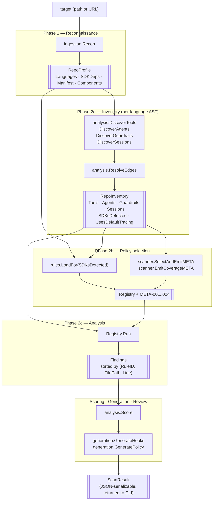
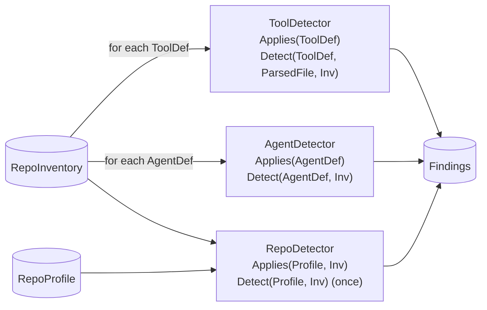
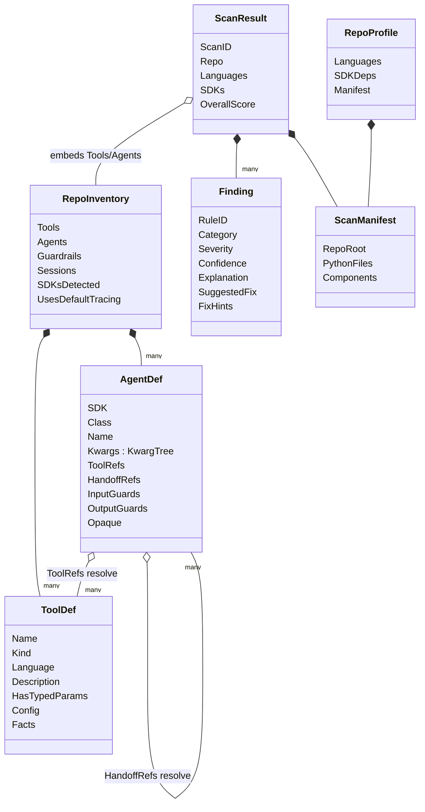

# Architecture

This document describes the concrete architecture of the trustabl codebase as it
exists today. It is the implementer's reference: what each package owns, the
data that crosses package boundaries, and the decisions that shaped the layout.

For the *product* vision (Trustabl Strawman v1), see the design doc tracker —
this file is scoped to the Go binary in this repository.

---

## 1. Goal

trustabl scans a Claude Agent SDK repository, finds reliability weaknesses in
its tool definitions, and emits committable artifacts that close those gaps:

- `hooks/pretooluse_validate.py` and `hooks/posttooluse_log.py` — Claude Agent
  SDK hook scripts the user commits to their own repo.
- `openshell/policy.yaml` — an NVIDIA OpenShell sandbox policy gating the
  agent's runtime privileges.

Single Go binary, no daemon, no server. Web app and CI surfaces are out of
scope for this skeleton (see `README.md` § Status).

---

## 1.1 Language scope

trustabl ships with **Python tool discovery** wired in. The scanner can also
recognize TypeScript, JavaScript, and Go *files* (they appear in
`manifest.typescript_files` etc. and feed component discovery), but no AST
parser for those languages is plumbed in yet — so no tools are extracted
from them and no rules fire against them.

The rule schema's `language:` field gates per-language rule sets. Existing
rules declare `language: python` explicitly and the loader rejects any
unknown language value. When TypeScript tool discovery lands, new rules
declare `language: typescript` and run only against TS tools; Python rules
remain inert against TS tools.

Adding a new tool-discovery language requires:

1. A tree-sitter binding for that language in `internal/analysis/astutil/`.
2. Discovery patterns for that language's tool definitions in
   `internal/analysis/discovery.go` (e.g. AI SDK's `tool({})` factory in TS).
3. Per-language predicate implementations in `internal/rules/predicates.go`
   (since AST node types differ across languages).
4. New rule files under `internal/rules/policies/<category>/` declaring
   `language: <new>`.

The OpenShell policy generator is already language-agnostic — that
infrastructure carries over for free when language #2 ships.

---

## 2. Pipeline

The scan is a staged pipeline. There is no concurrency between stages and no
state shared across runs. `scanner.Run` ([internal/scanner/scanner.go](internal/scanner/scanner.go))
calls each phase in order; the output of one is the typed input to the next.



The three scopes a rule can fire at — `tool`, `agent`, `repo` — flow into
`Registry.Run` from the same `RepoInventory`, but each detector consumes a
different typed input:



### Phase 1 — Reconnaissance ([internal/ingestion/normalizer.go](internal/ingestion/normalizer.go))

`ingestion.Resolve` resolves a CLI target to a directory on disk (cloning
remote repos). `ingestion.Recon` then walks the source tree and returns a
`RepoProfile`:

- **Languages** detected (by file extension).
- **SDK dependencies declared** — text search in `pyproject.toml` /
  `requirements.txt` / `Pipfile` / `poetry.lock` / `package.json` / `go.mod`
  for known SDK package names. Each hit becomes a typed `SDKDep{Name, Source}`.
- **`ScanManifest`** — per-language file paths and discovered agent components.

Phase 1 must stay cheap. No tree-sitter parses here.

### Phase 2a — Inventory ([internal/analysis/](internal/analysis/))

For each language Phase 1 cleared, do the AST work and produce a `RepoInventory`:

- **DiscoverTools** (`discovery.go`) — two-pass Python discovery (decorated
  functions and bare shell-invoking functions). Also captures decorator kwargs
  into `ToolDef.Config` for rules that inspect `@function_tool(strict_mode=...)`.
- **DiscoverAgents** (`agents.go`) — finds `Agent(...)` / `SandboxAgent(...)` /
  `AgentDefinition(...)` constructor calls; captures all constructor kwargs into
  a typed `KwargTree`; sets `Opaque=true` for `Agent(**config)` or
  `tools=<non-literal>`.
- **DiscoverGuardrails** — finds `@input_guardrail` / `@output_guardrail`
  decorated functions.
- **DiscoverSessions** — finds construction sites for `*Session` classes from
  the agents SDK.
- **ResolveEdges** — links agent `tools=`, `handoffs=`, `input_guardrails=`
  references to discovered definitions in the same repo; cross-module resolution
  uses import statements; unresolvable references are flagged `External=true`.

**Discovered agent components** (`Components []AgentComponent`).

The normalizer enumerates non-tool agent artifacts so users see the full
agent surface, even though detection rules currently only run against
tools. Component kinds:

| Kind                  | What it matches                                                |
| --------------------- | -------------------------------------------------------------- |
| `mcp_config`          | `mcp.json`, `mcp_servers.json`, `claude_desktop_config.json`   |
| `claude_md`           | `CLAUDE.md` / `claude.md` at any depth                         |
| `claude_settings`     | `.claude/settings.json`, `.claude/settings.local.json`         |
| `subagent`            | `.claude/agents/*.md`                                          |
| `slash_command`       | `.claude/commands/*.md`                                        |
| `hook_script`         | `hooks/*.{py,ts,js,jsx,mjs}`                                   |
| `sandbox_policy`      | `openshell/*.yaml` / `openshell/*.yml`                         |
| `system_prompt`       | `prompts/*.md`, `system_prompt.md`, `system_prompt.txt` (root) |
| `dependency_manifest` | `pyproject.toml`, `requirements.txt`, `Pipfile`, `poetry.lock`, `package.json`, `go.mod` |
| `claude_agent_definition` | Python file importing `claude_agent_sdk` AND containing an `AgentDefinition(` call |

Each `AgentComponent` carries `Path` (relative to repo root, normalized to
forward slashes) and `Language` (set for code components, empty for
configs / prompts).

**Directory skip rules.** Skips `.git`, `.venv`, `venv`, `node_modules`,
`__pycache__`, `dist`, `build`, `.tox`, `.mypy_cache`, `.pytest_cache`, and
any other dot-prefixed directory — **except `.claude/`**, which is a
deliberately-included agent-config directory.

Manifest fields are emitted as JSON in `ScanResult.manifest` for CI consumers;
the Go pipeline does not currently branch on them.

#### Discovery detail ([internal/analysis/discovery.go](internal/analysis/discovery.go))

Two-pass discovery over each Python file. tree-sitter is used because we need
structural recognition (decorator nodes, function bodies, call shapes) rather
than just text matching.

1. **Decorated functions.** A `decorated_definition` is classified by the
   decorator-substring matcher in `kindFromDecorators`:

   | Pattern in decorator text         | ToolKind              | Notes                       |
   | --------------------------------- | --------------------- | --------------------------- |
   | `@function_tool` (any args)       | `KindOpenAITool`      | OpenAI Agents SDK           |
   | `@tool`, `@claude_tool`, `@agent.tool`, `claude_agent_sdk` | `KindClaudeSDKTool` | Claude Agent SDK (pre-1.0 — names still in flux) |
   | `@server.tool`, `@mcp.tool`, `.register_tool` | `KindMCPTool`         | MCP server registrations    |
   | (none of the above)               | `KindUnknown`         | Falls through to shell pass |

   Order matters: `@function_tool` is matched before `@tool` so the broader
   substring doesn't capture the more specific OpenAI decorator. Discovery
   is conservative — when in doubt, return `KindUnknown` and let the
   function be considered for shell discovery.

2. **Bare functions that shell out.** Any `function_definition` not already
   captured above whose body calls `subprocess.*`, `os.system`, or `os.popen`
   is a `KindShellInvocation`. These feed the OpenShell detectors.

Each `ToolDef` carries `Language: python` (set unconditionally today —
discovery is python-only).

The function's docstring is extracted via `astutil.FunctionDocstring`, which
calls `stripPythonStringLiteral` to handle prefixes (r/b/u/f and 2-char
combinations) and triple-vs-single quote markers. Parameter names come from
`astutil.FunctionParams`; `self`/`cls` are dropped. `HasTypedParams` is set if
any parameter is type-annotated (`typed_parameter` or `typed_default_parameter`
in tree-sitter terms).

### Phase 2c — Analysis ([internal/rules/](internal/rules/) + [internal/analysis/detectors/](internal/analysis/detectors/))

Detection is **YAML-driven**. The `internal/analysis/detectors` package owns
three typed interfaces and the `Registry` runtime; concrete detectors are
produced by `internal/rules` from embedded YAML policy files.

```go
// ToolDetector fires against one ToolDef at a time.
type ToolDetector interface {
    RuleID() string
    Category() models.DetectorCategory
    Applies(models.ToolDef) bool
    Detect(models.ToolDef, analysis.ParsedFile, models.RepoInventory) []models.Finding
}

// AgentDetector fires against one AgentDef at a time.
type AgentDetector interface {
    RuleID() string
    Category() models.DetectorCategory
    Applies(models.AgentDef) bool
    Detect(models.AgentDef, models.RepoInventory) []models.Finding
}

// RepoDetector fires once per scan against the profile + inventory.
type RepoDetector interface {
    RuleID() string
    Category() models.DetectorCategory
    Applies(models.RepoProfile, models.RepoInventory) bool
    Detect(models.RepoProfile, models.RepoInventory) []models.Finding
}
```

`Registry.Run(profile, inv, parsed)` iterates all three slices: ToolDetectors
fire per `inv.Tools`, AgentDetectors per `inv.Agents`, RepoDetectors once.
Findings are sorted deterministically by `(RuleID, FilePath, Line)`.

Pipeline at startup:

1. `rules.DefaultFS()` returns the `embed.FS`-backed filesystem rooted at
   `internal/rules/policies/`.
2. `rules.LoadFor(fsys, inv.SDKsDetected)` walks recursively, decodes every
   `.yaml` file, validates required fields / enums / cross-file rule-ID
   uniqueness, then wraps each `RuleDef` whose category matches an SDK in
   `SDKsDetected` as a `ToolRuleDetector`, `AgentRuleDetector`, or
   `RepoRuleDetector` based on the rule's `scope:` field. (Tests that want
   every shipped rule loaded unconditionally use `rules.LoadRegistry(fsys)`
   instead — same loader, no SDK filter.)
3. Each detector's `Detect` evaluates the rule's `MatchExpr` against the
   typed input; on a match it emits one `Finding` populated from the rule's
   metadata.

Discipline: rule evaluation is pure (no I/O, no clocks); predicates may walk
the AST. Every `Finding` MUST carry an `Explanation`, `SuggestedFix`, and
`Confidence` — the YAML schema requires those fields, so the loader rejects a
rule that omits them.

The `Registry` supports `Subset(...categories)` for `--detectors` filtering.
Output is reproducible: detectors run in stable order, findings sorted by
`(RuleID, FilePath, Line)`.

Shipped rules (one row per YAML rule entry):

| Rule    | Scope | Category   | Severity | Source file                              | Notes                                                               |
| ------- | ----- | ---------- | -------- | ---------------------------------------- | ------------------------------------------------------------------- |
| CSDK-001 | tool | claude_sdk | low      | `claude_sdk/tool_definition.yaml`        | Missing docstring / description                                     |
| CSDK-002 | tool | claude_sdk | medium   | `claude_sdk/tool_definition.yaml`        | Untyped parameters                                                  |
| CSDK-003 | tool | claude_sdk | high     | `claude_sdk/network.yaml`                | HTTP call without `timeout=` kwarg                                  |
| CSDK-004 | tool | claude_sdk | high     | `claude_sdk/path_safety.yaml`            | Path-like param flows to I/O without `.resolve()`/`realpath()`     |
| CSDK-005 | tool | claude_sdk | medium   | `claude_sdk/error_handling.yaml`         | Raises with no try/except wrapping                                  |
| CSDK-006 | tool | claude_sdk | medium   | `claude_sdk/idempotency.yaml`            | Mutating verb in name + no idempotency-key param                    |
| CSDK-007 | tool | claude_sdk | low      | `claude_sdk/tool_definition.yaml`        | Ambiguous name (`process`, `handle`, `run`, …)                      |
| CSDK-101 | agent | claude_sdk | high    | `claude_sdk/agent_safety.yaml`           | Claude `AgentDefinition` subagent granted the built-in `Bash` tool  |
| OSH-001 | tool  | openshell  | critical | `openshell/shell.yaml`                   | `subprocess(..., shell=True)`                                       |
| OSH-002 | tool  | openshell  | high     | `openshell/shell.yaml`                   | Shell call without `ALLOWED_COMMANDS` allowlist                     |
| OSH-003 | tool  | openshell  | high     | `openshell/filesystem.yaml`              | `open(..., "w")` / `shutil.move`/`rmtree` etc.                      |
| OSH-004 | repo  | openshell  | medium   | `openshell/resources.yaml`               | No resource limits configured anywhere                              |
| OSH-005 | tool  | openshell  | high     | `openshell/network.yaml`                 | HTTP call with dynamic URL + no host allowlist                      |
| OAI-001 | tool  | openai_sdk | low      | `openai_sdk/tool_definition.yaml`        | Tool function has no docstring                                      |
| OAI-002 | tool  | openai_sdk | medium   | `openai_sdk/tool_definition.yaml`        | Tool has no type-annotated parameters                               |
| OAI-003 | tool  | openai_sdk | medium   | `openai_sdk/decorator_config.yaml`       | `@function_tool(strict_mode=False)` — schema not enforced           |
| OAI-004 | tool  | openai_sdk | medium   | `openai_sdk/decorator_config.yaml`       | No `failure_error_function` — errors propagate raw to the model     |
| OAI-005 | tool  | openai_sdk | high     | `openai_sdk/network.yaml`                | HTTP call without `timeout=`                                        |
| OAI-006 | tool  | openai_sdk | high     | `openai_sdk/path_safety.yaml`            | Path-like param passed to I/O without normalization                 |
| OAI-101 | agent | openai_sdk | high     | `openai_sdk/agent_safety.yaml`           | Agent with shell tools and no `input_guardrails`                    |
| OAI-102 | agent | openai_sdk | medium   | `openai_sdk/agent_safety.yaml`           | `tool_use_behavior="stop_on_first_tool"` — agent stops after one tool call |
| OAI-103 | agent | openai_sdk | high     | `openai_sdk/agent_safety.yaml`           | `tool_choice=required` + `reset_tool_choice=False` — unbounded loop risk |
| OAI-104 | agent | openai_sdk | high     | `openai_sdk/agent_safety.yaml`           | Bare `Agent` (not `SandboxAgent`) with shell-invoking tools         |
| OAI-105 | agent | openai_sdk | high     | `openai_sdk/mcp_safety.yaml`             | Agent uses MCP servers without `input_guardrails`                   |
| OAI-201 | repo  | openai_sdk | medium   | `openai_sdk/tracing.yaml`                | OpenAI Agents SDK present but no custom trace processor configured  |

### Stage 5 — Scoring ([internal/analysis/scoring.go](internal/analysis/scoring.go))

Per-tool:

```
weighted = Σ severityWeight(finding) * finding.confidence
score    = max(0, 1 - weighted / saturation)        # saturation = 3.0
```

Overall score is the **min** across per-tool scores. The agent is as reliable
as its weakest surface; mean is misleading because one terrible tool and one
perfect tool would average to a "moderate" overall score that hides the
critical exposure.

Both `saturation` and the severity weights in [models.SeverityWeight](internal/models/models.go)
are placeholders pending a corpus eval (architecture § 8). They live in one
place so the curve can be tuned without touching detectors.

### Stage 6 — Generation ([internal/generation/](internal/generation/))

Two generators, both deterministic by contract: same findings → byte-identical
output. The contract is enforced by the generators themselves (sorted tool
names, sorted findings by `RuleID`, deduped global-deny entries before
marshaling). `TestScanDeterministic` (see §6 test layer 4) asserts this
mechanically — a non-deterministic generator is a build failure, not a latent
bug.

- **Hooks** ([hooks.go](internal/generation/hooks.go)) — emits
  `hooks/pretooluse_validate.py` (per-tool validators behind a dispatch table)
  and `hooks/posttooluse_log.py` (structured logging stub). A finding is
  hook-eligible if its `FixHints["hook"]` is non-empty, OR if its rule ID is
  one of `CSDK-003` / `CSDK-004` / `CSDK-006` (the rules whose remediation is
  a runtime mutation rather than a code change). `stanzaForFinding` maps each
  hook-eligible rule to the Python lines it injects.
- **Policy** ([policy.go](internal/generation/policy.go)) — emits
  `openshell/policy.yaml`. With no OSH findings the generator still produces a
  defaults-only policy so the user has a starter file. Each OSH rule maps to a
  policy field: OSH-001 → globalDeny; OSH-002 → per-tool commands.allowed;
  OSH-003 → per-tool filesystem.writePrefixes; OSH-005 → per-tool
  network.allowedHosts. Placeholders are emitted as `# TODO:` comments so
  users see what to fill in, rather than the generator inventing plausible
  values.

The OpenShell schema (`apiVersion: openshell.nvidia.com/v1`, `kind:
SandboxPolicy`) is the generator's interpretation pending the real spec link;
renames are mechanical when the spec lands.

### Stage 7 — Review ([internal/review/](internal/review/))

- `Renderer.Render` ([diff.go](internal/review/diff.go)) — produces the human
  scan summary printed to stdout for `--format human`. Color via lipgloss,
  disabled with `--no-color`.
- `ApplyArtifacts` — writes generated files into the repo root. Refuses to
  overwrite by default; `--overwrite` opts in.
- `ExportZIP` ([export.go](internal/review/export.go)) — packages all
  generated artifacts into one ZIP for `--export <path>`.

The CLI's per-finding interactive accept/reject UX from the design doc is out
of scope; `--apply --yes` is the CLI equivalent of "accept all".

---

## 3. Data model

All cross-package values live in [internal/models/](internal/models/). Anything
that crosses ingestion → analysis → generation → review is a typed struct with
JSON tags, because `ScanResult` is the contract for `--format json` CI output.



```go
// Phase 1 output
RepoProfile {
    Languages []Language   // detected by file extension
    SDKDeps   []SDKDep     // declared deps (from manifests)
    Manifest  ScanManifest // file inventory + discovered components
}

SDKDep { Name, Source string; Confidence float64 }
SDK = "claude_agent_sdk" | "openai_agents" | "mcp" | "openshell"

// Phase 2a output
RepoInventory {
    Tools              []ToolDef
    Agents             []AgentDef
    Guardrails         []GuardrailDef
    Sessions           []SessionUse
    HostedTools        []HostedToolDef
    SDKsDetected       []SDK     // observed in code (drives Phase 2b policy selection)
    Manifest           ScanManifest
    UsesDefaultTracing bool
}

AgentDef {
    SDK, Class, FilePath string; Line, EndLine int
    Name         string         // from name= kwarg literal
    Kwargs       *KwargTree     // all constructor kwargs, typed
    ToolRefs     []ToolRef      // resolved to ToolDef or flagged External
    HandoffRefs  []AgentRef
    InputGuards  []GuardrailRef
    OutputGuards []GuardrailRef
    Opaque       bool           // Agent(**config) or tools=non-literal
}

// KwargTree holds a kwarg value as either a leaf or a nested map
// (e.g. model_settings.tool_choice parses as Children["model_settings"].Children["tool_choice"])
KwargTree { Value *Expr; Children map[string]*KwargTree }

ToolDef {
    Name           string
    Kind           ToolKind   // claude_sdk_tool | openai_tool | mcp_tool | shell_invocation | unknown
    Language       Language   // python | typescript | javascript | go
    FilePath       string
    Line, EndLine  int
    Description    string
    HasTypedParams bool
    ParamNames     []string
    Facts          map[string]string // detector-injected body facts
    Config         map[string]string // decorator kwargs (e.g. strict_mode, failure_error_function)
}

ScanManifest {
    RepoRoot, IsRemote, RemoteURL string
    PythonFiles, TypeScriptFiles, JavaScriptFiles []string
    YAMLFiles, JSONFiles, MarkdownFiles []string
    HasClaudeSDKDependency, HasOpenShellArtifact bool // legacy convenience flags; prefer RepoProfile.SDKDeps
    Components []AgentComponent
}

AgentComponent {
    Kind     ComponentKind  // mcp_config | claude_md | claude_settings | subagent | ...
    Path     string         // forward-slash relative to repo root
    Language Language       // set for code components, empty for configs/prompts
    Note     string
}

// Top-level output
ScanResult {
    ScanID             string
    Repo               string
    Languages          []Language          // Phase 1, by file extension
    SDKs               []SDK               // Phase 2a, observed in code
    Manifest           ScanManifest
    Tools              []ToolDef
    Agents             []AgentDef
    Findings           []Finding
    Readiness          []ToolReadiness
    OverallScore       float64
    GeneratedArtifacts []GeneratedArtifact
}
```

`ScanID` is derived deterministically from the repo label and the sorted
Python file list, so identical inputs produce diff-comparable JSON across runs.

Discipline rules:

- `RawSource` was deliberately **not** included on `ToolDef`. Carrying full
  function bodies in memory and then in JSON is wasteful, and the LLM
  enrichment path that would consume them is not yet wired.
- `ToolDef.Config` carries decorator kwargs (`strict_mode`, `failure_error_function`,
  hosted-tool args) captured at discovery time. Detectors read these fields
  instead of re-parsing the decorator from inside a rule.
- `ToolDef.Facts map[string]string` is reserved for detector-injected body
  facts (e.g., "this function shells out") that downstream stages can read
  without re-walking the AST.
- `Finding.FixHints map[string]any` carries generator-specific keys (e.g.,
  `"hook": "pretooluse_validate"`, `"policy_emit": "command_allowlist"`,
  `"unsafe_params": [...]`). The generators read these instead of hardcoding
  rule IDs in their own logic.
- `AgentComponent.Path` always uses forward slashes (`filepath.ToSlash`),
  even on Windows. This keeps manifest output platform-stable so JSON
  consumers and snapshot tests don't see `/` vs `\` differences.
- `Components` is sorted by `(Kind, Path)` for byte-stable JSON output.

---

## 4. Package layout

```
cmd/trustabl/                    CLI entry point (cobra). main.go only.
internal/
├── models/                      Cross-boundary types. JSON-tagged. Zero deps.
├── ingestion/                   Importer + Normalizer.
├── analysis/
│   ├── astutil/                 Tiny tree-sitter ergonomic layer (NodeText,
│   │                            Walk, FindAll, FunctionName, FunctionParams,
│   │                            FunctionDocstring, FunctionHasTypedParams,
│   │                            HasKwarg).
│   ├── discovery.go             Tool discovery passes.
│   ├── heuristics.go            Domain helpers shared by every detector path:
│   │                            FindFunctionNode, IsHTTPCall, IsPathishParam.
│   ├── scoring.go               Per-tool + overall scoring.
│   └── detectors/               Detector interface + Registry runtime only.
│       └── detector.go          Detector iface, Registry, New(ds), Subset, Run.
├── rules/                       YAML-driven detection engine. Authoritative.
│   ├── schema.go                PolicyFile / RuleDef / MatchExpr types.
│   ├── loader.go                Validating YAML loader (recursive walk).
│   ├── predicates.go            One Pred* per detection primitive.
│   ├── evaluator.go             MatchExpr.Evaluate — recursive walker.
│   ├── rule_detector.go         RuleDetector adapter + LoadRegistry.
│   ├── embed.go                 //go:embed all:policies → DefaultFS().
│   └── policies/                Embedded YAML rule definitions.
│       ├── claude_sdk/
│       │   ├── agent_safety.yaml      CSDK-101 (agent scope)
│       │   ├── error_handling.yaml    CSDK-005
│       │   ├── idempotency.yaml       CSDK-006
│       │   ├── network.yaml           CSDK-003
│       │   ├── path_safety.yaml       CSDK-004
│       │   └── tool_definition.yaml   CSDK-001, CSDK-002, CSDK-007
│       ├── openai_sdk/
│       │   ├── tool_definition.yaml   OAI-001, OAI-002
│       │   ├── decorator_config.yaml  OAI-003, OAI-004
│       │   ├── network.yaml           OAI-005
│       │   ├── path_safety.yaml       OAI-006
│       │   ├── agent_safety.yaml      OAI-101, OAI-102, OAI-103, OAI-104
│       │   ├── mcp_safety.yaml        OAI-105
│       │   └── tracing.yaml           OAI-201
│       └── openshell/
│           ├── shell.yaml             OSH-001, OSH-002
│           ├── filesystem.yaml        OSH-003
│           ├── resources.yaml         OSH-004
│           └── network.yaml           OSH-005
├── generation/                  Hooks + Policy generators (deterministic).
├── review/                      Human renderer, apply, export ZIP.
└── inference/                   BYOK inference router (stub; cache only).
```

### `internal/analysis/heuristics.go` — the shared-helper boundary

Domain-level utilities the rules package and any future Go-native detector
need:

- `FindFunctionNode(t, pf)` — relocate a tool's `function_definition` node.
- `IsHTTPCall(callee)` — exact-text match against the known HTTP client API
  surface. **Limitation**: aliased session calls (`s = requests.Session();
  s.get(...)`) are not resolved. Documented; address with an aliasing pass
  when corpus signal demands it.
- `IsPathishParam(name)` — word-boundary check against path/file/dir names so
  `editor_id` does not match `_dir`.

`HasKwarg(call, src, name)` is in `astutil` because it is pure tree-sitter and
has no domain knowledge.

---

## 5. The rules engine: schema, evaluator, embed

YAML rule files live under `internal/rules/policies/`, grouped first by
detector category and then by topic. Each file is a single `policy:` block
with one or more rules:

```yaml
policy:
  id: claude_sdk_network
  name: Network call hygiene
  category: claude_sdk
  description: >
    Rules covering outbound network calls made from inside agent tools.
rules:
  - id: CSDK-003
    title: Network call has no timeout
    severity: high
    confidence: 0.85
    applies_to: [claude_sdk_tool, mcp_tool]
    singleton: false
    match:
      call_without_kwarg:
        callees: [requests.get, requests.post, ...]
        missing: timeout
    explanation: >
      An agent tool that makes a network request without a timeout ...
    fix: Pass `timeout=` (typically 5–30s) to the request.
    fix_hints:
      hook: pretooluse_validate
      guard: timeout_required
```

### Adding a rule

1. Pick the right category subdirectory (`claude_sdk/`, `openai_sdk/`, or `openshell/`).
2. Either append to an existing topic file or create a new `<topic>.yaml`
   file — the loader walks recursively so new files are picked up
   automatically by `go:embed`.
3. Use a fresh rule ID that does not collide with any existing ID across all
   policy files (the loader rejects duplicates).
4. If your rule needs a primitive the schema does not yet expose, extend
   `MatchExpr` in `schema.go` and add a corresponding `Pred*` function in
   `predicates.go`. The evaluator wires them together by name.
5. Add at least one fire case and one silent case for the new rule to
   `policyRuleCases` in
   [internal/rules/policies_test.go](internal/rules/policies_test.go). The
   `TestPolicyRules_AllRulesCovered` guard fails at build time if a shipped
   rule has no test coverage — this is contract, not best practice.

### §5.1 META findings (engine-emitted, not YAML-driven)

Phase 2b emits up to three engine-level findings before any rule runs. These
are not backed by YAML policy files; they come from `SelectAndEmitMETA` in the
scanner.

| ID       | Trigger                                                    | Severity | Intent                                               |
| -------- | ---------------------------------------------------------- | -------- | ---------------------------------------------------- |
| META-001 | An SDK is observed in code (`SDKsDetected`) but trustabl has no policy pack for it | info | Honest "unaudited SDK" signal — silence on an unknown SDK is wrong |
| META-002 | An SDK appears in declared deps (`SDKDeps`) but no code use was observed | info | Dep declared but not used — surfaces drift between manifests and code |
| META-003 | An `AgentDef` has `Opaque=true` (`Agent(**config)` or `tools=non-literal`) | info | Agent analysis is partial; tool-graph predicates on this agent are unreliable |
| META-004 | An audited SDK (Claude/OpenAI) was observed but **no loaded rule was applicable** to any discovered tool/agent | info | Distinguishes "could not audit" from "audited, clean" — prevents a false clean bill when discovery extracted nothing a rule targets |

META-004 is emitted by `EmitCoverageMETA` (post-policy-selection, using
`Registry.ApplicableCategories`) — `Applies()` true means a rule was relevant,
not that it fired, so a genuinely clean repo still suppresses META-004.

META findings use `RuleID = "META-001"` etc. and `Category = ""` (no category
filter applies to them). They are included in `ScanResult.Findings` and
emitted in both human and JSON output formats.

### Evaluator semantics ([evaluator.go](internal/rules/evaluator.go))

`MatchExpr.Evaluate` is a recursive conjunctive walker:

- An empty `MatchExpr` returns true (vacuously matches; useful for singleton
  rules with no predicate body).
- Every set field on a node contributes one boolean to a logical AND: all
  combinators, all primitives, and all nested struct predicates that are
  non-nil must hold for the node to match.
- The combinators `all` and `any` recurse; `not` negates the whole subtree.

The conjunctive default makes simple one-predicate rules read naturally as
YAML, while combinators are available when a rule needs disjunction or
negation.

### Loader contract ([loader.go](internal/rules/loader.go))

- `fs.WalkDir` from the FS root, picking up every `*.yaml` recursively.
- File handles are closed inside the per-file decode helper, not deferred to
  Load's return — so the descriptor budget is bounded by iteration, not by
  total policy count.
- `KnownFields(true)` rejects unknown YAML keys (catches typos like
  `has_blah` immediately).
- Required-field validation, enum validation (severity / category),
  duplicate-rule-ID detection across files. Every error is collected via
  `errors.Join` so a contributor sees every problem in one run.

### Embedding ([embed.go](internal/rules/embed.go))

`//go:embed all:policies` bundles the YAML files into the binary at compile
time. `DefaultFS()` returns an `fs.FS` rooted at the policies directory (the
`policies/` prefix is stripped via `fs.Sub`), so the loader sees paths like
`claude_sdk/network.yaml`.

This is what `scanner.Run` uses by default. Tests can pass an `fstest.MapFS`
or any other `fs.FS` to `LoadRegistry` to exercise alternate rule sets.

### Detector interface boundary ([detectors/detector.go](internal/analysis/detectors/detector.go))

The `detectors` package is interface + runtime only. It owns three typed
interfaces — `ToolDetector`, `AgentDetector`, `RepoDetector` — and the
`Registry` type that runs them. `Registry.New(tool, agent, repo []…)` accepts
three slices; `Run`, `Subset(cats…)`, `ApplicableCategories`, and `Count`
operate on the union. There is no single `Detector` interface and no
`Singleton` flag — scope is now an explicit choice at construction time.

The package deliberately ships no concrete detectors. Any producer (the rules
engine today; potentially a future Go-native or LLM-judged producer) builds
its own typed slices and hands them to `detectors.New(...)`. This keeps the
runtime agnostic to where a rule comes from.

### Rule lifecycle

From YAML source on disk to a `Finding` emitted at scan time:

```mermaid
flowchart LR
    yaml["policies/&lt;sdk&gt;/&lt;topic&gt;.yaml"]
    embed["//go:embed all:policies"]
    fs[("DefaultFS()<br/>(embed.FS rooted at policies/)")]
    loader["rules.Load<br/>· KnownFields(true)<br/>· required-field validation<br/>· severity/category/scope enums<br/>· applies_to-vs-scope check<br/>· cross-file ID uniqueness"]
    rules[("[]PolicyFile")]
    loadfor["rules.LoadFor(SDKsDetected)<br/>filters by inventory"]
    wrap["wrap each RuleDef as<br/>ToolRuleDetector / AgentRuleDetector / RepoRuleDetector"]
    registry[("detectors.Registry")]
    evaluate["MatchExpr.Evaluate<br/>(recursive conjunctive walker)"]
    finding[("Finding<br/>RuleID · Severity · Confidence<br/>Explanation · SuggestedFix · FixHints")]

    yaml --> embed --> fs --> loader --> rules --> loadfor --> wrap --> registry
    registry -- "Run(profile, inv, parsed)" --> evaluate --> finding
```



---

## 6. Test strategy

Coverage is split across three layers, each with a focused contract:

1. **Predicate unit tests** ([predicates_test.go](internal/rules/predicates_test.go)).
   Each `Pred*` function in
   [internal/rules/predicates.go](internal/rules/predicates.go) is
   exercised against tiny Python snippets — the AST building blocks are
   verified in isolation.
2. **Per-rule fire/silent tests** ([policies_test.go](internal/rules/policies_test.go)).
   A table of `policyRuleCases` drives one fire and one silent case per
   shipped rule, loading the actual YAML via `rules.Load(rules.DefaultFS())`.
   `TestPolicyRules_AllRulesCovered` fails if any shipped rule lacks an
   entry — adding a rule without test cases is therefore a build failure.
3. **End-to-end sweep** ([scanner_test.go](internal/scanner/scanner_test.go)).
   `TestScanExamples_NoCrash` walks every immediate subdirectory of
   `examples/` (skipping the `ToolBench` dataset) and runs `scanner.Run`
   on each. It asserts no error and a populated manifest — *not* specific
   findings. The point is regression coverage: weird real-world code
   shouldn't panic the discovery pass.
4. **Determinism regression** ([determinism_test.go](internal/scanner/determinism_test.go)).
   `TestScanDeterministic` runs `scanner.Run` twice over
   `testdata/deterministic-fixture` and asserts that `ScanID` and all
   `GeneratedArtifact.Contents` are byte-identical across both runs.
   This enforces the §7 contract mechanically so a non-deterministic
   generator is a build failure, not a latent bug.

Real-world examples in `examples/` are NOT a controlled fixture and are
not expected to trigger every rule. Per-rule correctness lives in
`policies_test.go`.

## 7. Determinism contract

Two invariants are load-bearing for the user-facing experience:

1. **Same inputs → same `ScanID`.** Derived from a sorted file list, so file
   ordering from the OS walk does not leak into the ID.
2. **Same findings → byte-identical generated artifacts.** Generators sort
   tool names, sort findings by `RuleID`, and dedupe global deny entries by
   `(RuleID, Reason)` before marshaling. `Components` are sorted by
   `(Kind, Path)` for the same reason.

This matters because users commit the generated files. A non-deterministic
generator means a user sees spurious diffs on every CI run, which trains them
to ignore the diff entirely.

The contract is enforced by `TestScanDeterministic` in
[internal/scanner/determinism_test.go](internal/scanner/determinism_test.go):
two consecutive `scanner.Run` calls over `testdata/deterministic-fixture` must
produce identical `ScanID` values and byte-equal `GeneratedArtifact.Contents`
for every artifact. A new generator that violates this is a build failure.

New generators MUST sort their inputs and deduplicate before emitting. No
timestamp, no map iteration order, no goroutine scheduling may influence output.

---

## 8. CLI surface ([cmd/trustabl/main.go](cmd/trustabl/main.go))

```
trustabl scan <target> [--detectors=…] [--format=human|json]
                       [--apply [--yes] [--overwrite]]
                       [--export=path.zip]
                       [--strict] [--no-color]
trustabl version
```

Exit codes:

- `0` — no findings ≥ medium (or no findings at all).
- `1` — at least one finding ≥ medium, OR `--strict` and any finding present.
- `2` — scanner / I/O error.

The CLI is a thin shell over `scanner.Run`. The same `Run(Config) (ScanResult,
error)` is what a future HTTP server, GitHub Action, or test harness calls;
the boundary is intentionally narrow.

---

## 9. Build constraint: CGO

tree-sitter is a C library, so `CGO_ENABLED=1` is required. `README.md`
documents zig-cc as the easiest cross-compile path. If single-binary,
no-CGO distribution becomes a hard requirement, the swap target is
`github.com/go-python/gpython` with reduced fidelity on modern Python
(walrus, structural pattern matching, etc.). This is a known cliff; do not
take it absent a concrete distribution requirement.

---

## 10. What is intentionally out

- **No LLM enrichment yet.** `internal/inference/router.go` defines the BYOK
  interface and an in-process cache; `Call()` returns `ErrLLMDisabled` when
  no API key is set. The planned first target is upgrading low-confidence
  rule-based hits to confirmed findings (CSDK-005 raw-exception detection is
  the highest-leverage rule for this).
- **No corpus-eval benchmark.** Detection quality measured on a 20–40
  real-agent-repo corpus is the MVP gate. This skeleton ships rule-based
  detectors with three-layer test coverage (see §6) — that is not the
  corpus eval, which requires labelled-finding ground truth on real
  repos.
- **No web app, no API server, no GitHub Action.** CLI-only.
- **Per-finding interactive accept/edit/reject.** `--apply --yes` is the CLI
  equivalent of accept-all; richer UX waits for a host that can render it.
