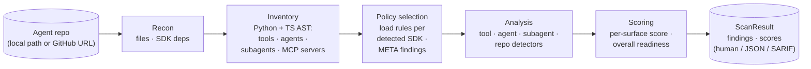

<p align="center">
  
</p>

Trustabl is a static analyzer for agent reliability. It parses an agent-SDK
repository (Claude Agent SDK, OpenAI Agents SDK, Google ADK, MCP, LangChain /
LangGraph, CrewAI, AutoGen / AG2, Pydantic AI, and the Vercel AI SDK), models the
tools, agents, subagents, skills, slash commands, and plugin manifests it
declares, and checks them against a catalog of reliability and safety rules. It reports the weaknesses it finds — each
with an explanation, a suggested fix, and a confidence score — as a
human-readable summary, JSON, or SARIF 2.1.0, plus a per-surface reliability
score and a CI-friendly exit code. It ships as a single Go binary with no
hosted service: it runs as a CLI, or as a local stdio MCP server
(`trustabl mcp`) that exposes the same scan to MCP clients without opening a
network port.

The rest of this document explains *what Trustabl reasons about* and *how
the scan works*, then covers building and running it. For the full
implementation reference see [ARCHITECTURE.md](ARCHITECTURE.md); for the
at-a-glance SDK coverage matrix see [COVERAGE.md](COVERAGE.md).

## What it analyzes — the four-scope model

Trustabl does not treat a repository as one undifferentiated blob. Every
rule is classified into exactly one of four scopes, and each scope receives
a different typed input:

- **`tool`** — fires once per tool definition. Input: a `ToolDef` (a
  `@function_tool` / `@tool` / `@claude_tool` function, a Claude TS
  `tool(name, description, schema, handler)` factory call, a
  `FunctionTool(fn)` ADK wrapper, an `@server.tool` MCP registration, or a
  bare shell-invoking function) plus its parsed file. Catches a missing
  docstring, an HTTP call with no timeout, untyped parameters, or an
  unnormalized path flowing into `open()`. (Hosted tools like
  `WebSearchTool()` are agent-scope edge data, captured as `HostedToolDef`,
  not `ToolDef`.)
- **`agent`** — fires once per agent declaration. Input: an `AgentDef` —
  a Python `Agent(...)` / `SandboxAgent(...)` / `AgentDefinition(...)`
  call, a Claude TS typed-const `AgentDefinition`, a Claude TS sub-agent
  inline in `options.agents`, or the Claude TS `query(...)` main-thread
  agent (`QueryMainAgent`) — with every constructor kwarg captured and its
  edges to tools, handoffs, and guardrails resolved. Catches an agent with
  shell tools and no `input_guardrails`,
  `tool_use_behavior="stop_on_first_tool"` paired with filesystem-touching
  tools, or a main-thread agent with unrestricted `allowedTools`.
- **`subagent`** — fires once per Claude Code subagent markdown
  declaration. Discovery is **hybrid**: canonical `.claude/agents/*.md`
  (any path depth, monorepo-safe) PLUS a frontmatter-shape fallback over
  all markdown files (gated on `name` + `tools`/`model`) that catches
  flat-collection repos which ship subagents under `categories/*.md`,
  `plugins/<x>/agents/*.md`, or similar layouts. Input: a `SubagentDef`
  parsed from frontmatter — `name`, `description`, `tools[]` (verbatim) +
  `ToolGrants[]` (parsed permission grammar), `disallowedTools`, `model`,
  `permissionMode` (incl. `bypassPermissions`), `mcpServers`, `skills`,
  `isolation`, `hasHooks`. Catches a subagent granted the built-in `Bash`
  tool despite a read-only description (CSDK-110). Subagent presence alone
  contributes `claude_agent_sdk` to `SDKsDetected`, so the Claude pack
  loads and CSDK-110 fires on pure-markdown subagent collections.
- **`repo`** — fires once per scan against the whole inventory. Catches
  project-wide gaps such as the OpenAI Agents SDK being present with no
  custom trace processor configured.

### The agent is the unit of analysis, not the repo

A repo can declare zero, one, or many agents, across one or more SDKs.
**Two agents in the same repo can be in completely different security
postures** — one wired with input/output guardrails, the other not.
Agent-scoped findings therefore attribute to a *specific* agent at its
constructor call site; flattening them to a single repo-level verdict
would lose that attribution and be wrong. Discovery builds a small
per-repo graph (tools, agents, subagents, and the edges between them) so
agent-scope and subagent-scope rules can query it.

### Rules are scoped to one SDK *and* one language

A Claude-SDK rule and an OpenAI-Agents-SDK rule that detect the same
conceptual problem (a missing timeout, say) are two separate rules with
SDK-specific explanation and fix text — there is no cross-SDK casting.
When a repo declares agents from multiple SDKs side by side, each agent is
checked only against the rules for the SDK that declared it. The same
holds across languages: a `language: python` rule will not fire on a
TypeScript agent.

## How it reasons — the scanning pipeline

trustabl scans in four steps. Each step's output is the typed input to the
next, with no shared state between runs — and the inventory the early
steps build is what makes policy selection *data-driven* rather than
statically configured.

The binary ships with **no embedded rules**. Before the pipeline runs,
Trustabl resolves its detection rules from a separate git repository
([`trustabl-rules`](https://github.com/trustabl/trustabl-rules)) —
fetching the latest, caching the clone locally, and falling back to the
cache when the network is unreachable. This decouples rule updates from
binary releases: rules can be added or changed without rebuilding the
scanner. The resolved rules commit is recorded in the result and folded
into the `ScanID`, so a scan is honest about *which* rules produced it.
If no rules can be fetched and none are cached, the scan exits `2` and
tells you to run `trustabl rules pull` — Trustabl never runs rule-less.



1. **Recon** — walk the repo and answer "what's in here" cheaply, without
   parsing any source language: languages present (by extension), SDK
   dependencies declared in manifests (`pyproject.toml` / `requirements.txt`
   / `Pipfile` / `poetry.lock` / `package.json` for the
   `claude-agent-sdk` / `@anthropic-ai/claude-agent-sdk` / `openai-agents` /
   `@openai/agents` / `google-adk` / `@google/adk` needles), the file inventory, and
   discovered agent components (MCP configs, hook scripts, `CLAUDE.md` and
   `AGENTS.md` guidance docs,
   `.claude/agents/*.md` subagents at any depth, `SKILL.md` skills,
   slash commands at both `.claude/commands/*.md` and
   `<plugin-root>/commands/*.md`, `.claude-plugin/{plugin,marketplace}.json`
   manifests, sandbox policies). No
   tree-sitter parses happen here — this step decides whether the
   expensive AST work is even worth attempting.
2. **Inventory** — for each language Recon cleared, do the AST work and
   extract a typed inventory: `ToolDef`s with their config and body facts,
   `AgentDef`s with all kwargs captured, `SubagentDef`s / `SkillDef`s /
   `SlashCommandDef`s / `PluginManifest`s parsed from markdown and JSON
   frontmatter, `MCPServerDef`s, guardrails, sessions, and the resolved
   edges between agents and the tools/guardrails they reference. Detectors
   read fields off these structs — they never re-parse raw source.
3. **Policy selection** — load **only** the rule packs for SDKs actually
   *observed in code*. An SDK seen in code with no shipped pack emits a
   `META-001` info finding ("Trustabl does not currently audit this SDK")
   — silence on an unknown SDK is wrong. A dep declared but never used in
   code emits a different info finding flagging the drift.
4. **Analysis** — run the selected scope-aware detectors against the
   inventory. Findings carry the scope they fired at and attribute to the
   right location: tool file/line, agent call site, subagent markdown
   file, or the manifest.

Three properties fall out of this staging, by design:

- **Performance.** A repo with no Python skips Python AST work; a repo
  with only Claude TS code skips Python AST work AND OpenAI policy
  loading.
- **Honest coverage.** An "unaudited SDK" info finding is louder than a
  zero-findings clean bill of health on an SDK Trustabl doesn't know. A
  `META-004` finding further distinguishes "audited and clean" from
  "could not audit — discovery extracted nothing a rule targets."
- **Determinism is a contract.** Same inputs → same `ScanID`, and the
  report is byte-stable across runs (findings sorted by
  `(RuleID, FilePath, Line)`, inventory slices sorted deterministically).
  CI consumers can diff scans without spurious churn.

See [ARCHITECTURE.md § 2](ARCHITECTURE.md#2-pipeline) for the full
diagram with typed inputs at each step.

### What's wired today

Tool/agent AST discovery is wired for:

- **Python** — Claude Agent SDK (decorators), OpenAI Agents SDK, Google
  ADK, LangChain / LangGraph, CrewAI, AutoGen / AG2, and Pydantic AI.
  Discovery extracts tool definitions, agent constructors, hosted
  tools, MCP servers, guardrails, sessions. The bare `Agent(...)`
  constructor shared by OpenAI / ADK / CrewAI / Pydantic AI is
  import-gated per SDK so the classes never cross-match, and the
  shared `@tool` decorator is routed to the owning SDK by its import
  binding.
- **TypeScript** — Claude Agent SDK (the `tool()` factory, the
  `query()` main-thread `QueryMainAgent`, inline-in-`query()` sub-agents,
  typed-const `AgentDefinition`s, `createSdkMcpServer` and the four
  `options.mcpServers` config literals), OpenAI Agents SDK (the
  `tool({...})` factory, `new Agent({...})` and `Agent.create({...})`,
  9 hosted-tool factories, MCP server classes across 3 transports plus
  the `MCPServers` wrapper, 4 `defineX` guardrail factories, and the
  `MemorySession` / `OpenAIConversationsSession` /
  `OpenAIResponsesCompactionSession` session classes — gated on imports
  from `@openai/agents`, `@openai/agents-core`, or
  `@openai/agents-openai`), and Google ADK (the
  `new FunctionTool({...})` constructor, 5 agent constructors —
  `new LlmAgent({...})` / `SequentialAgent` / `ParallelAgent` /
  `LoopAgent` / `RoutedAgent` — 13 hosted-tool classes, and `subAgents`
  edges — gated on imports from `@google/adk`), LangChain / LangGraph
  (the `tool(fn, {...})` factory, `DynamicStructuredTool` / `DynamicTool`,
  and `createReactAgent` / `createAgent` / `new AgentExecutor` — gated on
  the `@langchain/*` / `langchain` / `langgraph` ecosystem), and the
  Vercel AI SDK (the `tool({...})` / `dynamicTool({...})` single-object
  factory, the call-based `generateText` / `streamText` / `generateObject`
  / `streamObject` agents and the class `ToolLoopAgent` /
  `Experimental_Agent`, with `tools` walked as an object/record, plus the
  `<provider>.tools.*()` hosted tools — gated on the bare `ai` import).
  Handles `.ts` / `.tsx` / `.mts` / `.cts`
  with both `tree-sitter-typescript` and `tree-sitter-tsx` grammars
  (`.js` / `.mjs` are inventoried but not AST-parsed).
  TypeScript rule packs ship for the Claude Agent SDK
  (CSDK-010/011/012/013/014/016 tool rules; CSDK-120/130/131 agent rules),
  OpenAI Agents SDK (OAI-016/017/019/022/024 tool rules; OAI-105 agent rule),
  Google ADK (ADK-013/015/016 tool rules; ADK-109 agent rule), MCP
  (MCP-011/012/013/014 tool rules), LangChain (LC-010/011/012/013/014 tool
  rules; LC-111 agent rule), and the Vercel AI SDK (VAI-001..008 tool/agent
  rules; VAI-012 repo rule). A TS repo for any of these no longer produces a
  blanket `META-004`; see `COVERAGE.md` for the full matrix.

JavaScript and Go files are recognized by Recon (they appear in the
file inventory and feed component discovery) but no AST parser for them
is wired in, so no tools or agents are extracted from them. The rule
schema's `language:` field is in place for when those parsers ship.

### Scope boundaries

- **LLM enrichment is not wired yet.** Rule-based detection is the whole
  scan today and makes no network call at all — there is no LLM-backed
  enrichment path, with or without a key. `trustabl llm key set` only stores
  a provider key (`~/.config/trustabl/keys.json`, mode 0600) for that future
  path; `internal/inference/router.go` is the BYOK interface it will call
  once implemented (today it is a non-functional placeholder).
- **Confidence scores are heuristic**, not LLM-judged, and not yet
  calibrated against a labelled real-agent corpus — treat findings as
  signal to investigate.
- **The CLI is the surface.** No web app, API server, or hosted service:
  pipe `--format json` or `--format sarif` into your own automation. On GitHub
  Actions, [`trustabl/trustabl-action`](https://github.com/trustabl/trustabl-action)
  wraps the scan and uploads SARIF to the Security tab for you; for any other
  CI, `--format sarif --output <file>` produces a SARIF 2.1.0 report that feeds
  `github/codeql-action/upload-sarif` or any SARIF-aware step.

## What it produces

Trustabl is a detect-and-report tool: it does **not** write or modify any
files in the scanned repo. Each run produces a `ScanResult` containing:

- **Findings** — one per rule hit, each with `severity`, `confidence`,
  an `explanation`, a `suggested_fix`, and the location it fired at
  (tool file/line, agent call site, subagent file, or the manifest).
- **Per-surface readiness scores** (one per discovered tool, agent, subagent,
  or the repo as a whole) and an **overall score** (a breadth-aware,
  badness-weighted mean — weak surfaces pull it down harder, but a single
  poor surface does not zero it; the score is a triage signal, not the CI gate).
- **The discovered inventory** — tools, agents, hosted tools, MCP
  servers, subagents, skills, slash commands, plugin manifests, and
  Claude settings — surfaced at the top level for CI consumers.

### The summary's tool surface, broken out

The human format honestly separates the three things people commonly
conflate:

```
Tool definitions:   2  (custom tools with function bodies — scored below)
Agent tool grants: 14  (tool names the agent may call — audited by agent-scope rules)
Hosted tools:       1  (...)
```

Only the "Tool definitions" category flows through tool-scope rules
(they have function bodies a rule can read). Agent grants and hosted
instances are inputs to *agent-scope* rules, not unanalyzed — they just
don't appear in the per-surface readiness table.

### Output modes

`--format human` (default) renders a human summary to stdout and live
progress to stderr — an animated spinner and progress bar on an
interactive terminal, or plain `[phase] summary` lines when piped
(CI-friendly).

`--format json` marshals the full `ScanResult` for piping into your
own automation.

`--format sarif` emits a SARIF 2.1.0 document, suitable for
`github/codeql-action/upload-sarif` and other SARIF-aware tools. The suggested
fix is carried at the rule level (`help.text`); Trustabl emits no per-result
`fixes[]`, so the document passes GitHub Code Scanning's schema validator (which
rejects a `fix` that lacks `artifactChanges`).

`--json-out <file>` and `--sarif-out <file>` write the JSON / SARIF document to a
file independent of `--format` — one scan can print the human summary to stdout
while persisting both machine artifacts. The file bytes are identical to the
matching `--format` stdout output.

`--format json` and `--format sarif` are progress-silent and byte-stable
across identical-input runs (pure functions of the `ScanResult`). The human
format is not byte-stable by design: its ANSI color is auto-detected from the
terminal (TTY vs pipe, `NO_COLOR`), so the same scan can render with or without
color. Use `--no-color`, or diff the JSON/SARIF output, when byte-stability
matters.

Exit codes:
- `0` — no findings ≥ medium severity (or no findings at all).
- `1` — at least one finding ≥ medium severity, OR `--strict` with any
  finding present.
- `2` — scanner / I/O error, OR no usable rules found and none fetchable
  (run `trustabl rules pull`).

OpenShell surfaces are still discovered (shell-invocation functions,
`openshell/*.yaml` policies) and reported on a `Risk surfaces: openshell`
block in the human format: the count of shell-invoking functions, the first
three file:line locations (deterministically sorted), a `why:` line stating
the threat model (a prompt-injected agent that exposes one of these as a
callable tool can run arbitrary commands), and a `fix:` line with concrete
remediations (sandbox, allowlist, drop `shell=True`, keep shell logic out
of agent-callable code). The OSH-* detection rules that audited these
surfaces have moved to a closed-source companion project; with no OSH rules
shipped, such repos fire no rule and no `META` finding — the block makes
the unaudited risk legible without claiming an audit happened. OpenShell is
a risk surface, not an SDK, so it is not flagged as "unaudited" the way an
unknown SDK would be.

## Install

### Homebrew (macOS, Linux)

```sh
brew install trustabl/tap/trustabl
```

### Scoop (Windows)

```sh
scoop bucket add trustabl https://github.com/trustabl/scoop-bucket
scoop install trustabl
```

### Docker

```sh
docker run --rm -v "$PWD:/repo" ghcr.io/trustabl/trustabl:latest scan /repo
```

### Direct download

Grab a prebuilt archive for your platform from the
[Releases page](https://github.com/trustabl/trustabl/releases). Each release
includes a `checksums.txt` and a build-provenance attestation; verify with:

```sh
gh attestation verify <archive> --repo trustabl/trustabl
```

### From source

Requires `CGO_ENABLED=1` because the AST parsers use tree-sitter
(Python + TypeScript + TSX bindings), which is a C library:

```bash
# macOS / Linux
CGO_ENABLED=1 go build -o trustabl ./cmd/trustabl

# Cross-compile: pick a C toolchain for the target. zig is the easiest.
CGO_ENABLED=1 CC="zig cc -target x86_64-linux-gnu" \
  GOOS=linux GOARCH=amd64 go build -o trustabl-linux ./cmd/trustabl
```

This is the cost of using tree-sitter for accurate AST parsing. If a
single-binary, no-CGO distribution becomes a hard requirement later, the
swap target is `github.com/go-python/gpython` for Python (with lower
fidelity on modern Python); TypeScript would need a separate replacement.

## Use

```bash
# Local repo
trustabl scan ./path/to/agent-repo

# GitHub repo (shallow clone to temp dir, removed on exit)
trustabl scan https://github.com/org/repo

# Restrict detectors
trustabl scan ./repo --detectors claude_sdk
trustabl scan ./repo --detectors openai_sdk
trustabl scan ./repo --detectors google_adk
trustabl scan ./repo --detectors claude_sdk,openai_sdk,google_adk
# --detectors openshell is accepted but selects zero rules (pack is closed-source now)

# JSON output for CI piping
trustabl scan ./repo --format json

# SARIF output for GitHub Code Scanning / SARIF-aware tools
trustabl scan ./repo --format sarif > trustabl.sarif

# Write the report to a file instead of stdout (any format). --output writes
# the file even when the scan exits 1 on findings, so a CI step can upload it.
trustabl scan ./repo --format sarif --output trustabl.sarif

# One scan, both machine artifacts written to files (human summary to stdout)
trustabl scan ./repo --json-out trustabl.json --sarif-out trustabl.sarif

# Exit 1 on any finding regardless of severity
trustabl scan ./repo --strict

# Download / refresh the detection rule packs into the local cache
trustabl rules pull

# Use a custom rules repo or a specific ref (env: TRUSTABL_RULES_REPO)
trustabl scan ./repo --rules-repo https://github.com/org/my-rules
trustabl scan ./repo --rules-ref v1.2.0

# Air-gapped / offline: skip the network fetch, use the cached rules only
trustabl scan ./repo --no-rules-update

# Progress output (human format): animated on a terminal, plain lines when piped
trustabl scan ./repo                 # spinner + bars on a TTY; "[phase] summary" lines when piped
trustabl scan ./repo --no-progress   # disable progress entirely

# Run as a stdio MCP server so an MCP client (Claude Code, Cursor, Claude
# Desktop) can scan code an agent just wrote (see "Run as an MCP server" below)
trustabl mcp

# Configure LLM provider for enrichment (stores the key; the enrichment path is not yet wired)
trustabl llm list                          # show configured providers with masked keys
trustabl llm key set                       # prompt securely for an API key
trustabl llm key set sk-ant-api03-...      # set key non-interactively
trustabl llm key get                       # show masked key for active provider
trustabl llm key delete                    # delete key with confirmation prompt
trustabl llm model set claude-sonnet-4-6   # change model for active provider
trustabl llm provider set openai           # switch active provider (auto-creates entry)
trustabl llm provider list                 # list configured providers
```

Rules are cached under your OS cache dir (`os.UserCacheDir()`, e.g.
`%LocalAppData%\trustabl\rules\` on Windows, `~/.cache/trustabl/rules/`
on Linux). The first scan (or an explicit `trustabl rules pull`)
populates it; each subsequent scan checks for an update first (unless
`--no-rules-update`), falling back to the cached rules if the fetch
fails.

### Continuous integration

Two CI patterns are supported, and they compose:

- **Gate the build.** The exit code is the gate: `0` clean, `1` on a finding
  of medium severity or higher (`--strict` lowers the bar to any finding),
  `2` on an operational error. A bare `trustabl scan ./repo` in a job step
  fails the job when it should.
- **Publish to GitHub Code Scanning.** On GitHub Actions, the
  [`trustabl/trustabl-action`](https://github.com/trustabl/trustabl-action)
  runs the scan and uploads the SARIF to the repository's Security tab in a
  single step (`upload-sarif` defaults to `true`), with inline PR alerts and
  optional threshold gating — the recommended path, and the single source of
  truth for the workflow. Outside GitHub Actions, `--format sarif --output
  <file>` writes a SARIF 2.1.0 report that any
  `github/codeql-action/upload-sarif` or SARIF-aware step can publish. Because
  `--output` writes the file before the findings-based exit code is applied,
  the scan step can run with `continue-on-error: true` and the upload with
  `if: always()`, so a scan that finds issues still surfaces them instead of
  aborting the run with nothing uploaded.

The SARIF document is a pure function of the scan result: byte-stable across
identical-input runs, repo-relative file URIs, and a stable
`partialFingerprints` per finding so Code Scanning deduplicates alerts across
runs rather than re-opening them.

### Run as an MCP server

`trustabl mcp` runs a Model Context Protocol (MCP) server over stdio, so an MCP
client (Claude Code, Cursor, Claude Desktop) can scan a directory an agent just
edited and read the findings back. It is the same scan as `trustabl scan`,
exposed as an MCP tool — it opens no network port. The server speaks JSON-RPC on
stdout, so it writes nothing else there; status lines and diagnostics go to
stderr.

It exposes two tools:

- `scan` — input `{ "path": "<dir>", "rules_ref": "<branch-or-tag>"? }`. Scans
  `path` and returns the full scan result (findings, scores, discovered
  inventory) as JSON — the same shape as `--format json`.
- `version` — reports the build version, commit, and date.

Register it with an MCP client by pointing the client at the binary with the
`mcp` argument over stdio. For Claude Code:

```bash
claude mcp add trustabl -- trustabl mcp
```

Or configure it directly in a client's MCP config (the `mcpServers` stdio
shape used by Claude Desktop / Cursor):

```json
{
  "mcpServers": {
    "trustabl": {
      "command": "trustabl",
      "args": ["mcp"]
    }
  }
}
```

The rules-source flags (`--rules-repo`, `--rules-ref`, `--no-rules-update`) work
on `trustabl mcp` exactly as on `trustabl scan`; a client may also pass a
per-call `rules_ref` in the `scan` tool arguments, which overrides the
command-level `--rules-ref` for that call.

### Claude Code plugin (self-audit at generation time)

Trustabl ships a Claude Code plugin under [`.claude-plugin/`](.claude-plugin/)
with two skills that form a scan-and-fix loop:

- **[`trustabl-scan`](skills/trustabl-scan/)** — triggers right after agent,
  tool, subagent, or MCP-server code is written or changed and runs
  `trustabl scan` to self-audit it before committing, upstream of CI.
- **[`trustabl-enrich`](skills/trustabl-enrich/)** — takes the output of a
  `trustabl scan` run (JSON, SARIF, or pasted terminal text) and applies each
  finding as a targeted code edit, guided entirely by the scan's own
  `explanation` and `suggested_fix` fields. It does not re-run the scanner; use
  `trustabl-scan` first, then invoke `trustabl-enrich` with the results.

Both skills shell out to the same `trustabl` binary, so the binary must be
installed and on `PATH`. Neither runs a network service or modifies files
outside the scan target.

### "rules are newer than this Trustabl build"

Trustabl loads rules **forward-compatibly**. If the resolved pack targets a
newer rule-schema version than your binary understands, the scan still runs: it
evaluates every rule your build *can* understand and **skips** the rest, warning
on stderr (and recording the skipped rule IDs on `ScanResult.RulesSkipped`):

```
warning: the rules target schema version 9 but this Trustabl build supports up to 8; 2 rule(s) newer than this build were skipped. Upgrade Trustabl to evaluate them.
```

To evaluate the skipped rules, **upgrade Trustabl** to a build whose
`SupportedSchemaVersion` (see `internal/rules/schema_version.go`) covers the
pack. No action is needed if you're comfortable running the subset.

The scan only **fails** (exit 2) when nothing usable remains:

- **"all rules require a newer engine schema"** — *every* rule is too new for
  your build, so there is nothing to run. Upgrade Trustabl, or pin an older
  rules branch/tag your build fully understands (`--rules-ref` resolves branches
  and tags only, not raw commit SHAs, so a compatible ref must already exist):

  ```bash
  trustabl scan ./repo --rules-ref <branch-or-tag>
  ```
- **"no usable rules manifest"** — the pack's `manifest.yaml` is missing,
  unparseable, or declares a non-positive version (a corrupt/truncated pack).
  Run `trustabl rules pull` to refresh.
- **"no usable rules found"** — nothing cached and nothing fetchable (offline
  with a cold cache). Run `trustabl rules pull` while online.

## Where the code lives

| Pipeline node      | Code path                                |
| ------------------ | ---------------------------------------- |
| Importer           | `internal/ingestion/importer.go`         |
| Normalizer (recon) | `internal/ingestion/normalizer.go`       |
| Discovery (Python AST + markdown/JSON) | `internal/analysis/discovery.go`, `agents.go`, `hosted_tools.go`, `mcp_servers.go`, `adk_agents.go` (Python AST); `subagents.go`, `markdown_agents.go`, `skills.go`, `slash_commands.go` (markdown frontmatter); `plugins.go`, `claude_settings.go` (JSON) |
| TypeScript discovery | `internal/analysis/ts_discovery.go`, `ts_agents.go`, `ts_mcp_servers.go`, `ts_handler_facts.go`, `ts_openai_tools.go`, `ts_openai_agents.go`, `ts_openai_hosted_tools.go`, `ts_openai_mcp_servers.go`, `ts_openai_guardrails.go`, `ts_openai_sessions.go`, `ts_adk_tools.go`, `ts_adk_agents.go`, `ts_adk_hosted_tools.go`, `astutil/ts.go` |
| Detector runtime   | `internal/analysis/detectors/`           |
| Rule source        | `internal/rulesource/` (git fetch + cache + schema-version gate) |
| Detector rules     | external `trustabl-rules` repo (tests: `testdata/rules-fixture/`) |
| Rule engine        | `internal/rules/{schema,loader,evaluator,predicates,rule_detector}.go` |
| Scoring engine     | `internal/analysis/scoring.go`           |
| Report renderer    | `internal/review/diff.go` (human), `internal/sarif/render.go` (SARIF), JSON marshal in `cmd/trustabl` |
| Inference router   | `internal/inference/router.go`           |
| LLM config         | `internal/llm/` (key storage · masking · validation) |

Rule packs live in the separate `trustabl-rules` git repository (grouped
`{claude_sdk,openai_sdk,google_adk,mcp}/`), resolved at scan time rather
than embedded in the binary. Naming convention: `CSDK-NNN` for Claude
Agent SDK rules (CSDK-0xx tool-scope, CSDK-1xx agent + subagent-scope),
`OAI-NNN` for OpenAI Agents SDK rules, `ADK-NNN` for Google ADK rules,
`MCP-NNN` for the dedicated MCP tool-scope pack.
See
[ARCHITECTURE.md § 2 — steps 3–4](ARCHITECTURE.md#2-pipeline) for the
shipped rule table and [COVERAGE.md](COVERAGE.md) for per-SDK
recognition detail.

## Testing

`testdata/corpus/` holds real-world agent code (Claude SDK demos, OpenAI Agents
SDK demos, Google ADK demos, a TS Claude SDK fixture) — a corpus, not a
controlled fixture, so well-written agents won't trigger most rules and
that's correct. See [`testdata/corpus/PROVENANCE.md`](testdata/corpus/PROVENANCE.md)
for upstream sources and licenses of each example. Per-rule fire/silent
correctness lives in `internal/rules/policies_test.go`; the end-to-end
sweep in `internal/scanner/scanner_test.go` only asserts the scanner
doesn't crash on real-world inputs. A labelled 20–40 real-agent-repo
corpus is the detection-quality target (see
[ARCHITECTURE.md § 10](ARCHITECTURE.md#10-what-is-intentionally-out));
the current tests are regression coverage, not detection-quality
measurement.

## Community

Join the [Trustabl Discord](https://discord.gg/maQ7QMPsB) to ask questions, share feedback, and follow development.

## License

Apache-2.0. See [`LICENSE`](LICENSE).
