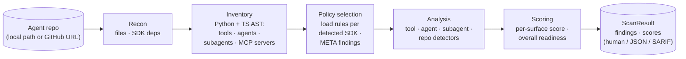

<p align="center">
  
</p>

<p align="center">
  <a href="LICENSE"></a>
  <a href="https://github.com/trustabl/trustabl/releases"></a>
  <a href="https://github.com/trustabl/trustabl/actions/workflows/test.yml"></a>
  <a href="go.mod"></a>
  <br>
  <a href="https://github.com/trustabl/trustabl-rules"></a>
  <a href="COVERAGE.md"></a>
  <a href="COVERAGE.md"></a>
  <a href="COVERAGE.md"></a>
  <a href="COVERAGE.md"></a>
  <a href="README.md#output-modes"></a>
</p>

Trustabl is a static analyzer for agent reliability. It parses an agent-SDK
repository (Claude Agent SDK, OpenAI Agents SDK, Google ADK, MCP, LangChain /
LangGraph, CrewAI, AutoGen / AG2, Pydantic AI, and the Vercel AI SDK), models the
tools, agents, subagents, skills, slash commands, and plugin manifests it
declares, and checks them against a catalog of reliability and safety rules. It reports the weaknesses it finds — each
with an explanation, a suggested fix, and a confidence score — as a
human-readable summary, JSON, or SARIF 2.1.0, plus a per-surface reliability
score and a CI-friendly exit code. It ships as a single Go binary with no
hosted service: it runs as a CLI, or as a local stdio MCP server
(`trustabl mcp`) that exposes the same scan to MCP clients without opening a
network port.

The rest of this document explains *what Trustabl reasons about* and *how
the scan works*, then covers building and running it. For the full
implementation reference see [ARCHITECTURE.md](ARCHITECTURE.md); for the
at-a-glance SDK coverage matrix see [COVERAGE.md](COVERAGE.md).

## What it analyzes — the five-scope model

Trustabl does not treat a repository as one undifferentiated blob. Every
rule is classified into exactly one of five scopes, and each scope receives
a different typed input:

- **`tool`** — fires once per tool definition. Input: a `ToolDef` (a
  `@function_tool` / `@tool` / `@claude_tool` function, a Claude TS
  `tool(name, description, schema, handler)` factory call, a
  `FunctionTool(fn)` ADK wrapper, an `@server.tool` MCP registration, or a
  bare shell-invoking function) plus its parsed file. Catches a missing
  docstring, an HTTP call with no timeout, untyped parameters, or an
  unnormalized path flowing into `open()`. (Hosted tools like
  `WebSearchTool()` are agent-scope edge data, captured as `HostedToolDef`,
  not `ToolDef`.)
- **`agent`** — fires once per agent declaration. Input: an `AgentDef` —
  a Python `Agent(...)` / `SandboxAgent(...)` / `AgentDefinition(...)`
  call, a Claude TS typed-const `AgentDefinition`, a Claude TS sub-agent
  inline in `options.agents`, or the Claude TS `query(...)` main-thread
  agent (`QueryMainAgent`) — with every constructor kwarg captured and its
  edges to tools, handoffs, and guardrails resolved. Catches an agent with
  shell tools and no `input_guardrails`,
  `tool_use_behavior="stop_on_first_tool"` paired with filesystem-touching
  tools, or a main-thread agent with unrestricted `allowedTools`.
- **`subagent`** — fires once per Claude Code subagent markdown
  declaration. Discovery is **hybrid**: canonical `.claude/agents/*.md`
  (any path depth, monorepo-safe) PLUS a frontmatter-shape fallback over
  all markdown files (gated on `name` + `tools`/`model`) that catches
  flat-collection repos which ship subagents under `categories/*.md`,
  `plugins/<x>/agents/*.md`, or similar layouts. Input: a `SubagentDef`
  parsed from frontmatter — `name`, `description`, `tools[]` (verbatim) +
  `ToolGrants[]` (parsed permission grammar), `disallowedTools`, `model`,
  `permissionMode` (incl. `bypassPermissions`), `mcpServers`, `skills`,
  `isolation`, `hasHooks`. Catches a subagent granted the built-in `Bash`
  tool despite a read-only description (CSDK-110). Subagent presence alone
  contributes `claude_agent_sdk` to `SDKsDetected`, so the Claude pack
  loads and CSDK-110 fires on pure-markdown subagent collections.
- **`skill`** — fires once per Claude Code skill (`SKILL.md`, any path
  depth). Input: a `SkillDef` parsed from frontmatter — `name`,
  `description`, `allowed-tools` → `ToolGrants[]`,
  `disable-model-invocation` — plus body facts (dynamic-context exec
  commands, external URLs, prompt-injection markers) and a bundled-file
  inventory. Catches a skill that auto-approves unrestricted `Bash`
  (CSKILL-001), runs a dynamic-context command that performs network egress
  or reads secrets before the model sees it (CSKILL-003), or is
  model-invocable while granting side-effecting tools (CSKILL-050). Skills
  are markdown, so skill rules carry no `language:`; the `claude_skill`
  pack loads whenever a `SKILL.md` is present.
- **`repo`** — fires once per scan against the whole inventory. Catches
  project-wide gaps such as the OpenAI Agents SDK being present with no
  custom trace processor configured.

### The agent is the unit of analysis, not the repo

A repo can declare zero, one, or many agents, across one or more SDKs.
**Two agents in the same repo can be in completely different security
postures** — one wired with input/output guardrails, the other not.
Agent-scoped findings therefore attribute to a *specific* agent at its
constructor call site; flattening them to a single repo-level verdict
would lose that attribution and be wrong. Discovery builds a small
per-repo graph (tools, agents, subagents, and the edges between them) so
agent-scope and subagent-scope rules can query it.

### Rules are scoped to one SDK *and* one language

A Claude-SDK rule and an OpenAI-Agents-SDK rule that detect the same
conceptual problem (a missing timeout, say) are two separate rules with
SDK-specific explanation and fix text — there is no cross-SDK casting.
When a repo declares agents from multiple SDKs side by side, each agent is
checked only against the rules for the SDK that declared it. The same
holds across languages: a `language: python` rule will not fire on a
TypeScript agent.

## How it reasons — the scanning pipeline

trustabl scans in four steps, each step's typed output feeding the next:



1. **Recon** — walk the repo cheaply (no parsing): languages, declared SDK
   deps, and agent components (MCP configs, `CLAUDE.md`/`AGENTS.md`,
   `.claude/agents/*.md`, `SKILL.md`, slash commands, plugin manifests).
2. **Inventory** — for each language Recon cleared, do the AST work into a
   typed inventory (`ToolDef`/`AgentDef`/`SubagentDef`/`SkillDef`/…) with
   agent→tool/guardrail edges resolved. Detectors read these structs; they
   never re-parse source.
3. **Policy selection** — load **only** the packs for SDKs observed in code.
   An observed-but-unshipped SDK emits a `META-001` info finding; silence on
   an unknown SDK is wrong.
4. **Analysis** — run the scope-aware detectors; findings attribute to the
   tool file/line, agent call site, subagent file, or manifest.

The binary ships with **no embedded rules** — they resolve from the separate
[`trustabl-rules`](https://github.com/trustabl/trustabl-rules) repo at scan
time (cached, offline-fallback), and the resolved commit folds into the
`ScanID`. The staging buys performance (skip AST work for absent languages),
honest coverage (an unaudited SDK is louder than a false clean bill), and
determinism (same inputs → same `ScanID`, byte-stable report). The full
pipeline with typed inputs at each step is in
[ARCHITECTURE.md § 2](ARCHITECTURE.md#2-pipeline).

### What's wired today

Full-depth **Python + TypeScript** AST discovery (tools, agents, hosted tools,
MCP servers, guardrails, sessions) ships for nine SDKs — Claude Agent SDK,
OpenAI Agents SDK, Google ADK, LangChain / LangGraph, CrewAI, AutoGen / AG2,
Pydantic AI, the Vercel AI SDK, and MCP — with shared constructors (`Agent(...)`,
`@tool`, `tool(...)`) import-gated per SDK so they never cross-match.
**JavaScript** (`.js`/`.jsx`/`.mjs`/`.cjs`) routes through the same TS-family
pipeline. **Go, C#, PHP, and Rust** have MCP-server discovery (the official SDKs
plus key community ones). Other SDKs in those languages are recognized by Recon
but not yet AST-parsed.

The exact per-SDK, per-language recognition and rule coverage — including which
TypeScript rule packs ship — is the [COVERAGE.md](COVERAGE.md) matrix.

### Scope boundaries

- **LLM enrichment is a separate post-scan step (`trustabl enrich`).** Rule-based
  detection (`trustabl scan`) makes no network call — there is no LLM involved in
  the scan itself. `trustabl enrich` reads the scan output and calls Anthropic with
  BYOK (key stored via `trustabl llm key set` at `~/.config/trustabl/keys.json`,
  mode 0600). The Anthropic call carries a request timeout, and `--apply` rewrites
  a file only when its current contents still match what the model reviewed
  (writing a `.trustabl.bak` backup first) — a stale scan is skipped, never
  mis-applied.
- **Confidence scores are heuristic**, not LLM-judged, and not yet
  calibrated against a labelled real-agent corpus — treat findings as
  signal to investigate.
- **The CLI is the surface.** No web app, API server, or hosted service:
  pipe `--format json` or `--format sarif` into your own automation. On GitHub
  Actions, [`trustabl/trustabl-action`](https://github.com/trustabl/trustabl-action)
  wraps the scan and uploads SARIF to the Security tab for you; for any other
  CI, `--format sarif --output <file>` produces a SARIF 2.1.0 report that feeds
  `github/codeql-action/upload-sarif` or any SARIF-aware step.

## What it produces

Trustabl is a detect-and-report tool: it does **not** write or modify any
files in the scanned repo. Each run produces a `ScanResult` containing:

- **Findings** — one per rule hit, each with `severity`, `confidence`,
  an `explanation`, a `suggested_fix`, and the location it fired at
  (tool file/line, agent call site, subagent file, or the manifest).
- **Per-surface readiness scores** (one per discovered tool, agent, subagent,
  or the repo as a whole) and an **overall score** (a breadth-aware,
  badness-weighted mean — weak surfaces pull it down harder, but a single
  poor surface does not zero it; the score is a triage signal, not the CI gate).
- **The discovered inventory** — tools, agents, hosted tools, MCP
  servers, subagents, skills, slash commands, plugin manifests, and
  Claude settings — surfaced at the top level for CI consumers.

### The summary's tool surface, broken out

The human format honestly separates the three things people commonly
conflate:

```
Tool definitions:   2  (custom tools with function bodies — scored below)
Agent tool grants: 14  (tool names the agent may call — audited by agent-scope rules)
Hosted tools:       1  (...)
```

Only the "Tool definitions" category flows through tool-scope rules
(they have function bodies a rule can read). Agent grants and hosted
instances are inputs to *agent-scope* rules, not unanalyzed — they just
don't appear in the per-surface readiness table.

### Output modes

`--format human` (default) renders a human summary to stdout and live
progress to stderr — an animated spinner and progress bar on an
interactive terminal, or plain `[phase] summary` lines when piped
(CI-friendly).

`--format json` marshals the full `ScanResult` for piping into your
own automation.

`--format sarif` emits a SARIF 2.1.0 document, suitable for
`github/codeql-action/upload-sarif` and other SARIF-aware tools. The suggested
fix is carried at the rule level (`help.text`); Trustabl emits no per-result
`fixes[]`, so the document passes GitHub Code Scanning's schema validator (which
rejects a `fix` that lacks `artifactChanges`).

`--json-out <file>` and `--sarif-out <file>` write the JSON / SARIF document to a
file independent of `--format` — one scan can print the human summary to stdout
while persisting both machine artifacts. The file bytes are identical to the
matching `--format` stdout output.

**Supply chain (`--bom-out`, `--vuln-scan`).** `--bom-out <file>` writes a
byte-stable CycloneDX 1.5 BOM of the repo's declared direct deps across every
supported language (pure inventory, no network). `--vuln-scan` (opt-in, online)
matches concretely-pinned deps against a cached [OSV](https://osv.dev) snapshot
and reports each affected package as a finding (advisory ID, CVSS severity,
fixed version) that fails the scan through the normal gate; combined with
`--bom-out` the CycloneDX document gains a VEX `vulnerabilities[]` array. Only
the `--vuln-scan` path makes a network call and folds the snapshot version into
`ScanID`; a default scan stays byte-identical.

`--format json` and `--format sarif` are byte-stable across identical-input runs
(pure functions of the `ScanResult`); the human format is not, since its color
auto-detects from the terminal (use `--no-color` or diff the JSON/SARIF when
byte-stability matters).

**Diagnostics (`--verbose` / `--debug`).** Global flags (`scan`, `mcp`,
`rules pull`; before or after the subcommand) that narrate the scan on
**stderr** only — rule provenance, discovery counts, and a result summary
(`-v`), plus per-phase timing and per-entity/per-finding detail (`--debug`). They
never touch stdout, so `--format json --debug` still emits a clean document.
There's no `--log-file`: redirect stderr (`2>diagnostics.log`).

Exit codes:
- `0` — no findings ≥ medium severity (or no findings at all).
- `1` — at least one finding ≥ medium severity, OR `--strict` with any
  finding present.
- `2` — scanner / I/O error, OR no usable rules found and none fetchable
  (run `trustabl rules pull`), OR a signed channel (`--channel`) that failed
  verification (bad signature, untrusted/expired key, channel confusion, an
  expired or rolled-back statement, or a digest mismatch) — Trustabl refuses to
  run unverified rules.

Shell-invocation functions are still discovered and reported in a
`Risk surfaces: openshell` block (count, first locations, threat model, fix),
making the risk legible even though the OSH-* detection rules now live in a
closed-source companion project — the block claims no audit happened.

## Install

### Homebrew (macOS, Linux)

```sh
brew install trustabl/tap/trustabl
```

### Scoop (Windows)

```sh
scoop bucket add trustabl https://github.com/trustabl/scoop-bucket
scoop install trustabl
```

### Docker

```sh
docker run --rm -v "$PWD:/repo" ghcr.io/trustabl/trustabl:latest scan /repo
```

### Direct download

Grab a prebuilt archive for your platform from the
[Releases page](https://github.com/trustabl/trustabl/releases). Each release
includes a `checksums.txt` and a build-provenance attestation; verify with:

```sh
gh attestation verify <archive> --repo trustabl/trustabl
```

### From source

Requires `CGO_ENABLED=1` because the AST parsers use tree-sitter
(Python + TypeScript + TSX bindings), which is a C library:

```bash
# macOS / Linux
CGO_ENABLED=1 go build -o trustabl ./cmd/trustabl

# Cross-compile: pick a C toolchain for the target. zig is the easiest.
CGO_ENABLED=1 CC="zig cc -target x86_64-linux-gnu" \
  GOOS=linux GOARCH=amd64 go build -o trustabl-linux ./cmd/trustabl
```

This is the cost of using tree-sitter for accurate AST parsing. If a
single-binary, no-CGO distribution becomes a hard requirement later, the
swap target is `github.com/go-python/gpython` for Python (with lower
fidelity on modern Python); TypeScript would need a separate replacement.

## Use

One representative invocation per capability — the full flag surface of each is
in `trustabl <command> --help`.

```bash
# Scan a local repo, a GitHub URL (shallow-cloned, removed on exit), or one skill
trustabl scan ./path/to/agent-repo
trustabl scan https://github.com/org/repo
trustabl scan ./path/to/my-skill

# Restrict to specific SDK detectors
trustabl scan ./repo --detectors claude_sdk,openai_sdk

# Machine output for CI (--output writes even when the scan exits 1 on findings)
trustabl scan ./repo --format json
trustabl scan ./repo --format sarif --output trustabl.sarif
trustabl scan ./repo --strict                 # fail on any finding, any severity

# Supply chain: a CycloneDX BOM, and an opt-in online OSV vulnerability scan
trustabl scan ./repo --bom-out sbom.json
trustabl scan ./repo --vuln-scan

# Diagnostics on stderr (stdout/report unaffected); -v narrates, --debug adds detail
trustabl scan ./repo --verbose

# Generate an Agent Format (.agf.yaml) manifest, and optionally an OpenShell policy
trustabl generate agent-yaml ./repo --agent "Research Agent" --fail-on needs_work
trustabl generate agent-yaml ./repo --openshell-policy policy.yaml

# Manage the detection rules and the vulnerability database
trustabl rules pull                           # refresh the local rules cache
trustabl rules validate ./trustabl-rules      # CI gate: strict-load a rule-pack dir
trustabl vulndb pull                          # pre-download the OSV snapshot

# Run as a stdio MCP server so an MCP client (Claude Code, Cursor, …) can scan
trustabl mcp

# Configure a BYOK LLM provider (key stored at ~/.config/trustabl/keys.json, 0600)
trustabl llm list                             # configured providers, keys masked
trustabl llm key set                          # prompt securely for an API key
trustabl llm key set sk-ant-api03-...         # set the key non-interactively
trustabl llm key get                          # show the masked key for the active provider
trustabl llm key delete                       # delete the key (with confirmation)
trustabl llm model set claude-sonnet-4-6      # change the model for the active provider
trustabl llm provider set openai              # switch active provider (auto-creates it)
trustabl llm provider list                    # list configured providers

# Enrich a scan result with AI explanations and in-place fixes (anthropic + key)
trustabl scan ./repo --format json | trustabl enrich --repo ./repo      # pipe in, stdout
trustabl enrich --input scan.json --repo ./repo --output enriched.json  # file in, file out
trustabl enrich --input scan.json --repo ./repo --diff                  # preview fixes (stderr)
trustabl enrich --input scan.json --repo ./repo --diff --apply          # preview, then apply
trustabl enrich --input scan.json --repo ./repo --apply                 # apply without previewing
trustabl enrich --input scan.json --repo ./repo --rule CSDK-010         # focus on one rule
trustabl enrich --input scan.json --repo ./repo --only-enriched         # CI: drop unenriched findings
```

Rules are cached under your OS cache dir (`os.UserCacheDir()`, e.g.
`%LocalAppData%\trustabl\rules\` on Windows, `~/.cache/trustabl/rules/`
on Linux). The first scan (or an explicit `trustabl rules pull`)
populates it; each subsequent scan checks for an update first (unless
`--no-rules-update`), falling back to the cached rules if the fetch
fails.

**Signed rules channels (opt-in).** `--channel <name>` resolves rules from a
signature-verified release channel instead of cloning git: Trustabl verifies a
signed channel statement against an embedded trust keyring, fetches the bundle
it commits to, and refuses (exit `2`) on any verification failure rather than
running unverified rules. The **default scan is unchanged** — it still uses the
git source. A scan that did not use blessed production rules (a pre-release
`--channel`, or a custom `--rules-repo` source) is watermarked in the report and
in the JSON `rules_origin` field, and its provenance is folded into `ScanID`.
Signed channels require a build with published signing keys; until then
`--channel` refuses with a clear message.

### Generate an Agent Format manifest

`trustabl generate agent-yaml [PATH]` scans a repo and emits a portable
[Agent Format](https://agentformat.org) manifest (`.agf.yaml`) for **one
agent**, carrying a `x-trustabl` extension block with per-surface readiness
scores, the findings attributed to that agent's graph (annotated with OWASP
ASI/AST IDs from a pinned engine map), the skill/hosted-tool inventory, and
honest coverage data (detected SDKs, unaudited SDKs, dependency BOM summary).

> **Two artifact classes, two review owners.** The `.agf.yaml` manifest is an
> **Agent Configuration as Code (ACaC)** artifact: it *defines* the agent,
> travels with it across conforming runtimes, and is interpreted by the
> model/runtime — a behavioral guarantee, so its `reliability_score` is
> informational and its diffs belong in **engineering** review. The optional
> `--openshell-policy` output (below) is an **Agent Infrastructure as Code
> (AIaC)** artifact: it constrains the host, stays with the OpenShell gateway,
> and is enforced mechanically — a structural guarantee, so its diffs belong in
> **platform/security** review. Trustabl derives both from one scan but never
> conflates them: it does not claim the manifest enforces anything. The
> `x-trustabl` block is, strictly, neither — it is an *assessment* of the
> configuration, carried inside the manifest for convenience.

- **One manifest, one agent.** A single-agent repo selects automatically; a
  multi-agent repo requires `--agent <name>` (without it, exit `2` listing the
  candidates). Subagents and skills are never manifest roots — they ride along
  on the selected agent.
- **Derived where provable, scaffolded where not.** Everything the scan can
  prove (tools, model, instructions, memory use) is auto-filled. Human intent
  (versioning, budgets, the I/O contract, MCP registry identities) is emitted
  as a scaffold with a `# trustabl: needs-human-input` / `suggested — confirm`
  / `review` comment — checked for presence, never invented.
- **Deterministic by default.** Same repo + same rules version → byte-identical
  manifest. `--timestamp` opts in to a `generated_at` field.
- **Readiness gate for CI.** Exit `0` when generated and the gate passes; `1`
  when `deployment_readiness` is at or below `--fail-on`
  (`not_ready` default | `needs_work` | `never`); `2` on operational errors.
  `ready` additionally requires that the scan actually audited something: at
  least one scored surface in the agent's graph and no observed-but-unaudited
  SDK. A repo Trustabl could not vouch for caps at `needs_work` — absence of
  evidence is never a clean bill.
- **`reliability_score` is informational in v0.x.** Its thresholds are
  provisional pending corpus calibration of the scoring constants; do not gate
  releases on the absolute number yet.
- `--vuln-scan` additionally carries known-CVE matches in
  `x-trustabl.vulnerabilities`.
- **`--openshell-policy <file>`** also emits an NVIDIA
  OpenShell sandbox policy derived from the same scan — an **AIaC** artifact
  (it constrains the host and is mechanically enforced; route its diffs to
  platform/security review): hardened static
  defaults (`include_workdir`, read-only system roots, non-root
  `sandbox`/`sandbox` process), `read_write` extended with the tool bodies'
  captured absolute write-path literals, and one `network_policies` entry per
  tool with a captured static host (conservative `access: read-only` +
  confirm marker; interpreter-path guesses carry review markers). Dynamic
  URLs/paths and private-range/loopback hosts are never guessed — they
  surface as review comments. The emitted file is validated against
  OpenShell's documented constraints before writing, and is primarily a
  **creation-time** policy: `filesystem_policy` and `process` lock at sandbox
  creation; only `network_policies` hot-reload. Verified end-to-end against
  OpenShell 0.0.36 — a generated policy is accepted by both
  `openshell sandbox create --policy` and `openshell policy set`, and enforces
  network egress, filesystem write boundaries, and the non-root process
  identity as written (transcript in
  `.superpowers/verification/`). Always review the `trustabl:` markers (the
  interpreter path and per-endpoint access method) before applying.

### Continuous integration

Two CI patterns are supported, and they compose:

- **Gate the build.** The exit code is the gate: `0` clean, `1` on a finding
  of medium severity or higher (`--strict` lowers the bar to any finding),
  `2` on an operational error. A bare `trustabl scan ./repo` in a job step
  fails the job when it should.
- **Publish to GitHub Code Scanning.** On GitHub Actions, the
  [`trustabl/trustabl-action`](https://github.com/trustabl/trustabl-action)
  runs the scan and uploads the SARIF to the repository's Security tab in a
  single step (`upload-sarif` defaults to `true`), with inline PR alerts and
  optional threshold gating — the recommended path, and the single source of
  truth for the workflow. Outside GitHub Actions, `--format sarif --output
  <file>` writes a SARIF 2.1.0 report that any
  `github/codeql-action/upload-sarif` or SARIF-aware step can publish. Because
  `--output` writes the file before the findings-based exit code is applied,
  the scan step can run with `continue-on-error: true` and the upload with
  `if: always()`, so a scan that finds issues still surfaces them instead of
  aborting the run with nothing uploaded.

The SARIF document is a pure function of the scan result: byte-stable across
identical-input runs, repo-relative file URIs, and a stable
`partialFingerprints` per finding so Code Scanning deduplicates alerts across
runs rather than re-opening them.

### Run as an MCP server

`trustabl mcp` runs a Model Context Protocol (MCP) server over stdio, so an MCP
client (Claude Code, Cursor, Claude Desktop) can scan a directory an agent just
edited and read the findings back. It is the same scan as `trustabl scan`,
exposed as an MCP tool — it opens no network port. The server speaks JSON-RPC on
stdout, so it writes nothing else there; status lines and diagnostics go to
stderr.

It exposes two tools:

- `scan` — input `{ "path": "<dir>", "rules_ref": "<branch-or-tag>"?, "vuln_scan": true? }`.
  Scans `path` and returns the full scan result (findings, scores, discovered
  inventory) as JSON — the same shape as `--format json`. Set `vuln_scan: true`
  to also match declared dependencies against a pinned OSV snapshot and report
  known CVEs (mirrors `--vuln-scan`; off by default).
- `version` — reports the build version, commit, and date.

Register it with an MCP client by pointing the client at the binary with the
`mcp` argument over stdio. For Claude Code:

```bash
claude mcp add trustabl -- trustabl mcp
```

Or configure it directly in a client's MCP config (the `mcpServers` stdio
shape used by Claude Desktop / Cursor):

```json
{
  "mcpServers": {
    "trustabl": {
      "command": "trustabl",
      "args": ["mcp"]
    }
  }
}
```

The rules-source flags (`--rules-repo`, `--rules-ref`, `--no-rules-update`) work
on `trustabl mcp` exactly as on `trustabl scan`; a client may also pass a
per-call `rules_ref` in the `scan` tool arguments, which overrides the
command-level `--rules-ref` for that call.

### Claude Code plugin (self-audit at generation time)

Trustabl ships a Claude Code plugin under [`.claude-plugin/`](.claude-plugin/)
with two skills that form a scan-and-fix loop:

- **[`trustabl-scan`](skills/trustabl-scan/)** — triggers right after agent,
  tool, subagent, or MCP-server code is written or changed and calls Trustabl's
  `scan` tool (the bundled MCP server, `mcp__trustabl__scan`) to self-audit it
  before committing, upstream of CI.
- **[`trustabl-enrich`](skills/trustabl-enrich/)** — takes the output of a
  `trustabl scan` run (JSON, SARIF, or pasted terminal text) and applies each
  finding as a targeted code edit, guided entirely by the scan's own
  `explanation` and `suggested_fix` fields. It does not re-run the scanner; use
  `trustabl-scan` first, then invoke `trustabl-enrich` with the results.

Scanning runs through a **bundled MCP server**: [`.mcp.json`](.mcp.json)
registers a `trustabl` server whose command is a launcher
([`scripts/trustabl-mcp.sh`](scripts/trustabl-mcp.sh)) exposing the
`mcp__trustabl__scan` tool. The launcher and a `SessionStart` hook
([`hooks/hooks.json`](hooks/hooks.json) →
[`scripts/check-trustabl.sh`](scripts/check-trustabl.sh)) share install logic
([`scripts/lib-trustabl.sh`](scripts/lib-trustabl.sh)) that downloads the pinned
CLI version from GitHub Releases, verifies it against the release
`checksums.txt`, and installs it into the plugin's private data directory
(`$CLAUDE_PLUGIN_DATA` — no `sudo`, nothing outside that dir touched). The
install is idempotent (re-runs only when the pin changes or the copy is
missing/corrupt), and the launcher installs synchronously before starting the
server, so there is no first-session race. The same binary is exposed as
`$TRUSTABL_BIN` for the enrich skill's direct-CLI path. When auto-install cannot
run (offline first session, an unsupported platform, or missing `curl`/`tar`) it
falls back to whatever `trustabl` is on `PATH`; the system-wide install stays a
consented step inside `trustabl-scan`. The plugin runs no network service of its
own and modifies nothing outside the scan target.

### "rules are newer than this Trustabl build"

Rule loading is **forward-compatible**: a pack (or individual rule) that targets
a newer schema, scope, `applies_to`, or predicate than your binary understands
is **skipped** — its siblings still run — with a stderr warning and a `META-005`
info finding, so a degraded scan is never mistaken for a clean one. A *malformed*
known rule still hard-fails the load (authoring errors aren't silently dropped).
**Upgrade Trustabl** to evaluate the skipped rules, or keep running the subset.

The scan only **fails** (exit `2`) when *nothing* is usable: every rule too new
(`--rules-ref <older-branch-or-tag>` to pin a compatible pack), a corrupt
`manifest.yaml`, or nothing cached and nothing fetchable (`trustabl rules pull`
while online). See [ARCHITECTURE.md § 5](ARCHITECTURE.md#5-the-rules-engine-schema-evaluator-loader)
for the schema-version discipline.

## Where the code lives

| Pipeline node      | Code path                                |
| ------------------ | ---------------------------------------- |
| Importer           | `internal/ingestion/importer.go`         |
| Normalizer (recon) | `internal/ingestion/normalizer.go`       |
| Discovery (Python AST + markdown/JSON) | `internal/analysis/discovery.go`, `agents.go`, `hosted_tools.go`, `mcp_servers.go`, `adk_agents.go` (Python AST); `subagents.go`, `markdown_agents.go`, `skills.go`, `slash_commands.go` (markdown frontmatter); `plugins.go`, `claude_settings.go` (JSON) |
| TypeScript discovery | `internal/analysis/ts_discovery.go`, `ts_agents.go`, `ts_mcp_servers.go`, `ts_handler_facts.go`, `ts_openai_tools.go`, `ts_openai_agents.go`, `ts_openai_hosted_tools.go`, `ts_openai_mcp_servers.go`, `ts_openai_guardrails.go`, `ts_openai_sessions.go`, `ts_adk_tools.go`, `ts_adk_agents.go`, `ts_adk_hosted_tools.go`, `astutil/ts.go` |
| Detector runtime   | `internal/analysis/detectors/`           |
| Rule source        | `internal/rulesource/` (git fetch + cache + schema-version gate) |
| Detector rules     | external `trustabl-rules` repo (tests: `testdata/rules-fixture/`) |
| Rule engine        | `internal/rules/{schema,loader,evaluator,predicates,rule_detector}.go` |
| Scoring engine     | `internal/analysis/scoring.go`           |
| Report renderer    | `internal/review/diff.go` (human), `internal/sarif/render.go` (SARIF), JSON marshal in `cmd/trustabl` |
| LLM config         | `internal/llm/` (key storage · masking · validation) |

Rule packs live in the separate `trustabl-rules` git repository (grouped
`{claude_sdk,openai_sdk,google_adk,mcp}/`), resolved at scan time rather
than embedded in the binary. Naming convention: `CSDK-NNN` for Claude
Agent SDK rules (CSDK-0xx tool-scope, CSDK-1xx agent + subagent-scope),
`OAI-NNN` for OpenAI Agents SDK rules, `ADK-NNN` for Google ADK rules,
`MCP-NNN` for the dedicated MCP tool-scope pack.
See
[ARCHITECTURE.md § 2 — steps 3–4](ARCHITECTURE.md#2-pipeline) for the
shipped rule table and [COVERAGE.md](COVERAGE.md) for per-SDK
recognition detail.

## Testing

`testdata/corpus/` holds real-world agent code (Claude SDK demos, OpenAI Agents
SDK demos, Google ADK demos, a TS Claude SDK fixture) — a corpus, not a
controlled fixture, so well-written agents won't trigger most rules and
that's correct. See [`testdata/corpus/PROVENANCE.md`](testdata/corpus/PROVENANCE.md)
for upstream sources and licenses of each example. Per-rule fire/silent
correctness lives in `internal/rules/policies_test.go`; the end-to-end
sweep in `internal/scanner/scanner_test.go` only asserts the scanner
doesn't crash on real-world inputs. A labelled 20–40 real-agent-repo
corpus is the detection-quality target (see
[ARCHITECTURE.md § 10](ARCHITECTURE.md#10-what-is-intentionally-out));
the current tests are regression coverage, not detection-quality
measurement.

## Community

Join the [Trustabl Discord](https://discord.gg/maQ7QMPsB) to ask questions, share feedback, and follow development.

## License

Apache-2.0. See [`LICENSE`](LICENSE).
