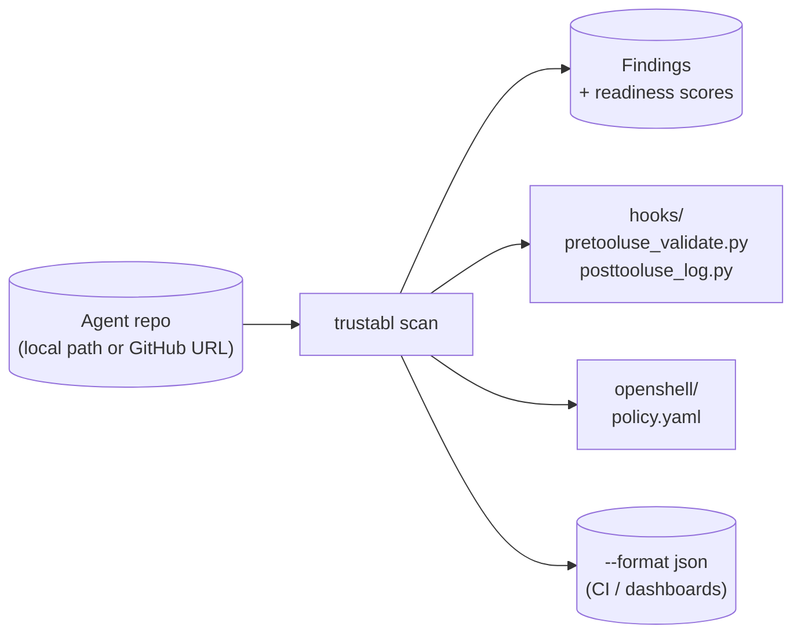

# trustabl

Static analyzer for agent reliability. Scans an agent SDK repo (Claude Agent
SDK, OpenAI Agents SDK, MCP, OpenShell), finds reliability and safety
weaknesses, emits committable artifacts (Pre/PostToolUse hook configs +
NVIDIA OpenShell sandbox policies).

Implements the Phase 1 MVP scope of *Trustabl Architecture v1 (Strawman)* as a single
Go binary.



## Status

Skeleton. Critical path is wired end-to-end. Detection runs from YAML rule
files embedded at build time via `go:embed`; see
[ARCHITECTURE.md](ARCHITECTURE.md) for the engine and `internal/rules/policies/`
for the rule definitions.

**Language scope.** Tool discovery is **Python-only** today —
TypeScript / JavaScript / Go files are recognized in the file inventory and
contribute to agent-component discovery (MCP configs, hooks, manifests,
etc.), but no AST parser for those languages is plumbed in, so no tools are
extracted from them. The rule schema's `language:` field is in place for
multi-language rule sets when those parsers ship. See
[ARCHITECTURE.md § 1.1](ARCHITECTURE.md#11-language-scope).

**SDK coverage.** Tool-decorator discovery recognizes Claude Agent SDK
(`@tool`, `@claude_tool`, `claude_agent_sdk`), OpenAI Agents SDK
(`@function_tool`), and MCP server registrations (`@server.tool`,
`@mcp.tool`, `.register_tool`). Shipped detection rules live in
`internal/rules/policies/claude_sdk/` (CSDK-001–007 tool, CSDK-101 agent),
`openai_sdk/` (OAI-001–201), and `openshell/` (OSH-001–005); each pack's `explanation`
and `fix` text is scoped to the SDK it targets. Each SDK's agents are
discovered separately (`kind: openai_agent` vs `claude_agent_definition`)
and checked only against the rules for that SDK — no cross-SDK casting.

**Test contract.** The `examples/` directory holds real-world agent code
(Claude SDK demos, OpenAI Agents SDK demos, etc.). It is a corpus, not a
controlled fixture — well-written agents won't trigger most rules, and
that's correct. Per-rule fire/silent correctness lives in
[`internal/rules/policies_test.go`](internal/rules/policies_test.go); the
end-to-end sweep in
[`internal/scanner/scanner_test.go`](internal/scanner/scanner_test.go) only
asserts the scanner doesn't crash on real-world inputs.

The following are intentionally stubbed and called out where they live:

- **LLM enrichment** (`internal/inference/router.go`) — typed BYOK interface, no
  Anthropic call yet. Rule-based detectors run without it.
- **Confidence scores** — heuristic, not LLM-judged.
- **Detection-quality benchmark** — no corpus eval. A 20–40 real-agent-repo
  corpus with labelled findings is the MVP gate (see
  [ARCHITECTURE.md §10](ARCHITECTURE.md#10-what-is-intentionally-out));
  the three-layer test strategy in `internal/rules/` and `internal/scanner/`
  is regression coverage, not detection-quality measurement.
- **No web app, no API server, no GitHub Action.** This is the CLI surface only.

## Build

CGO is required because the Python AST parser uses tree-sitter:

```bash
# macOS / Linux
CGO_ENABLED=1 go build -o trustabl ./cmd/trustabl

# Cross-compile: pick a C toolchain for the target. zig is the easiest.
CGO_ENABLED=1 CC="zig cc -target x86_64-linux-gnu" \
  GOOS=linux GOARCH=amd64 go build -o trustabl-linux ./cmd/trustabl
```

This is the cost of using tree-sitter for accurate Python parsing. If single-binary,
no-CGO distribution becomes a hard requirement later, swap the parser for
`github.com/go-python/gpython` and accept lower fidelity on modern Python.

## Use

```bash
# Local repo
trustabl scan ./path/to/agent-repo

# GitHub repo (shallow clone to temp dir, removed on exit)
trustabl scan https://github.com/org/repo

# Restrict detectors
trustabl scan ./repo --detectors claude_sdk
trustabl scan ./repo --detectors openshell
trustabl scan ./repo --detectors claude_sdk,openshell

# Apply generated artifacts (writes hooks/ and openshell/ into the repo;
# requires --yes or interactive approval)
trustabl scan ./repo --apply --yes

# Export the bundle as a ZIP
trustabl scan ./repo --export bundle.zip

# JSON output (for CI piping)
trustabl scan ./repo --format json
```

Exit codes: `0` = no findings ≥ medium, `1` = findings ≥ medium present, `2` =
scanner error. There is no built-in CI integration in this skeleton — pipe
`--format json` to your own CI logic, or invoke `trustabl scan ./repo` and act
on the exit code.

## Produced artifacts

The generated artifacts get committed to the user's repo:

```
<repo>/
├── hooks/
│   ├── pretooluse_validate.py
│   └── posttooluse_log.py
├── openshell/
│   └── policy.yaml
└── otel/
    └── trace_config.yaml          # deferred (Phase 2) — not generated
```

## Layout

| Architecture node | Code path                                |
| ----------------- | ---------------------------------------- |
| Importer          | `internal/ingestion/importer.go`         |
| Normalizer        | `internal/ingestion/normalizer.go`       |
| Tool Discovery    | `internal/analysis/discovery.go`         |
| Detector runtime  | `internal/analysis/detectors/`           |
| Detector rules    | `internal/rules/policies/<category>/`    |
| Rule engine       | `internal/rules/{schema,loader,evaluator,predicates,rule_detector,embed}.go` |
| Scoring Engine    | `internal/analysis/scoring.go`           |
| Hook Generator    | `internal/generation/hooks.go`           |
| Policy Generator  | `internal/generation/policy.go`          |
| Diff Renderer     | `internal/review/diff.go`                |
| Exporter          | `internal/review/export.go`              |
| Inference Router  | `internal/inference/router.go` (stub)    |

## Detectors shipped

Naming: `CSDK-NNN` for Claude Agent SDK reliability, `OAI-NNN` for OpenAI
Agents SDK, `OSH-NNN` for OpenShell policy. Rules are defined as YAML in
`internal/rules/policies/<category>/<topic>.yaml` and embedded into the binary
via `go:embed`. To add a rule, drop a new YAML entry; no Go code change is
required unless the rule needs a new predicate primitive (see
[ARCHITECTURE.md § 5](ARCHITECTURE.md#5-the-rules-engine-schema-evaluator-embed)).

**Claude Agent SDK (tool scope)**

| Rule     | Title                                              | Severity |
| -------- | -------------------------------------------------- | -------- |
| CSDK-001 | Tool function has no docstring / description       | low      |
| CSDK-002 | Tool function has no type-annotated params         | medium   |
| CSDK-003 | Tool performs network I/O without timeout          | high     |
| CSDK-004 | Tool accepts user-supplied path without validation | high     |
| CSDK-005 | Tool raises raw exceptions (no error contract)     | medium   |
| CSDK-006 | Tool with side-effects has no idempotency hint     | medium   |
| CSDK-007 | Ambiguous tool name (`process`, `handle`, ...)     | low      |

**Claude Agent SDK (agent scope)**

| Rule     | Title                                                  | Severity |
| -------- | ------------------------------------------------------ | -------- |
| CSDK-101 | `AgentDefinition` subagent granted the built-in `Bash` tool | high |

**OpenAI Agents SDK (tool scope)**

| Rule    | Title                                                  | Severity |
| ------- | ------------------------------------------------------ | -------- |
| OAI-001 | Tool function has no docstring                         | low      |
| OAI-002 | Tool has no type-annotated parameters                  | medium   |
| OAI-003 | `@function_tool(strict_mode=False)` — schema not enforced | medium |
| OAI-004 | No `failure_error_function` — errors propagate raw     | medium   |
| OAI-005 | HTTP call without `timeout=`                           | high     |
| OAI-006 | Path-like param passed to I/O without normalization    | high     |

**OpenAI Agents SDK (agent scope)**

| Rule    | Title                                                         | Severity |
| ------- | ------------------------------------------------------------- | -------- |
| OAI-101 | Agent with shell tools and no `input_guardrails`              | high     |
| OAI-102 | `tool_use_behavior="stop_on_first_tool"` — stops after one call | medium |
| OAI-103 | `tool_choice=required` + `reset_tool_choice=False` — loop risk | high   |
| OAI-104 | Bare `Agent` (not `SandboxAgent`) with shell-invoking tools   | high     |
| OAI-105 | Agent uses MCP servers without `input_guardrails`             | high     |

**OpenAI Agents SDK (repo scope)**

| Rule    | Title                                                | Severity |
| ------- | ---------------------------------------------------- | -------- |
| OAI-201 | No custom trace processor configured                 | medium   |

**OpenShell**

| Rule    | Title                                              | Severity |
| ------- | -------------------------------------------------- | -------- |
| OSH-001 | `subprocess` call with `shell=True`                | critical |
| OSH-002 | Shell tool without allowed-command list            | high     |
| OSH-003 | Filesystem write without path restriction          | high     |
| OSH-004 | No resource limits configured (repo scope)         | medium   |
| OSH-005 | Broad network egress (no host allowlist)           | high     |
