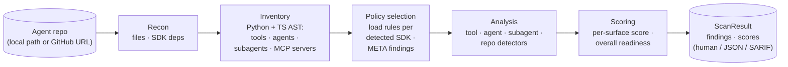

<p align="center">
  
</p>

<p align="center">
  <a href="LICENSE"></a>
  <a href="https://github.com/trustabl/trustabl/releases"></a>
  <a href="https://github.com/trustabl/trustabl/releases"></a>
  <a href="https://github.com/trustabl/trustabl/actions/workflows/test.yml"></a>
  <a href="go.mod"></a>
  <br>
  <a href="https://github.com/trustabl/trustabl-rules"></a>
  <a href="COVERAGE.md"></a>
  <a href="COVERAGE.md"></a>
  <a href="COVERAGE.md"></a>
  <a href="COVERAGE.md"></a>
  <a href="README.md#output-modes"></a>
</p>

Trustabl is a static analyzer for agent reliability. It parses an agent-SDK
repository (Claude Agent SDK, OpenAI Agents SDK, Google ADK, MCP, LangChain /
LangGraph, CrewAI, AutoGen / AG2, Pydantic AI, and the Vercel AI SDK), models the
tools, agents, subagents, skills, slash commands, and plugin manifests it
declares, and checks them against a catalog of reliability and safety rules. It reports the weaknesses it finds — each
with an explanation, a suggested fix, and a confidence score — as a
human-readable summary, JSON, or SARIF 2.1.0, plus a per-surface reliability
score and a CI-friendly exit code. It ships as a single Go binary with no
hosted service: it runs as a CLI, or as a local stdio MCP server
(`trustabl mcp`) that exposes the same scan to MCP clients without opening a
network port.

The rest of this document explains *what Trustabl reasons about* and *how
the scan works*, then covers building and running it. For the full
implementation reference see [ARCHITECTURE.md](ARCHITECTURE.md); for the
at-a-glance SDK coverage matrix see [COVERAGE.md](COVERAGE.md).

## What it analyzes — the five-scope model

Trustabl does not treat a repository as one undifferentiated blob. Every
rule is classified into exactly one of five scopes, and each scope receives
a different typed input:

- **`tool`** — fires once per tool definition. Input: a `ToolDef` (a
  `@function_tool` / `@tool` / `@claude_tool` function, a Claude TS
  `tool(name, description, schema, handler)` factory call, a
  `FunctionTool(fn)` ADK wrapper, an `@server.tool` MCP registration, or a
  bare shell-invoking function) plus its parsed file. Catches a missing
  docstring, an HTTP call with no timeout, untyped parameters, or an
  unnormalized path flowing into `open()`. (Hosted tools like
  `WebSearchTool()` are agent-scope edge data, captured as `HostedToolDef`,
  not `ToolDef`.)
- **`agent`** — fires once per agent declaration. Input: an `AgentDef` —
  a Python `Agent(...)` / `SandboxAgent(...)` / `AgentDefinition(...)`
  call, a Claude TS typed-const `AgentDefinition`, a Claude TS sub-agent
  inline in `options.agents`, or the Claude TS `query(...)` main-thread
  agent (`QueryMainAgent`) — with every constructor kwarg captured and its
  edges to tools, handoffs, and guardrails resolved. Catches an agent with
  shell tools and no `input_guardrails`,
  `tool_use_behavior="stop_on_first_tool"` paired with filesystem-touching
  tools, or a main-thread agent with unrestricted `allowedTools`.
- **`subagent`** — fires once per Claude Code subagent markdown
  declaration. Discovery is **hybrid**: canonical `.claude/agents/*.md`
  (any path depth, monorepo-safe) PLUS a frontmatter-shape fallback over
  all markdown files (gated on `name` + `tools`/`model`) that catches
  flat-collection repos which ship subagents under `categories/*.md`,
  `plugins/<x>/agents/*.md`, or similar layouts. Input: a `SubagentDef`
  parsed from frontmatter — `name`, `description`, `tools[]` (verbatim) +
  `ToolGrants[]` (parsed permission grammar), `disallowedTools`, `model`,
  `permissionMode` (incl. `bypassPermissions`), `mcpServers`, `skills`,
  `isolation`, `hasHooks`. Catches a subagent granted the built-in `Bash`
  tool despite a read-only description (CSDK-110). Subagent presence alone
  contributes `claude_agent_sdk` to `SDKsDetected`, so the Claude pack
  loads and CSDK-110 fires on pure-markdown subagent collections.
- **`skill`** — fires once per Claude Code skill (`SKILL.md`, any path
  depth). Input: a `SkillDef` parsed from frontmatter — `name`,
  `description`, `allowed-tools` → `ToolGrants[]`,
  `disable-model-invocation` — plus body facts (dynamic-context exec
  commands, external URLs, prompt-injection markers) and a bundled-file
  inventory. Catches a skill that auto-approves unrestricted `Bash`
  (CSKILL-001), runs a dynamic-context command that performs network egress
  or reads secrets before the model sees it (CSKILL-003), or is
  model-invocable while granting side-effecting tools (CSKILL-050). Skills
  are markdown, so skill rules carry no `language:`; the `claude_skill`
  pack loads whenever a `SKILL.md` is present.
- **`repo`** — fires once per scan against the whole inventory. Catches
  project-wide gaps such as the OpenAI Agents SDK being present with no
  custom trace processor configured.

### The agent is the unit of analysis, not the repo

A repo can declare zero, one, or many agents, across one or more SDKs.
**Two agents in the same repo can be in completely different security
postures** — one wired with input/output guardrails, the other not.
Agent-scoped findings therefore attribute to a *specific* agent at its
constructor call site; flattening them to a single repo-level verdict
would lose that attribution and be wrong. Discovery builds a small
per-repo graph (tools, agents, subagents, and the edges between them) so
agent-scope and subagent-scope rules can query it.

### Rules are scoped to one SDK *and* one language

A Claude-SDK rule and an OpenAI-Agents-SDK rule that detect the same
conceptual problem (a missing timeout, say) are two separate rules with
SDK-specific explanation and fix text — there is no cross-SDK casting.
When a repo declares agents from multiple SDKs side by side, each agent is
checked only against the rules for the SDK that declared it. The same
holds across languages: a `language: python` rule will not fire on a
TypeScript agent.

## How it reasons — the scanning pipeline

trustabl scans in four steps. Each step's output is the typed input to the
next, with no shared state between runs — and the inventory the early
steps build is what makes policy selection *data-driven* rather than
statically configured.

The binary ships with **no embedded rules**. Before the pipeline runs,
Trustabl resolves its detection rules from a separate git repository
([`trustabl-rules`](https://github.com/trustabl/trustabl-rules)) —
fetching the latest, caching the clone locally, and falling back to the
cache when the network is unreachable. This decouples rule updates from
binary releases: rules can be added or changed without rebuilding the
scanner. The resolved rules commit is recorded in the result and folded
into the `ScanID`, so a scan is honest about *which* rules produced it.
If no rules can be fetched and none are cached, the scan exits `2` and
tells you to run `trustabl rules pull` — Trustabl never runs rule-less.



1. **Recon** — walk the repo and answer "what's in here" cheaply, without
   parsing any source language: languages present (by extension), SDK
   dependencies declared in manifests (`pyproject.toml` / `requirements.txt`
   / `Pipfile` / `poetry.lock` / `package.json` for the
   `claude-agent-sdk` / `@anthropic-ai/claude-agent-sdk` / `openai-agents` /
   `@openai/agents` / `google-adk` / `@google/adk` needles), the file inventory, and
   discovered agent components (MCP configs, hook scripts, `CLAUDE.md` and
   `AGENTS.md` guidance docs,
   `.claude/agents/*.md` subagents at any depth, `SKILL.md` skills,
   slash commands at both `.claude/commands/*.md` and
   `<plugin-root>/commands/*.md`, `.claude-plugin/{plugin,marketplace}.json`
   manifests, sandbox policies). No
   tree-sitter parses happen here — this step decides whether the
   expensive AST work is even worth attempting.
2. **Inventory** — for each language Recon cleared, do the AST work and
   extract a typed inventory: `ToolDef`s with their config and body facts,
   `AgentDef`s with all kwargs captured, `SubagentDef`s / `SkillDef`s /
   `SlashCommandDef`s / `PluginManifest`s parsed from markdown and JSON
   frontmatter, `MCPServerDef`s, guardrails, sessions, and the resolved
   edges between agents and the tools/guardrails they reference. Detectors
   read fields off these structs — they never re-parse raw source.
3. **Policy selection** — load **only** the rule packs for SDKs actually
   *observed in code*. An SDK seen in code with no shipped pack emits a
   `META-001` info finding ("Trustabl does not currently audit this SDK")
   — silence on an unknown SDK is wrong. A dep declared but never used in
   code emits a different info finding flagging the drift.
4. **Analysis** — run the selected scope-aware detectors against the
   inventory. Findings carry the scope they fired at and attribute to the
   right location: tool file/line, agent call site, subagent markdown
   file, or the manifest.

Three properties fall out of this staging, by design:

- **Performance.** A repo with no Python skips Python AST work; a repo
  with only Claude TS code skips Python AST work AND OpenAI policy
  loading.
- **Honest coverage.** An "unaudited SDK" info finding is louder than a
  zero-findings clean bill of health on an SDK Trustabl doesn't know. A
  `META-004` finding further distinguishes "audited and clean" from
  "could not audit — discovery extracted nothing a rule targets."
- **Determinism is a contract.** Same inputs → same `ScanID`, and the
  report is byte-stable across runs (findings sorted by
  `(RuleID, FilePath, Line)`, inventory slices sorted deterministically).
  CI consumers can diff scans without spurious churn.

See [ARCHITECTURE.md § 2](ARCHITECTURE.md#2-pipeline) for the full
diagram with typed inputs at each step.

### What's wired today

Tool/agent AST discovery is wired for:

- **Python** — Claude Agent SDK (decorators), OpenAI Agents SDK, Google
  ADK, LangChain / LangGraph, CrewAI, AutoGen / AG2, and Pydantic AI.
  Discovery extracts tool definitions, agent constructors, hosted
  tools, MCP servers, guardrails, sessions. The bare `Agent(...)`
  constructor shared by OpenAI / ADK / CrewAI / Pydantic AI is
  import-gated per SDK so the classes never cross-match, and the
  shared `@tool` decorator is routed to the owning SDK by its import
  binding.
- **TypeScript** — Claude Agent SDK (the `tool()` factory, the
  `query()` main-thread `QueryMainAgent`, inline-in-`query()` sub-agents,
  typed-const `AgentDefinition`s, `createSdkMcpServer` and the four
  `options.mcpServers` config literals), OpenAI Agents SDK (the
  `tool({...})` factory, `new Agent({...})` and `Agent.create({...})`,
  9 hosted-tool factories, MCP server classes across 3 transports plus
  the `MCPServers` wrapper, 4 `defineX` guardrail factories, and the
  `MemorySession` / `OpenAIConversationsSession` /
  `OpenAIResponsesCompactionSession` session classes — gated on imports
  from `@openai/agents`, `@openai/agents-core`, or
  `@openai/agents-openai`), and Google ADK (the
  `new FunctionTool({...})` constructor, 5 agent constructors —
  `new LlmAgent({...})` / `SequentialAgent` / `ParallelAgent` /
  `LoopAgent` / `RoutedAgent` — 13 hosted-tool classes, and `subAgents`
  edges — gated on imports from `@google/adk`), LangChain / LangGraph
  (the `tool(fn, {...})` factory, `DynamicStructuredTool` / `DynamicTool`,
  and `createReactAgent` / `createAgent` / `new AgentExecutor` — gated on
  the `@langchain/*` / `langchain` / `langgraph` ecosystem), and the
  Vercel AI SDK (the `tool({...})` / `dynamicTool({...})` single-object
  factory, the call-based `generateText` / `streamText` / `generateObject`
  / `streamObject` agents and the class `ToolLoopAgent` /
  `Experimental_Agent`, with `tools` walked as an object/record, plus the
  `<provider>.tools.*()` hosted tools — gated on the bare `ai` import).
  Handles `.ts` / `.tsx` / `.mts` / `.cts` plus JavaScript
  `.js` / `.jsx` / `.mjs` / `.cjs` with the `tree-sitter-typescript` and
  `tree-sitter-tsx` grammars (JavaScript routes to the tsx grammar — a JS
  superset — and is audited by the same `language: typescript` rule packs).
  TypeScript rule packs ship for the Claude Agent SDK
  (CSDK-010/011/012/013/014/016 tool rules; CSDK-120/130/131 agent rules),
  OpenAI Agents SDK (OAI-016/017/019/022/024 tool rules; OAI-105 agent rule),
  Google ADK (ADK-013/015/016 tool rules; ADK-109 agent rule), MCP
  (MCP-011/012/013/014 tool rules), LangChain (LC-010/011/012/013/014 tool
  rules; LC-111 agent rule), and the Vercel AI SDK (VAI-001..008 tool/agent
  rules; VAI-012 repo rule). A TS repo for any of these no longer produces a
  blanket `META-004`; see `COVERAGE.md` for the full matrix.

JavaScript (`.js` / `.jsx` / `.mjs` / `.cjs`) is AST-parsed through the shared
TypeScript-family pipeline: its tools and agents are discovered, tagged
`javascript`, and audited by the `language: typescript` rule packs (both ES
`import` and CommonJS `require()` bindings are recognized). Go has
tree-sitter-go discovery for MCP tools (mark3labs/mcp-go and the official
modelcontextprotocol/go-sdk), audited by the `language: go` rules in the MCP
pack. C# has tree-sitter-c-sharp discovery for the official ModelContextProtocol
SDK's `[McpServerTool]` methods, audited by the `language: csharp` rules. PHP has
tree-sitter-php discovery for `#[McpTool]`-attributed methods (official mcp/sdk
and community php-mcp/server), audited by the `language: php` rules. Rust has
tree-sitter-rust discovery for the official rmcp crate's `#[tool]`-attributed
methods (descriptions read from the `description = "..."` arg or the `///` doc
comment), audited by the `language: rust` rules; other Go, .NET, PHP, and Rust
SDKs are recognized as files by Recon but not yet AST-parsed.
The rule schema's `language:` field gates per-language rule sets.

### Scope boundaries

- **LLM enrichment is a separate post-scan step (`trustabl enrich`).** Rule-based
  detection (`trustabl scan`) makes no network call — there is no LLM involved in
  the scan itself. `trustabl enrich` reads the scan output and calls the configured
  LLM provider (Anthropic, OpenAI, or Google Gemini) with BYOK (key stored via
  `trustabl llm key set` at `~/.config/trustabl/keys.json`, mode 0600). Each call
  carries a request timeout, and `--apply` rewrites a file only when its current
  contents still match what the model reviewed (writing a `.trustabl.bak` backup
  first) — a stale scan is skipped, never mis-applied. With `--langsmith`
  (opt-in, requires `LANGSMITH_API_KEY`), tool-scope findings are additionally
  grounded in runtime trace evidence sampled from a LangSmith project: error
  rate, latency, and recent error messages for each flagged tool, carried on
  the output as `trace_evidence` and fed to the LLM alongside the static code
  snippet; tools with no trace history degrade per finding to plain static
  enrichment.
- **Confidence scores are heuristic**, not LLM-judged, and not yet
  calibrated against a labelled real-agent corpus — treat findings as
  signal to investigate.
- **The CLI is the surface.** No web app, API server, or hosted service:
  pipe `--format json` or `--format sarif` into your own automation. On GitHub
  Actions, [`trustabl/trustabl-action`](https://github.com/trustabl/trustabl-action)
  wraps the scan and uploads SARIF to the Security tab for you; for any other
  CI, `--format sarif --output <file>` produces a SARIF 2.1.0 report that feeds
  `github/codeql-action/upload-sarif` or any SARIF-aware step.

## What it produces

Trustabl is a detect-and-report tool: it does **not** write or modify any
files in the scanned repo. Each run produces a `ScanResult` containing:

- **Findings** — one per rule hit, each with `severity`, `confidence`,
  an `explanation`, a `suggested_fix`, and the location it fired at
  (tool file/line, agent call site, subagent file, or the manifest).
- **Per-surface readiness scores** (one per discovered tool, agent, subagent,
  or the repo as a whole) and an **overall score** (a breadth-aware,
  badness-weighted mean — weak surfaces pull it down harder, but a single
  poor surface does not zero it; the score is a triage signal, not the CI gate).
- **The discovered inventory** — tools, agents, hosted tools, MCP
  servers, subagents, skills, slash commands, plugin manifests, and
  Claude settings — surfaced at the top level for CI consumers.

### The summary's tool surface, broken out

The human format honestly separates the three things people commonly
conflate:

```
Tool definitions:   2  (custom tools with function bodies — scored below)
Agent tool grants: 14  (tool names the agent may call — audited by agent-scope rules)
Hosted tools:       1  (...)
```

Only the "Tool definitions" category flows through tool-scope rules
(they have function bodies a rule can read). Agent grants and hosted
instances are inputs to *agent-scope* rules, not unanalyzed — they just
don't appear in the per-surface readiness table.

### Output modes

`--format human` (default) renders a human summary to stdout and live
progress to stderr — an animated spinner and progress bar on an
interactive terminal, or plain `[phase] summary` lines when piped
(CI-friendly).

`--format json` marshals the full `ScanResult` for piping into your
own automation.

`--format sarif` emits a SARIF 2.1.0 document, suitable for
`github/codeql-action/upload-sarif` and other SARIF-aware tools. The suggested
fix is carried at the rule level (`help.text`); Trustabl emits no per-result
`fixes[]`, so the document passes GitHub Code Scanning's schema validator (which
rejects a `fix` that lacks `artifactChanges`).

`--json-out <file>` and `--sarif-out <file>` write the JSON / SARIF document to a
file independent of `--format` — one scan can print the human summary to stdout
while persisting both machine artifacts. The file bytes are identical to the
matching `--format` stdout output.

`--bom-out <file>` additionally writes a byte-stable CycloneDX 1.5 BOM of the
dependencies the repo declares across every supported language — `requirements.txt`
/ `pyproject.toml` / `Pipfile` (pip), `package.json` (npm), `go.mod` (Go),
`composer.json` (Composer), `*.csproj` (NuGet), `Cargo.toml` (Cargo). It is pure
inventory of DECLARED direct deps and makes no network call.

`--vuln-scan` turns that BOM into a vulnerability verdict: it matches the repo's
concretely-pinned dependencies against a pinned [OSV](https://osv.dev) snapshot
and reports each affected package as a finding carrying the advisory ID
(CVE / GHSA / PYSEC / …), a CVSS-derived severity, and the first fixed version —
so a vulnerable dependency fails the scan through the normal severity gate and
exit codes and lands in the JSON / SARIF output alongside the rule findings, on
`ScanResult.vulnerabilities`. Unlike the rest of a scan it is **opt-in and
online**: the OSV snapshot is fetched from osv.dev on first use, cached under
your user cache directory, and then **cache-first** — a later `--vuln-scan`
reuses the cached database (no re-download) until it is older than 24h, so
repeated scans are fast and offline-capable. `trustabl vulndb pull` refreshes the
cache on demand; `--no-rules-update` pins to the cache at any age (fully offline).
Only concretely-pinned versions are matched
— a declared range (`^1.0`, `>=2`) can't be resolved to one version without a
lockfile, so it is left unmatched rather than guessed. The snapshot version is
folded into the `ScanID` only when `--vuln-scan` is on, so the result is honest
about which vulnerability data produced it while a default scan stays
byte-identical to before.

Combining `--vuln-scan` with `--bom-out` upgrades the CycloneDX document from a
plain inventory into a BOM **plus VEX**: the matched advisories are emitted as a
CycloneDX 1.5 `vulnerabilities[]` array — each with the advisory ID, an OSV
`source`, a severity `rating`, an upgrade `recommendation`, and an `affects[]`
reference linking it to the affected component's `bom-ref` — so a single
`trustabl scan ./repo --vuln-scan --bom-out bom.json` produces a standards-based
artifact that any CycloneDX-aware tool can ingest. Without `--vuln-scan` the
`vulnerabilities[]` array is omitted and the BOM stays pure inventory.

`--format json` and `--format sarif` are progress-silent and byte-stable
across identical-input runs (pure functions of the `ScanResult`). The human
format is not byte-stable by design: its ANSI color is auto-detected from the
terminal (TTY vs pipe, `NO_COLOR`), so the same scan can render with or without
color. Use `--no-color`, or diff the JSON/SARIF output, when byte-stability
matters.

### Diagnostics (`--verbose` / `--debug`)

`--verbose` (`-v`) narrates the scan on **stderr**: rule provenance (repo, ref,
resolved SHA, and any cache fallback), per-phase discovery counts (languages,
tools, agents, detected SDKs, loaded detectors, unaudited SDKs), output
destinations, and a final result summary (scan ID, score, findings by severity,
exit code). `--debug` adds everything `--verbose` shows plus per-phase timing and
capped per-entity / per-finding detail (each discovered tool/agent and each
finding with its `file:line`).

Both are **global** flags — they work on `scan`, `mcp`, and `rules pull`, and may
appear before or after the subcommand (`trustabl -v scan …` or `trustabl scan -v
…`). `--debug` implies `--verbose`. Both write **only to stderr**, so they never
perturb the report on stdout or the JSON/SARIF byte-stability contract:
`--format json --debug` still emits a clean document on stdout while the
diagnostics stream to stderr. Diagnostic color follows the same rules as the
report (off under `--no-color`, `NO_COLOR`, or when stderr is not a terminal).
Because an animated progress panel and interleaved log lines would corrupt each
other on the same stderr, `--verbose`/`--debug` automatically render progress as
plain `[phase]` lines instead of the live spinner.

**Saving diagnostics to a file.** There is no dedicated `--log-file` flag —
because diagnostics are a separate stream (stderr), redirecting stderr is the
intended mechanism:

```bash
# Report and diagnostics to separate files (stdout vs stderr)
trustabl scan ./repo --debug --format json >report.json 2>diagnostics.log

# Human report on screen, diagnostics to a file
trustabl scan ./repo --debug 2>diagnostics.log

# Everything (report + diagnostics) in one file
trustabl scan ./repo --debug &>everything.log
```

With `--format json`/`sarif` progress is off, so the stderr file is
diagnostics-only; with `--format human` it also carries the plain `[phase]`
progress lines.

Exit codes:
- `0` — no findings ≥ medium severity (or no findings at all).
- `1` — at least one finding ≥ medium severity, OR `--strict` with any
  finding present.
- `2` — scanner / I/O error, OR no usable rules found and none fetchable
  (run `trustabl rules pull`), OR a signed channel (`--rules-source`) that failed
  verification (bad signature, untrusted/expired key, channel confusion, an
  expired or rolled-back statement, or a digest mismatch) — Trustabl refuses to
  run unverified rules.

OpenShell surfaces are still discovered (shell-invocation functions,
`openshell/*.yaml` policies) and reported on a `Risk surfaces: openshell`
block in the human format: the count of shell-invoking functions, the first
three file:line locations (deterministically sorted), a `why:` line stating
the threat model (a prompt-injected agent that exposes one of these as a
callable tool can run arbitrary commands), and a `fix:` line with concrete
remediations (sandbox, allowlist, drop `shell=True`, keep shell logic out
of agent-callable code). The OSH-* detection rules that audited these
surfaces have moved to a closed-source companion project; with no OSH rules
shipped, such repos fire no rule and no `META` finding — the block makes
the unaudited risk legible without claiming an audit happened. OpenShell is
a risk surface, not an SDK, so it is not flagged as "unaudited" the way an
unknown SDK would be.

## Install

### Homebrew (macOS, Linux)

```sh
brew install trustabl/tap/trustabl
```

### Scoop (Windows)

```sh
scoop bucket add trustabl https://github.com/trustabl/scoop-bucket
scoop install trustabl
```

### Docker

```sh
docker run --rm -v "$PWD:/repo" ghcr.io/trustabl/trustabl:latest scan /repo
```

### Direct download

Grab a prebuilt archive for your platform from the
[Releases page](https://github.com/trustabl/trustabl/releases). Each release
includes a `checksums.txt` and a build-provenance attestation; verify with:

```sh
gh attestation verify <archive> --repo trustabl/trustabl
```
## Attestation
### Test Usage Example
#### **Prerequisite and setup:**
Install cosign **2.4.x** version

##### Add to target folder path:
`export PATH="<folder_path>:$PATH"`

##### Export and Generate Key Pair:
`export COSIGN_PASSWORD="" `
skip the passphrase prompt (omit for a real key)

`cosign generate-key-pair`
writes cosign.key (private) + cosign.pub (public)

##### Trustabl Scan and Attest:
`./trustabl.exe scan https://github.com/google/adk-samples --json-out report.json --attest --attest-key cosign.key --attest-bundle att.bundle.json --attest-no-tlog`

##### VERIFICATION
`./trustabl.exe verify report.json --key cosign.pub --bundle att.bundle.json --no-tlog`

### cosign (optional — only for scan attestation)

Trustabl's `attest` / `verify` commands and `scan --attest` shell out to the
[cosign](https://docs.sigstore.dev/cosign/system_config/installation/) CLI —
cosign does the signing and verification, and Trustabl ships no keys of its own.
It is needed **only** if you use attestation; a plain `scan` never touches it.

```sh
# macOS / Linux
brew install cosign
# Windows
scoop install cosign
```

In CI you do not install it by hand — the Trustabl GitHub Action and GitLab
component add `sigstore/cosign-installer` for you.

#### Scan with attestation — step by step (key mode, offline)

Key mode signs with a local key pair and skips the public transparency log — no
browser, no network, ideal for a laptop or air-gapped run.

> **cosign version:** the `--no-tlog` flag needs cosign **2.4.x**. cosign 2.5+
> removed the underlying `--tlog-upload` flag, so the command errors there — pin
> 2.4.3 if you hit that. On a PATH install the command is `trustabl`; for a local
> Windows build it is `.\trustabl.exe`.

**Step 0 — install cosign** (see the commands above for your OS).

**Step 1 — generate a signing key pair:**

```sh
export COSIGN_PASSWORD=""        # skip the passphrase prompt (omit for a real key)
cosign generate-key-pair         # writes cosign.key (private) + cosign.pub (public)
```

**Step 2 — scan and sign in one step:**

```sh
trustabl scan https://github.com/google/adk-samples \
  --json-out report.json \
  --attest --attest-key cosign.key --attest-bundle att.bundle.json --attest-no-tlog
```

Writes `report.json` (the scan result), `trustabl-predicate.json`, and the signed
`att.bundle.json`. Exit 1 only means findings were present — the bundle is still
written (it signs the verdict, pass or fail).

**Step 3 — verify (consumer side):**

```sh
trustabl verify report.json --key cosign.pub --bundle att.bundle.json --no-tlog
```

`Verified OK`, exit 0 — the report is authentic and unmodified.

**Step 4 — (optional) prove tamper detection:**

```sh
echo '{"tampered":true}' >> report.json
trustabl verify report.json --key cosign.pub --bundle att.bundle.json --no-tlog
```

Verification now FAILS (exit 1): the signature is bound to the exact report bytes,
so any edit is caught.

Keyless signing (no private key to manage) is the default in CI, where an ambient
OIDC identity exists; it also records the signature in the public Rekor
transparency log. See [Use](#use) for the full command surface.

### Claude Code plugin

The plugin installs two skills (`trustabl-scan` and `trustabl-enrich`), a
`SessionStart` hook, and a bundled MCP server — and auto-downloads the pinned
CLI binary on first session (no `sudo`, nothing outside Claude Code's plugin
data directory touched).

Install from within a Claude Code session using the `/plugin` slash command:

```
/plugin install trustabl@claude-plugins-official
```

Then reload to activate:

```
/reload-plugins
```

After installation, the `mcp__trustabl__scan` tool is available for direct
calls, the `trustabl-scan` and `trustabl-enrich` skills appear in the skill
picker, and the hook confirms the binary is ready at session start. Uninstall
with `/plugin uninstall trustabl`.

### Claude Code agent

A standalone subagent (`trustabl`) runs the full scan → enrich → review →
apply pipeline interactively. It does not require the plugin — just the
`trustabl` binary already on your PATH. Copy the agent file into your project
or home config:

```sh
# Project-level (scoped to this repo)
curl -fsSL https://raw.githubusercontent.com/trustabl/trustabl/main/agents/trustabl.md \
  -o .claude/agents/trustabl.md

# Global (available in every project)
curl -fsSL https://raw.githubusercontent.com/trustabl/trustabl/main/agents/trustabl.md \
  -o ~/.claude/agents/trustabl.md
```

Once installed, invoke it via `@trustabl` in Claude Code or select it from
the subagent picker. It will ask which directory to scan, run `trustabl scan`
and `trustabl enrich`, then walk you through each proposed fix as a diff.

The enrich step requires an Anthropic API key. Set it before invoking the agent:

```sh
export ANTHROPIC_API_KEY=sk-ant-api03-...   # or: trustabl llm key set
```

### From source

Requires `CGO_ENABLED=1` because the AST parsers use tree-sitter
(Python + TypeScript + TSX bindings), which is a C library:

```bash
# macOS / Linux
CGO_ENABLED=1 go build -o trustabl ./cmd/trustabl

# Cross-compile: pick a C toolchain for the target. zig is the easiest.
CGO_ENABLED=1 CC="zig cc -target x86_64-linux-gnu" \
  GOOS=linux GOARCH=amd64 go build -o trustabl-linux ./cmd/trustabl
```

This is the cost of using tree-sitter for accurate AST parsing. If a
single-binary, no-CGO distribution becomes a hard requirement later, the
swap target is `github.com/go-python/gpython` for Python (with lower
fidelity on modern Python); TypeScript would need a separate replacement.

## Use

```bash
# Local repo
trustabl scan ./path/to/agent-repo

# GitHub repo (shallow clone to temp dir, removed on exit)
trustabl scan https://github.com/org/repo

# Restrict detectors
trustabl scan ./repo --detectors claude_sdk
trustabl scan ./repo --detectors openai_sdk
trustabl scan ./repo --detectors google_adk
trustabl scan ./repo --detectors claude_sdk,openai_sdk,google_adk
# --detectors openshell is accepted but selects zero rules (pack is closed-source now)

# Agent Skill security (SKILL.md) — flags unrestricted allowed-tools (a bare
# `Bash` grant), pre-model dynamic-context exec, bundled-script network egress /
# secret reads, committed secrets, hidden-Unicode prompt injection, and a
# description that claims read-only while granting side-effecting tools (the
# CSKILL-* rules). Skills are discovered and scanned automatically.
trustabl scan ./repo                              # scans skills alongside tools/agents/MCP
trustabl scan ./repo --detectors claude_skill     # only the Agent Skill (CSKILL-*) rules
trustabl scan ./path/to/my-skill                  # point straight at one skill's directory

# Dependency BOM (supply chain): export the repo's DECLARED deps across all
# supported languages (pip / npm / Go / Composer / NuGet / Cargo manifests) as a
# CycloneDX SBOM, to hand to OSV-Scanner / Dependabot / syft. Pure inventory —
# the scan itself does no CVE lookup.
trustabl scan ./repo --bom-out sbom.json

# Vulnerability scan (opt-in, online): match the repo's pinned deps against the
# OSV database and FAIL on known CVEs — advisory id, CVSS severity, fixed version.
trustabl vulndb pull                              # pre-download OSV (optional; --vuln-scan auto-fetches)
trustabl scan ./repo --vuln-scan                  # BOM inventory + CVE verdict in one pass
trustabl scan ./repo --vuln-scan --bom-out bom.json  # CycloneDX BOM + VEX (vulnerabilities[]) in one file

# JSON output for CI piping
trustabl scan ./repo --format json

# SARIF output for GitHub Code Scanning / SARIF-aware tools
trustabl scan ./repo --format sarif > trustabl.sarif

# Write the report to a file instead of stdout (any format). --output writes
# the file even when the scan exits 1 on findings, so a CI step can upload it.
trustabl scan ./repo --format sarif --output trustabl.sarif

# One scan, both machine artifacts written to files (human summary to stdout)
trustabl scan ./repo --json-out trustabl.json --sarif-out trustabl.sarif

# Exit 1 on any finding regardless of severity
trustabl scan ./repo --strict

# --- Attestation (opt-in; requires the cosign CLI on PATH) -------------------
# Sign the JSON report into a cosign attestation of the SCANNED repo's result.
# Keyless by default: in CI it uses the runner's ambient OIDC identity (no keys
# to manage) and logs the signing event to the PUBLIC Rekor transparency log.
trustabl scan ./repo --json-out trustabl.json --attest
trustabl attest trustabl.json                       # same, as a separate step
# Offline / private signing with a key (no public transparency log):
trustabl attest trustabl.json --key cosign.key --no-tlog
# Verify (run where you CONSUME the attestation). Keyless pins who signed + issuer:
trustabl verify trustabl.json \
  --certificate-identity https://github.com/OWNER/REPO/.github/workflows/scan.yml@refs/heads/main \
  --certificate-oidc-issuer https://token.actions.githubusercontent.com
trustabl verify trustabl.json --key cosign.pub --no-tlog   # key-mode, offline

# Download / refresh the detection rule packs into the local cache
trustabl rules pull

# Validate a local rule-pack directory against this build's schema (CI gate
# for the trustabl-rules repo — strict-loads every pack, fails on the first error)
trustabl rules validate ./trustabl-rules

# Use a custom rules repo, or pin a specific released ruleset (env: TRUSTABL_RULES_REPO).
# Default pulls the latest reviewed rules from trustabl-rules main; pin a tag for stability.
trustabl scan ./repo --rules-repo https://github.com/org/my-rules
trustabl scan ./repo --rules-ref v0.1.0

# Air-gapped / offline: skip the network fetch, use the cached rules only
trustabl scan ./repo --no-rules-update

# Progress output (human format): animated on a terminal, plain lines when piped
trustabl scan ./repo                 # spinner + bars on a TTY; "[phase] summary" lines when piped
trustabl scan ./repo --no-progress   # disable progress entirely

# Diagnostics on stderr (global flags; stdout/report unaffected)
trustabl scan ./repo --verbose       # -v: rule provenance, discovery counts, result summary
trustabl scan ./repo --debug         # + per-phase timing and per-entity/per-finding detail
trustabl scan ./repo --debug --format json > out.json   # clean JSON on stdout, diagnostics on stderr

# Run as a stdio MCP server so an MCP client (Claude Code, Cursor, Claude
# Desktop) can scan code an agent just wrote (see "Run as an MCP server" below)
trustabl mcp

# Configure LLM provider, then enrich a scan result with AI explanations and fixes
export ANTHROPIC_API_KEY=sk-ant-api03-...  # preferred: env var (works in CI, no setup)
trustabl llm list                          # show configured providers with masked keys
trustabl llm key set                       # prompt securely for an API key (persistent)
trustabl llm key set sk-ant-api03-...      # set key non-interactively
trustabl llm key get                       # show masked key for active provider
trustabl llm key delete                    # delete key with confirmation prompt
trustabl llm model set claude-sonnet-4-6   # change model for active provider
trustabl llm provider set openai           # switch active provider (auto-creates entry)
trustabl llm provider list                 # list configured providers

# Enrich a scan result (requires any configured LLM provider with a key set)
trustabl scan ./myrepo --format json | trustabl enrich --repo ./myrepo        # pipe scan into enrich (stdout)
trustabl enrich --input scan.json --repo ./myrepo --output enriched.json      # file in, file out
trustabl enrich --input scan.json --repo ./myrepo --diff                      # preview proposed fixes as a unified diff (stderr)
trustabl enrich --input scan.json --repo ./myrepo --diff --apply              # preview and apply fixes
trustabl enrich --input scan.json --repo ./myrepo --apply                     # apply fixes without previewing
trustabl enrich --input scan.json --repo ./myrepo --rule CSDK-010             # focus on one rule
trustabl enrich --input scan.json --repo ./myrepo --only-enriched             # CI: only enriched findings

# Ground tool findings in LangSmith runtime traces (opt-in; error rates, latency,
# recent errors are fetched per flagged tool and fed to the LLM as evidence)
export LANGSMITH_API_KEY=lsv2_...          # BYOK; LANGSMITH_ENDPOINT overrides for self-hosted
trustabl enrich --input scan.json --repo ./myrepo --langsmith                  # project: $LANGSMITH_PROJECT or "default"
trustabl enrich --input scan.json --repo ./myrepo --langsmith --langsmith-project prod
```

Rules are cached under your OS cache dir (`os.UserCacheDir()`, e.g.
`%LocalAppData%\trustabl\rules\` on Windows, `~/.cache/trustabl/rules/`
on Linux). The first scan (or an explicit `trustabl rules pull`)
populates it; each subsequent scan checks for an update first (unless
`--no-rules-update`), falling back to the cached rules if the fetch
fails.

**Signed rules channels (opt-in).** `--rules-source <name>` resolves rules from a
signature-verified release channel instead of cloning git: Trustabl verifies a
signed channel statement against an embedded trust keyring, fetches the bundle
it commits to, and refuses (exit `2`) on any verification failure rather than
running unverified rules. `--rules-source git` selects the unsigned git path
explicitly, and `--rules-repo` / `--rules-ref` imply it; a non-default channel
can still be pointed at a fork with `--rules-source <name> --rules-repo <fork>`
to test a signed fork. (`--channel <name>` is a deprecated alias for
`--rules-source <name>`.) The **default scan is unchanged** — it still uses the
git source until the signed-production cutover. A scan that did not use blessed
production rules (a pre-release channel, or a custom `--rules-repo` source) is
watermarked in the report and in the JSON `rules_origin` field, and its
provenance is folded into `ScanID`. This build embeds the rule-signing public
key, so a signed `--rules-source` runs the verification pipeline and refuses
(exit `2`) only on a genuine verification failure (bad signature, untrusted or
expired key, channel mismatch, expired or rolled-back statement, or digest
mismatch).

### Continuous integration

Two CI patterns are supported, and they compose:

- **Gate the build.** The exit code is the gate: `0` clean, `1` on a finding
  of medium severity or higher (`--strict` lowers the bar to any finding),
  `2` on an operational error. A bare `trustabl scan ./repo` in a job step
  fails the job when it should.
- **Publish to GitHub Code Scanning.** On GitHub Actions, the
  [`trustabl/trustabl-action`](https://github.com/trustabl/trustabl-action)
  runs the scan and uploads the SARIF to the repository's Security tab in a
  single step (`upload-sarif` defaults to `true`), with inline PR alerts and
  optional threshold gating — the recommended path, and the single source of
  truth for the workflow. Outside GitHub Actions, `--format sarif --output
  <file>` writes a SARIF 2.1.0 report that any
  `github/codeql-action/upload-sarif` or SARIF-aware step can publish. Because
  `--output` writes the file before the findings-based exit code is applied,
  the scan step can run with `continue-on-error: true` and the upload with
  `if: always()`, so a scan that finds issues still surfaces them instead of
  aborting the run with nothing uploaded.

The SARIF document is a pure function of the scan result: byte-stable across
identical-input runs, repo-relative file URIs, and a stable
`partialFingerprints` per finding so Code Scanning deduplicates alerts across
runs rather than re-opening them.

### Run as an MCP server

`trustabl mcp` runs a Model Context Protocol (MCP) server over stdio, so an MCP
client (Claude Code, Cursor, Claude Desktop) can scan a directory an agent just
edited and read the findings back. It is the same scan as `trustabl scan`,
exposed as an MCP tool — it opens no network port. The server speaks JSON-RPC on
stdout, so it writes nothing else there; status lines and diagnostics go to
stderr.

It exposes two tools:

- `scan` — input `{ "path": "<dir>", "rules_ref": "<branch-or-tag>"?, "vuln_scan": true? }`.
  Scans `path` and returns the full scan result (findings, scores, discovered
  inventory) as JSON — the same shape as `--format json`. Set `vuln_scan: true`
  to also match declared dependencies against a pinned OSV snapshot and report
  known CVEs (mirrors `--vuln-scan`; off by default).
- `version` — reports the build version, commit, and date.

Register it with an MCP client by pointing the client at the binary with the
`mcp` argument over stdio. For Claude Code:

```bash
claude mcp add trustabl -- trustabl mcp
```

For Gemini CLI, add to `~/.gemini/settings.json`:

```json
{
  "mcpServers": {
    "trustabl": {
      "command": "trustabl",
      "args": ["mcp"]
    }
  }
}
```

For OpenAI Codex, add to `~/.codex/config.toml`:

```toml
[mcp_servers.trustabl]
command = "trustabl"
args = ["mcp"]
```

Or configure it directly in a client's MCP config (the `mcpServers` stdio
shape used by Claude Desktop / Cursor):

```json
{
  "mcpServers": {
    "trustabl": {
      "command": "trustabl",
      "args": ["mcp"]
    }
  }
}
```

The rules-source flags (`--rules-repo`, `--rules-ref`, `--no-rules-update`) work
on `trustabl mcp` exactly as on `trustabl scan`; a client may also pass a
per-call `rules_ref` in the `scan` tool arguments, which overrides the
command-level `--rules-ref` for that call.

### Claude Code plugin (self-audit at generation time)

Trustabl ships a Claude Code plugin under [`.claude-plugin/`](.claude-plugin/)
with two skills that form a scan-and-fix loop:

- **[`trustabl-scan`](skills/trustabl-scan/)** — triggers right after agent,
  tool, subagent, or MCP-server code is written or changed and calls Trustabl's
  `scan` tool (the bundled MCP server, `mcp__trustabl__scan`) to self-audit it
  before committing, upstream of CI.
- **[`trustabl-enrich`](skills/trustabl-enrich/)** — takes the output of a
  `trustabl scan` run (JSON, SARIF, or pasted terminal text) and applies each
  finding as a targeted code edit, guided entirely by the scan's own
  `explanation` and `suggested_fix` fields. It does not re-run the scanner; use
  `trustabl-scan` first, then invoke `trustabl-enrich` with the results.

Scanning runs through a **bundled MCP server**: [`.mcp.json`](.mcp.json)
registers a `trustabl` server whose command is a launcher
([`scripts/trustabl-mcp.sh`](scripts/trustabl-mcp.sh)) exposing the
`mcp__trustabl__scan` tool. The launcher and a `SessionStart` hook
([`hooks/hooks.json`](hooks/hooks.json) →
[`scripts/check-trustabl.sh`](scripts/check-trustabl.sh)) share install logic
([`scripts/lib-trustabl.sh`](scripts/lib-trustabl.sh)) that downloads the pinned
CLI version from GitHub Releases, verifies it against the release
`checksums.txt`, and installs it into the plugin's private data directory
(`$CLAUDE_PLUGIN_DATA` — no `sudo`, nothing outside that dir touched). The
install is idempotent (re-runs only when the pin changes or the copy is
missing/corrupt), and the launcher installs synchronously before starting the
server, so there is no first-session race. The same binary is exposed as
`$TRUSTABL_BIN` for the enrich skill's direct-CLI path. When auto-install cannot
run (offline first session, an unsupported platform, or missing `curl`/`tar`) it
falls back to whatever `trustabl` is on `PATH`; the system-wide install stays a
consented step inside `trustabl-scan`. The plugin runs no network service of its
own and modifies nothing outside the scan target.

### Gemini CLI extension (self-audit at generation time)

Trustabl ships a Gemini CLI extension under [`gemini-extension.json`](gemini-extension.json)
with the same two skills available in the Claude Code plugin.

**Prerequisites.** Install the Trustabl binary first — the extension does not
auto-install it the way the Claude Code plugin does (Gemini CLI has no private
plugin data directory):

```bash
# macOS / Linux
brew install trustabl/tap/trustabl

# Windows
scoop bucket add trustabl https://github.com/trustabl/scoop-bucket
scoop install trustabl
```

**Install the extension:**

```bash
gemini extensions install https://github.com/trustabl/trustabl
```

**Register the MCP server** so Gemini CLI can call `mcp__trustabl__scan`. Add
to `~/.gemini/settings.json`:

```json
{
  "mcpServers": {
    "trustabl": {
      "command": "trustabl",
      "args": ["mcp"]
    }
  }
}
```

**How it works.** When a Gemini CLI session starts, the extension injects
[`GEMINI.md`](GEMINI.md) as context, which pulls in the full `trustabl-scan`
and `trustabl-enrich` skill content via `@` imports. Gemini then treats those
skills exactly as it would any loaded context: it runs the scan after you write
or change agent, tool, or MCP-server code, and offers to apply findings via
`trustabl-enrich`. The MCP tool is named `mcp__trustabl__scan` — the same name
as in Claude Code.

**Update the extension later:**

```bash
gemini extensions update trustabl
```

### OpenAI Codex plugin (self-audit at generation time)

Trustabl ships an OpenAI Codex plugin under [`.codex-plugin/`](.codex-plugin/)
with the same two skills.

**Prerequisites.** Install the Trustabl binary first:

```bash
# macOS / Linux
brew install trustabl/tap/trustabl

# Windows
scoop bucket add trustabl https://github.com/trustabl/scoop-bucket
scoop install trustabl
```

**Install the plugin.** In Codex CLI, open the plugin search interface and
search for `trustabl`:

```bash
/plugins
```

Search for `trustabl` and select **Install Plugin**. In the Codex App, go to
**Plugins** in the sidebar, find Trustabl under the Security category, and
click **+**.

**Register the MCP server** so Codex can call `mcp__trustabl__scan`. Add to
`~/.codex/config.toml`:

```toml
[mcp_servers.trustabl]
command = "trustabl"
args = ["mcp"]
```

**How it works.** Codex reads [`.codex-plugin/plugin.json`](.codex-plugin/plugin.json),
which points `"skills": "./skills/"`. Codex loads the `trustabl-scan` and
`trustabl-enrich` skills from that directory automatically — no explicit
invocation step required. Skills trigger when you write or modify agent, tool,
or MCP-server code, and Codex applies findings via `trustabl-enrich`. The MCP
tool is named `mcp__trustabl__scan` — the same name as in Claude Code and Gemini CLI.

To enable subagent delegation in Codex (used by `trustabl-enrich` for parallel
file edits), set `multi_agent = true` in `~/.codex/config.toml`.

### "rules are newer than this Trustabl build"

Trustabl loads rules **forward-compatibly**. If the resolved pack targets a
newer rule-schema version than your binary understands, the scan still runs: it
evaluates every rule your build *can* understand and **skips** the rest, warning
on stderr (and recording the skipped rule IDs on `ScanResult.RulesSkipped`):

```
warning: the rules target schema version 13 but this Trustabl build supports up to 12; 2 rule(s) newer than this build were skipped. Upgrade Trustabl to evaluate them.
```

The same per-rule skip happens for any *individual* rule that references a
`scope`, an `applies_to` value, or a predicate your build does not understand —
that rule is dropped while its siblings still run, so a newer rules release never
forces a lockstep binary upgrade. Every skip is also surfaced **in the report
itself** as a single `META-005` info finding ("N rules require a newer Trustabl
engine"), so a degraded scan is never mistaken for a clean one. A *malformed*
rule your build does understand (a missing field, a bad value) is **not**
forward-skipped — it still hard-fails the load, so real authoring errors are
never silently dropped.

To evaluate the skipped rules, **upgrade Trustabl** to a build whose
`SupportedSchemaVersion` (see `internal/rules/schema_version.go`) covers the
pack. No action is needed if you're comfortable running the subset.

The scan only **fails** (exit 2) when nothing usable remains:

- **"all rules require a newer engine schema"** — *every* rule is too new for
  your build, so there is nothing to run. Upgrade Trustabl, or pin an older
  rules branch/tag your build fully understands (`--rules-ref` resolves branches
  and tags only, not raw commit SHAs, so a compatible ref must already exist):

  ```bash
  trustabl scan ./repo --rules-ref <branch-or-tag>
  ```
- **"no usable rules manifest"** — the pack's `manifest.yaml` is missing,
  unparseable, or declares a non-positive version (a corrupt/truncated pack).
  Run `trustabl rules pull` to refresh.
- **"no usable rules found"** — nothing cached and nothing fetchable (offline
  with a cold cache). Run `trustabl rules pull` while online.

## Where the code lives

| Pipeline node      | Code path                                |
| ------------------ | ---------------------------------------- |
| Importer           | `internal/ingestion/importer.go`         |
| Normalizer (recon) | `internal/ingestion/normalizer.go`       |
| Discovery (Python AST + markdown/JSON) | `internal/analysis/discovery.go`, `agents.go`, `hosted_tools.go`, `mcp_servers.go`, `adk_agents.go` (Python AST); `subagents.go`, `markdown_agents.go`, `skills.go`, `slash_commands.go` (markdown frontmatter); `plugins.go`, `claude_settings.go` (JSON) |
| TypeScript discovery | `internal/analysis/ts_discovery.go`, `ts_agents.go`, `ts_mcp_servers.go`, `ts_handler_facts.go`, `ts_openai_tools.go`, `ts_openai_agents.go`, `ts_openai_hosted_tools.go`, `ts_openai_mcp_servers.go`, `ts_openai_guardrails.go`, `ts_openai_sessions.go`, `ts_adk_tools.go`, `ts_adk_agents.go`, `ts_adk_hosted_tools.go`, `astutil/ts.go` |
| Detector runtime   | `internal/analysis/detectors/`           |
| Rule source        | `internal/rulesource/` (git fetch + cache + schema-version gate) |
| Detector rules     | external `trustabl-rules` repo (tests: `testdata/rules-fixture/`) |
| Rule engine        | `internal/rules/{schema,loader,evaluator,predicates,rule_detector}.go` |
| Scoring engine     | `internal/analysis/scoring.go`           |
| Report renderer    | `internal/review/diff.go` (human), `internal/sarif/render.go` (SARIF), JSON marshal in `cmd/trustabl` |
| LLM config         | `internal/llm/` (key storage · masking · validation) |

Rule packs live in the separate `trustabl-rules` git repository (grouped
`{claude_sdk,openai_sdk,google_adk,mcp}/`), resolved at scan time rather
than embedded in the binary. Naming convention: `CSDK-NNN` for Claude
Agent SDK rules (CSDK-0xx tool-scope, CSDK-1xx agent + subagent-scope),
`OAI-NNN` for OpenAI Agents SDK rules, `ADK-NNN` for Google ADK rules,
`MCP-NNN` for the dedicated MCP tool-scope pack.
See
[ARCHITECTURE.md § 2 — steps 3–4](ARCHITECTURE.md#2-pipeline) for the
shipped rule table and [COVERAGE.md](COVERAGE.md) for per-SDK
recognition detail.

## Testing

`testdata/corpus/` holds real-world agent code (Claude SDK demos, OpenAI Agents
SDK demos, Google ADK demos, a TS Claude SDK fixture) — a corpus, not a
controlled fixture, so well-written agents won't trigger most rules and
that's correct. See [`testdata/corpus/PROVENANCE.md`](testdata/corpus/PROVENANCE.md)
for upstream sources and licenses of each example. Per-rule fire/silent
correctness lives in `internal/rules/policies_test.go`; the end-to-end
sweep in `internal/scanner/scanner_test.go` only asserts the scanner
doesn't crash on real-world inputs. A labelled 20–40 real-agent-repo
corpus is the detection-quality target (see
[ARCHITECTURE.md § 10](ARCHITECTURE.md#10-what-is-intentionally-out));
the current tests are regression coverage, not detection-quality
measurement.

## Privacy & telemetry

Trustabl optionally collects anonymous usage data — which SDKs are scanned, scan duration, which rules fire — to guide product direction. **No source code, file paths, repo names, or finding details are ever sent.** Telemetry is **off by default**; on your first interactive scan, Trustabl asks you to choose a level.

On a panic, Trustabl writes a scrubbed crash report to `~/.config/trustabl/crash-<timestamp>.log` and, only in an interactive terminal, offers to send it anonymously or open a pre-filled GitHub issue — otherwise nothing is transmitted. There is no auto-send: the default is always silence, and sending is an explicit per-crash choice. The report contains the panic message (with common secret shapes redacted best-effort) and stack frames; no source code, file contents, or argument values are included.

Three levels are available:
- **Disabled** — no data sent (default)
- **Minimal** — CLI version and scan outcome only
- **Full** — anonymous usage stats

```sh
trustabl telemetry off          # disable
trustabl telemetry minimal      # version and outcome only
trustabl telemetry full         # full anonymous usage stats
export TRUSTABL_TELEMETRY=0     # or disable for the current shell session
trustabl telemetry status       # show current level and its source
```

The full event schema — every event name and every property, verbatim — is at [TELEMETRY.md](TELEMETRY.md) (and at [trustabl.ai/telemetry](https://trustabl.ai/telemetry) once the site is live). That page is kept in sync with the code; stale docs are treated as a defect.

## Community

Join the [Trustabl Discord](https://discord.gg/G6gM8nKxPg) to ask questions, share feedback, and follow development.

## License

Apache-2.0. See [`LICENSE`](LICENSE).
