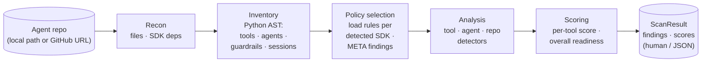

<p align="center">
  
</p>

Trustabl is a static analyzer for agent reliability. It parses an agent-SDK
repository (Claude Agent SDK, OpenAI Agents SDK, Google ADK, MCP), models the
tools and agents it declares, and checks them against a catalog of reliability
and safety rules. It reports the weaknesses it finds — each with an explanation, a
suggested fix, and a confidence score — as a human-readable summary or as JSON,
plus a per-tool reliability score and a CI-friendly exit code. It ships as a
single Go binary; there is no daemon, server, or hosted service.

The rest of this document explains *what Trustabl reasons about* and *how the
scan works*, then covers building and running it. For the full implementation
reference see [ARCHITECTURE.md](ARCHITECTURE.md); for the at-a-glance SDK
coverage matrix see [COVERAGE.md](COVERAGE.md).

## What it analyzes — the three-scope model

Trustabl does not treat a repository as one undifferentiated blob. Every rule
is classified into exactly one of three scopes, and each scope receives a
different typed input:

- **`tool`** — fires once per tool definition. Input: a `ToolDef` (a
  `@function_tool` / `@tool` function, a `FunctionTool(fn)` ADK wrapper, an
  `@server.tool` MCP registration, or a bare shell-invoking function) plus its
  parsed file. Catches a missing
  docstring, an HTTP call with no timeout, untyped parameters, or an
  unnormalized path flowing into `open()`. (Hosted tools like `WebSearchTool()`
  are agent-scope edge data, captured as `HostedToolDef`, not `ToolDef`.)
- **`agent`** — fires once per agent declaration. Input: an `AgentDef` — a
  single `Agent(...)` / `SandboxAgent(...)` / `AgentDefinition(...)` call with
  every constructor kwarg captured and its edges to tools, handoffs, and
  guardrails resolved. Catches an agent with shell tools and no
  `input_guardrails`, `tool_use_behavior="stop_on_first_tool"` paired with
  filesystem-touching tools, or a subagent granted the built-in `Bash` tool.
- **`repo`** — fires once per scan against the whole inventory. Catches
  project-wide gaps such as the OpenAI Agents SDK being present with no custom
  trace processor configured.

### The agent is the unit of analysis, not the repo

A repo can declare zero, one, or many agents, across one or more SDKs. **Two
agents in the same repo can be in completely different security postures** —
one wired with input/output guardrails, the other not. Agent-scoped findings
therefore attribute to a *specific* agent at its constructor call site;
flattening them to a single repo-level verdict would lose that attribution and
be wrong. Discovery builds a small per-repo graph (tools, agents, and the
edges between them) so agent-scoped rules can query it.

### Rules are scoped to one SDK *and* one language

A Claude-SDK rule and an OpenAI-Agents-SDK rule that detect the same
conceptual problem (a missing timeout, say) are two separate rules with
SDK-specific explanation and fix text — there is no cross-SDK casting. When a
repo declares agents from multiple SDKs side by side, each agent is checked
only against the rules for the SDK that declared it.

## How it reasons — the scanning pipeline

trustabl scans in four steps. Each step's output is the typed input to the
next, with no shared state between runs — and the inventory the early steps
build is what makes policy selection *data-driven* rather than statically
configured.

The binary ships with **no embedded rules**. Before the pipeline runs, Trustabl
resolves its detection rules from a separate git repository
([`trustabl-rules`](https://github.com/jhumel-code/trustabl-rules)) — fetching
the latest, caching the clone locally, and falling back to the cache when the
network is unreachable. This decouples rule updates from binary releases: rules
can be added or changed without rebuilding the scanner. The resolved rules
commit is recorded in the result and folded into the `ScanID`, so a scan is
honest about *which* rules produced it. If no rules can be fetched and none are
cached, the scan exits `2` and tells you to run `trustabl rules pull` — Trustabl
never runs rule-less.



1. **Recon** — walk the repo and answer "what's in here" cheaply, without
   parsing any source language: languages present (by extension), SDK
   dependencies declared in manifests, the file inventory, and discovered agent
   components (MCP configs, hook scripts, `CLAUDE.md`, sandbox policies). No
   tree-sitter parses happen here — this step decides whether the expensive AST
   work is even worth attempting.
2. **Inventory** — for each language Recon cleared, do the AST work and extract
   a typed inventory: `ToolDef`s with their config and body facts, `AgentDef`s
   with all kwargs captured, guardrails, sessions, and the resolved edges
   between agents and the tools/guardrails they reference. Detectors read
   fields off these structs — they never re-parse raw source.
3. **Policy selection** — load **only** the rule packs for SDKs actually
   *observed in code*. An SDK seen in code with no shipped pack emits a
   `META-001` info finding ("Trustabl does not currently audit this SDK") —
   silence on an unknown SDK is wrong. A dep declared but never used in code
   emits a different info finding flagging the drift.
4. **Analysis** — run the selected scope-aware detectors against the inventory.
   Findings carry the scope they fired at and attribute to the right location:
   tool file/line, agent call site, or the manifest.

Three properties fall out of this staging, by design:

- **Performance.** A repo with no Python skips Python AST work; a repo with
  only Claude agents skips OpenAI policy loading.
- **Honest coverage.** An "unaudited SDK" info finding is louder than a
  zero-findings clean bill of health on an SDK Trustabl doesn't know. A
  `META-004` finding further distinguishes "audited and clean" from "could not
  audit — discovery extracted nothing a rule targets."
- **Determinism is a contract.** Same inputs → same `ScanID`, and the report is
  byte-stable across runs (findings sorted by `(RuleID, FilePath, Line)`,
  inventory slices sorted deterministically). CI consumers can diff scans
  without spurious churn.

See [ARCHITECTURE.md § 2](ARCHITECTURE.md#2-pipeline) for the full diagram with
typed inputs at each step.

### Scope boundaries

- **LLM enrichment is opt-in.** The BYOK interface and cache exist
  (`internal/inference/router.go`), but rule-based detection runs fully without
  a key and makes no network call without one.
- **Confidence scores are heuristic**, not LLM-judged, and not yet calibrated
  against a labelled real-agent corpus — treat findings as signal to
  investigate.
- **Tool/agent AST discovery is Python-only today.** TypeScript, JavaScript,
  and Go files are recognized in the file inventory and feed component
  discovery, but no AST parser for them is wired in, so no tools are extracted
  from them. The rule schema's `language:` field is in place for when those
  parsers ship.
- **The CLI is the surface.** No web app, API server, or GitHub Action — pipe
  `--format json` into your own automation.

## What it produces

Trustabl is a detect-and-report tool: it does **not** write or modify any files
in the scanned repo. Each run produces a `ScanResult` containing:

- **Findings** — one per rule hit, each with `severity`, `confidence`, an
  `explanation`, a `suggested_fix`, and the location it fired at (tool
  file/line, agent call site, or the manifest).
- **Per-tool readiness scores** and an **overall score** (the minimum across
  tools — an agent is only as reliable as its weakest surface).
- **The discovered inventory** — tools, agents, hosted tools, MCP servers,
  subagents, and Claude settings — surfaced at the top level for CI consumers.

Output is rendered as a human-readable summary (`--format human`, the default)
or as JSON (`--format json`) for piping into your own automation. Exit codes:
`0` = no findings ≥ medium, `1` = findings ≥ medium present (or any finding
under `--strict`), `2` = scanner error (including no usable rules — run
`trustabl rules pull`). There is no built-in CI integration — pipe
`--format json` to your own logic, or act on the exit code.

In `--format human`, the scan prints real-time progress to **stderr** — an
animated spinner and progress bar on an interactive terminal, or plain
`[phase] summary` lines when piped (CI-friendly). `--format json` emits no
progress. The report itself always goes to stdout and is byte-stable.

`--format sarif` emits a SARIF 2.1.0 document on stdout, suitable for
`github/codeql-action/upload-sarif` and other SARIF-aware tools. Like
`--format json`, the SARIF mode is progress-silent.

OpenShell surfaces are still discovered (shell-invocation functions,
`openshell/*.yaml` policies), but the OSH-* detection rules that audited them
have moved to a closed-source companion project, so repos using OpenShell
produce a `META-001` info finding rather than firing those rules.

## Build

CGO is required because the Python AST parser uses tree-sitter:

```bash
# macOS / Linux
CGO_ENABLED=1 go build -o trustabl ./cmd/trustabl

# Cross-compile: pick a C toolchain for the target. zig is the easiest.
CGO_ENABLED=1 CC="zig cc -target x86_64-linux-gnu" \
  GOOS=linux GOARCH=amd64 go build -o trustabl-linux ./cmd/trustabl
```

This is the cost of using tree-sitter for accurate Python parsing. If a
single-binary, no-CGO distribution becomes a hard requirement later, the swap
target is `github.com/go-python/gpython` (with lower fidelity on modern
Python).

## Use

```bash
# Local repo
trustabl scan ./path/to/agent-repo

# GitHub repo (shallow clone to temp dir, removed on exit)
trustabl scan https://github.com/org/repo

# Restrict detectors
trustabl scan ./repo --detectors claude_sdk
trustabl scan ./repo --detectors openai_sdk
trustabl scan ./repo --detectors google_adk
trustabl scan ./repo --detectors claude_sdk,openai_sdk,google_adk
# --detectors openshell is accepted but selects zero rules (pack is closed-source now)

# JSON output for CI piping
trustabl scan ./repo --format json

# SARIF output for GitHub Code Scanning / SARIF-aware tools
trustabl scan ./repo --format sarif > trustabl.sarif

# Exit 1 on any finding regardless of severity
trustabl scan ./repo --strict

# Download / refresh the detection rule packs into the local cache
trustabl rules pull

# Use a custom rules repo or a specific ref (env: TRUSTABL_RULES_REPO)
trustabl scan ./repo --rules-repo https://github.com/org/my-rules
trustabl scan ./repo --rules-ref v1.2.0

# Air-gapped / offline: skip the network fetch, use the cached rules only
trustabl scan ./repo --no-rules-update

# Progress output (human format): animated on a terminal, plain lines when piped
trustabl scan ./repo                 # spinner + bars on a TTY; "[phase] summary" lines when piped
trustabl scan ./repo --no-progress   # disable progress entirely
```

Rules are cached under your OS cache dir (`os.UserCacheDir()`, e.g.
`%LocalAppData%\trustabl\rules\` on Windows, `~/.cache/trustabl/rules/` on
Linux). The first scan (or an explicit `trustabl rules pull`) populates it;
each subsequent scan checks for an update first (unless `--no-rules-update`),
falling back to the cached rules if the fetch fails.

## Where the code lives

| Pipeline node      | Code path                                |
| ------------------ | ---------------------------------------- |
| Importer           | `internal/ingestion/importer.go`         |
| Normalizer (recon) | `internal/ingestion/normalizer.go`       |
| Tool discovery     | `internal/analysis/discovery.go`         |
| Detector runtime   | `internal/analysis/detectors/`           |
| Rule source        | `internal/rulesource/` (git fetch + cache + schema gate) |
| Detector rules     | external `trustabl-rules` repo (tests: `testdata/rules-fixture/`) |
| Rule engine        | `internal/rules/{schema,loader,evaluator,predicates,rule_detector}.go` |
| Scoring engine     | `internal/analysis/scoring.go`           |
| Report renderer    | `internal/review/diff.go`                |
| Inference router   | `internal/inference/router.go`           |

Rule packs live in the separate `trustabl-rules` git repository (grouped
`{claude_sdk,openai_sdk,google_adk}/`), resolved at scan time rather than
embedded in the binary. Naming convention: `CSDK-NNN` for Claude Agent SDK
rules, `OAI-NNN` for OpenAI Agents SDK rules, `ADK-NNN` for Google ADK rules.
See
[ARCHITECTURE.md § 2 — steps 3–4](ARCHITECTURE.md#2-pipeline) for the shipped
rule table and [COVERAGE.md](COVERAGE.md) for per-SDK recognition detail.

## Testing

`examples/` holds real-world agent code (Claude SDK demos, OpenAI Agents SDK
demos) — a corpus, not a controlled fixture, so well-written agents won't
trigger most rules and that's correct. Per-rule fire/silent correctness lives
in `internal/rules/policies_test.go`; the end-to-end sweep in
`internal/scanner/scanner_test.go` only asserts the scanner doesn't crash on
real-world inputs. A labelled 20–40 real-agent-repo corpus is the
detection-quality target (see
[ARCHITECTURE.md § 10](ARCHITECTURE.md#10-what-is-intentionally-out)); the
current tests are regression coverage, not detection-quality measurement.
